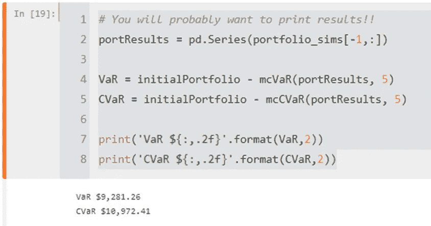

# 使用 python 中的蒙特卡罗模拟测量投资组合风险—第 2 部分

> 原文：<https://medium.com/codex/measuring-portfolio-risk-using-monte-carlo-simulation-in-python-part-2-9297889588e8?source=collection_archive---------7----------------------->

**简介**

让我们快速回顾一下之前关于为投资组合实现蒙特卡洛模拟模型的讨论。

我们讨论了蒙特卡罗的定义，以及为什么它是许多不同行业中需要考虑的重要过程，如金融、零售、投资等。我们还解释了处理和计算结果所需的所有基本函数，在我们的例子中，结果是迭代一系列投资组合的输出，这些投资组合显示了最佳可能和最差情况下的表现。这些函数与使用协方差计算投资组合中的平均回报、波动性以及两只股票和更多股票之间的关系有关。我根据预定义的初始投资组合价值将这些结果可视化在一个折线图中。

最后，我提到蒙特卡洛模拟的可视化是不够的，因为我们需要使用额外的参数，如 **VaR** 和 **cVaR** 值来量化投资组合的未实现和预计损失，所以不再多说，让我们用已经实现的蒙特卡洛模型来解释和实现 **VaR** 和 **cVaR** 。

**点击下方或复制粘贴以下链接:[*https://medium . com/codex/measuring-portfolio-risk-using-Monte-Carlo-simulation-in-python-part-1-AC 69 ea 9802 f*](/codex/measuring-portfolio-risk-using-monte-carlo-simulation-in-python-part-1-ac69ea9802f)**

[](/codex/measuring-portfolio-risk-using-monte-carlo-simulation-in-python-part-1-ac69ea9802f) [## 使用 python 中的蒙特卡罗模拟测量投资组合风险—第 1 部分

### 介绍

medium.com](/codex/measuring-portfolio-risk-using-monte-carlo-simulation-in-python-part-1-ac69ea9802f) 

**什么是 Var 和 cVar？**

在我们开始在我们的模型中实现 VaR 和 cVaR 之前，我们需要知道什么是 **VaR** 和 **cVaR** 。

**VaR** 和 **cVaR** 分别代表风险价值和条件风险价值。

**VaR** (风险价值)是一种统计方法，它量化了一个投资组合、组织或头寸在特定时间框架内可能的财务损失程度，而 **cVaR** (条件风险价值)被称为预期短缺，是一种风险评估方法，它量化了投资组合的尾部风险量。 **cVaR** 的计算方法是对可能回报分布尾部的极端损失进行加权平均，超过风险值( **VaR** )截止点，换句话说， **cVaR** 将给出您的投资组合或头寸在最坏情况下的损失值。因此， **cVaR** 值在数学上往往大于 **VaR** ，这就是为什么基金经理总是会考虑 VaR 和 **cVaR** 的读数，以优化和衡量风险，实现有效的风险管理。

**理解投资组合的风险价值(VaR)和条件风险价值(CVaR)之间差异的简单方法是什么？**

为了回答这些问题，让我提醒你一下统计学中的一些重要概念，你还记得正态(或高斯)分布、置信区间和 Z 值吗？

请访问以下链接或[点击此处](/swlh/a-simple-refresher-on-confidence-intervals-1e29a8580697)<https://medium . com/swlh/a-simple-refresh-on-confidence-intervals-1e29a 8580697>阅读这些概念，并在我们继续解释这些概念的关系以及我们计算 **cVaR** 和 **VaR 的尝试之前快速复习这些概念。**

**图 1** 清楚地说明了每个 Z 值的不同置信区间


**图 1** :正态分布的置信区间&百分位点图，形状为钟形曲线。

**置信区间**是我们期望实际结果以给定的概率(置信度)落在其中的区间。正态分布有四个常用的置信区间，它们是:

68%的值落在平均值的 1 个标准偏差内。

90%的值在平均值的 1.65 倍标准偏差范围内。

95%的值在平均值的 1.96 倍标准差范围内。

99%的值在平均值的 2.58 倍标准偏差范围内。

这意味着我们的置信区间决定了我们的投资组合代表哪个 z 值。查看下图，**图 2**


**图 2**:Z 值与置信区间关系表样本

**例如**，一个股票投资组合每年的平均回报率为 10%，回报率的标准差为 20%。收益服从正态分布。计算 99%的置信区间。95%置信区间= 10% +/- 2.58*20%。

因此，置信区间为-41.6%至 61.6%。这意味着在 **99%的信心**下，回报率将从-41.6%到 61.6%不等。

你不必担心所有这些，因为我们可以很容易地用 python 计算 z 分数，当然，给定我们之前从正态分布得到的所有数据。

**Python 代码的 VaR 和 cVaR**

现在，我们可以定义一个函数，根据蒙特卡罗模拟分布的百分位数的不确定性水平，给出风险值。

```
def mcVaR(returns, alpha):
    """ Input: pandas series of returns
        Output: percentile on return distribution to a given confidence level alpha
    """
    if isinstance(returns, pd.Series):
        return np.percentile(returns, alpha)
    else:
        raise TypeError("Expected a pandas data series.")

def mcCVaR(returns, alpha):
    """ Input: pandas series of returns
        Output: CVaR or Expected Shortfall to a given confidence level alpha
    """
    if isinstance(returns, pd.Series):
        belowVaR = returns <= mcVaR(returns, alpha=alpha)
        return returns[belowVaR].mean()
    else:
        raise TypeError("Expected a pandas data series.")
```

```
# You will probably want to print results!!
portResults = pd.Series(portfolio_sims[-1,:])

VaR = initialPortfolio - mcVaR(portResults, 5)
CVaR = initialPortfolio - mcCVaR(portResults, 5)

print('VaR ${:,.2f}'.format(VaR,2))
print('CVaR ${:,.2f}'.format(CVaR,2))
```

我认为代码简单易懂。这里，如果我们的投资组合落在最差的区域或表现方面，我们将简单地使用 95%的置信区间和 5%的百分位数。

**结果**



基于熊猫系列填充的结果，我们的结果如下

VaR 位于 9281.26

**cVaR** 为 10972.41

因此，在最坏的情况下，假设市场将在我们的置信区间内下跌 5%,我们价值为 47，000 美元的投资组合将价值=47，000–10，972，约为**36，000 美元。**

简单来说，基于这个投资组合的选股(组合资产配置构成)，过去 100 天的预期风险值为亏损 10，972.41 美元。

一位经验丰富的投资组合经理会尝试不同的资产类别，以就特定风险水平下的最佳投资组合达成总体共识。

例如，假设一个基金/投资组合经理构建了投资组合 A、B 和 C，它们都有不同的股票组合(苹果、Meta、埃克森等)。投资组合 A 的 cVaR 值为 1 万美元，B 和 C 的 cVaR 值分别为 8 万美元和 5 万美元。

基于以上所述，基金经理应该选择投资组合 C，因为与投资组合 A 和 B 相比，它的损失更少，但是，这不应该是选择最佳投资组合的唯一因素。还有其他因素需要考虑，如这些股票的收益情况、投资目标和风险、行业分析、地理分析等。

使用 CVaR 值作为您的风险参考始终是一个好主意，而 VaR 衡量的是给定置信水平和期限内的最大损失，cVaR 衡量的是给定置信水平下超过 VaR 的损失额。

我希望你喜欢阅读这篇文章，请跟随我，这样你就不会错过金融科技、人工智能和其他相关的数据科学项目。我一直是数据科学和物联网概念在现实生活中实现的忠实粉丝。

再次感谢，不要忘记关注我的账号，如果你对这篇文章有任何问题，请给我留言。