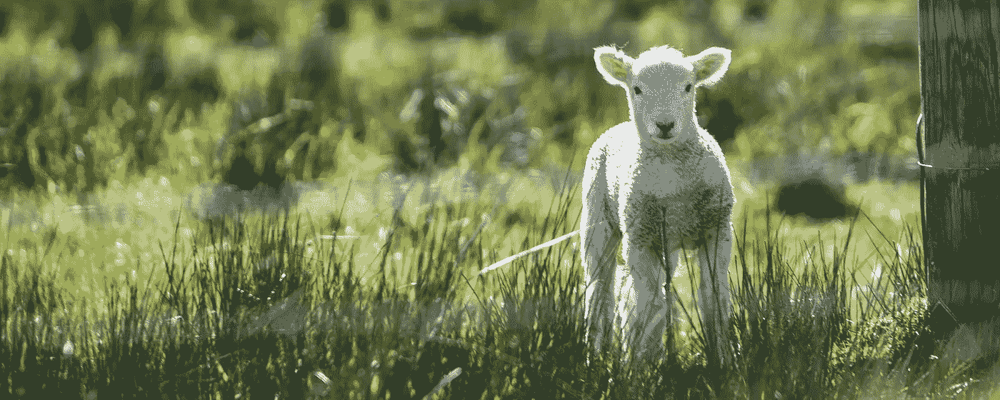
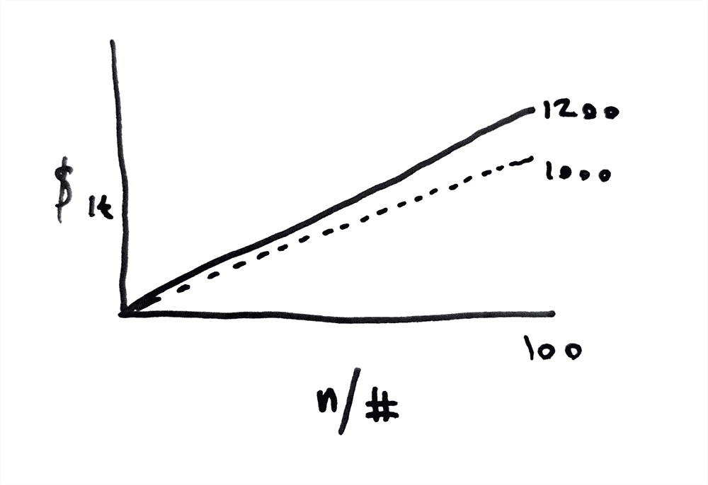

# 测量不可能

> 原文：<https://medium.com/codex/measuring-the-impossible-8f4144cf6bc1?source=collection_archive---------10----------------------->

## [法典](http://medium.com/codex)

🐑🐑🐑🐑🐑

想象一下你是一个农民。你有一群羊，每只母羊大约 150 美元，你想确保它们得到很好的照顾——直到它们每天吃草的质量。

如果可以选择，你会花 20 万美元安装地下湿度探测器，定期采集你的泥土样本送到实验室，还是会花 50 美元在你的羊身上安装加速度计？

答案似乎很清楚——它概述了代理数据的巨大(且被忽视的)价值。让我们开始吧。

术语“代理数据”最初是由[古气候学家](https://serc.carleton.edu/microbelife/topics/proxies/paleoclimate.html)创造的——如果你想直接测量你的研究重点，这是一个不幸的领域。
由于古气候学家不能测量除了现在*以外的任何其他时间点的气候质量，他们依靠其他测量来推断过去时代的气候。你可能已经知道了其中的一个——树的年轮。树木年轮的生长在很大程度上受其生长期间的气候影响，因此，如果您可以测量倒下的树木年轮的不同指标，您就可以估计从树苗到今天的气候质量。*

这个概念可以应用于几乎所有的行业——你不需要树木年轮来实现它。都是二阶里的[思维，对相关性和因果性的深刻理解。](https://finnshewell.com/news-notes/2019/and-then-what)

让我们以农民的情况为例——我有幸亲自研究过。非常感谢 Abacus Bio[的 Peter、Sharl 和 Luke 让我在本文中将这项工作作为一个案例来展示——我和他们一起做的工作首先激发了“代理数据”的概念。](https://abacusbio.com/)

问题是这样的:

如果一个农民想要跟踪羊群的位置，测量羊的健康状况，估计草的质量，并判断羔羊何时发情，那么需要将几种不同的解决方案拼凑在一起，以高成本并通过大量的工作来获得所需的洞察力。

我们开发了一个单一的产品，可以推断出上述的一切，甚至更多。

利用加速度计和温度数据，我们可以计算任何给定羔羊和母羊之间的相对距离，跟踪绵羊是否偏离羊群(与健康状况不佳相关)，放牧率(与草地的营养密度相关)，以及给定绵羊可能发情的可能性。

因此，只需两种形式的测量，我们就能以很小的代价，清晰地了解大量的洞见。

价值主张很明确:如果你能从极其昂贵或根本无法直接衡量的数据中受益，探索如何通过代理数据获得洞察力。

对此问题的一个补充观点是提出以下问题:

*您是愿意捕捉 60%准确的数据，从而获得 20 美元的转换，还是 100%准确的数据，但将获得 10 美元的转换？*

一旦你算过，答案就很简单。假设你根据这些见解采取了 200 项行动。有了精确的数据，你会得到 2000 美元。还不错。由于几乎所有的坏数据，你最终会得到大约 2，400 美元。(补充一点:如果你正在收集的任何数据有 60%是准确的…让我们来解决这个问题。)

通过代理衡量的任何东西都有可能不太可靠——这就是当我们相信相关性时会发生的情况。虚假关联和混淆变量的风险总是存在的，除非你测量的东西与你推断的东西有因果联系。

所以你需要回答的问题是:你想要测量的东西有多有价值——你需要你的数据有多可靠？

在某些情况下，后一个问题本质上是二元的。诊断癌症时，你不能出错。一个错误的肯定会让一个家庭无缘无故地陷入经济混乱，一个错误的否定会让一个人付出生命的代价。在其他情况下，风险要低得多。
在权衡数据的准确性和洞察力的价值时，有一种真正的技术可以平衡风险和回报。

如果你有想通过代理来衡量的东西，但不确定你能不能做到，或者你有一个想验证的理论——[联系](https://finnshewell.com/get-in-touch)。我很乐意和你一起探索。