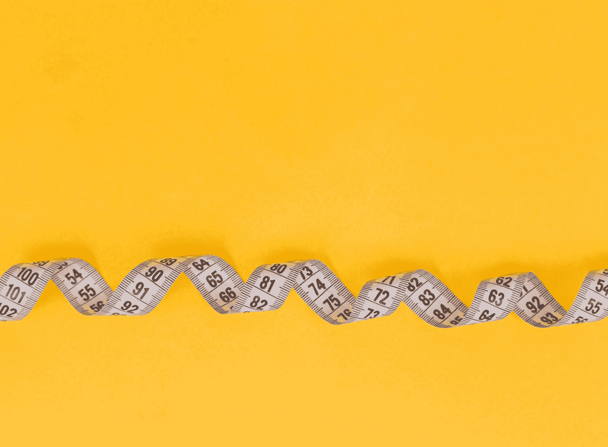

# 衡量产品成功的用户参与度指标

> 原文：<https://medium.com/codex/measuring-user-engagement-metrics-for-your-product-success-8fee33431d14?source=collection_archive---------22----------------------->

## 如何衡量产品的用户参与度

戴安娜·波莱希娜在 [Unsplash](https://unsplash.com?utm_source=medium&utm_medium=referral) 上拍摄的照片

## 在后台

这一切都始于 [**iHateReading**](http://www.ihatereading.in) 背后的团队致力于用户体验的时候。我们正在寻找一些参数，这些参数可以帮助我们了解人们非常喜欢我们产品的哪些特性。