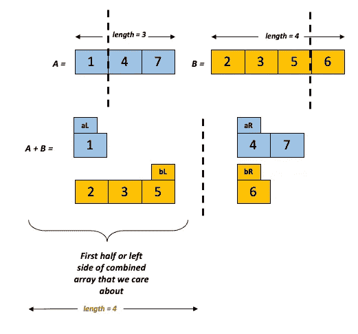

# 两个排序数组的中值

> 原文：<https://medium.com/codex/median-of-two-sorted-arrays-a84a4315e85?source=collection_archive---------3----------------------->

照片由[戴恩·托普金](https://unsplash.com/@dtopkin1?utm_source=medium&utm_medium=referral)在 [Unsplash](https://unsplash.com?utm_source=medium&utm_medium=referral) 上拍摄

## [抄本](http://medium.com/codex)

我们得到两个排序后的数组，我们的目标是在**对数**时间和 **O(1)** 空间复杂度( [LeetCode](https://leetcode.com/problems/median-of-two-sorted-arrays/) )下找到这些数组的中值。这是一个非常常见的问题，在互联网上有很多解决方法。然而，我花了一些时间来理解它。我想在这里描述一下我的思考过程和解决方案。

## 问题陈述

首先，这是我们计算单个排序数组的中值的方法:

图一。寻找单个偶数长度排序数组的中值

图二。寻找单个奇数长度排序数组的中值

我们先把问题陈述形象化。考虑如下所示的两个数组:

图三。寻找两个排序数组的中间值(问题陈述)

这里，我们有两个排序的数组 A 和 b。为了找到这些数组的中值，我们可能需要组合这两个数组，对其排序并计算组合数组的中值。这种方法不能满足问题陈述的要求，因为:

a)将两个数组组合成一个数组并对其排序(使用类似 merge sort 的算法)是一个 **O(n*log(n))** 时间操作

b)空间复杂度也是 O(n) 因为我们需要创建一个新的数组来容纳这两个数组

不能通过简单地将一个数组附加到另一个数组来获得组合数组 A+B。这就是为什么试图组合数组来确定中值的方法不能满足问题所强加的对数时间约束——我们知道每个数组中元素之间的关系，因为它们是排序的。所以，最小的在开头，最大的在结尾。但是，我们不知道数组中元素之间的关系。如果不完全遍历两个数组，我们就找不到它们之间的关系，这违反了时间限制。

## 解决方法

如果你仔细想想，这些约束确实在把我们推向不必担心组合数组的方向。一个 O(log(n))算法(像二分搜索法)基本上是在每次迭代中根据一些标准丢弃数组的一部分。因此，我们需要想办法将其纳入我们的解决方案。

也就是说，如果我们知道 A 和 B 已经排序，我们就不需要知道 A+B 看起来是什么样子来计算中位数。我们只需要知道组合数组的**前半部分**就可以求出中值。根据 A+B 的长度，中间带的位置会略有不同:

图 4。当 A+B 中的中间元素的长度为奇数时，它的索引

图五。A+B 中长度为偶数的中间元素的索引

底线是，一旦我们知道 A 和 B 中的哪些元素对组合数组 A+B 的前半部分(左侧)有贡献，我们并不真正关心其余的元素，这将帮助我们在对数时间内解决这个问题。

好，那么 O(1)空间约束呢？这意味着，我们不应该为任何临时数组分配内存。严格来说我们不需要。一旦我们开始实施解决方案，我们将进一步讨论这一点。

简而言之，我们将对两个数组应用二分搜索法，画一条线来表示给定数组的多少部分将贡献给组合数组的左半部分或前半部分。这可以想象成这样:

图六。可视化二分搜索法方法以确定每个阵列中的哪些元素对组合阵列有贡献(奇数长度)

图 7。可视化二分搜索法方法以确定每个数组中的哪些元素对组合数组有贡献(偶数长度)

## 实施细节

请记住，我们的目标是使用二分搜索法来计算每个数组对组合数组的贡献。二分搜索法问题的结构是什么？

图 8。二分搜索法伪代码

因此，我们需要将我们的问题陈述映射成这种格式。我们有两个数组可以使用。我们应该关注一个数组(较小的那个)并用它来确定两个数组的贡献。假设 A 是较小的数组。

**a)什么能让我们的循环继续下去？**

我们应该继续循环，直到我们探索了所有可能的方法来组合两个数组以确定 A+B 的左半部分。例如，如果 A+B 的左侧大小为 4，并且我们从 A 中选取了一个元素，这自动意味着我们需要从 B 中选取三个元素。我们可以从 A 中不选取任何元素，从 A 中选取几个元素，或者从 A 中选取所有元素。因此，我们继续循环，直到 A 的贡献等于其长度。

**b)我们的目标是什么，我们应该如何测试它？**

我们想找到 A+B 的左边，这样我们就可以很容易地计算出中间值。所以，我们想找到一个能帮助我们达到中间值的分割。

每个拆分将两个数组分成 4 部分，我们将拆分的左半部分的元素组合起来，形成 A+B 的前半部分，如下所示:

图九。目标可视化

如果左边的所有元素都小于右边的所有元素，那么，我们知道分裂给了我们 A+B 的前半部分。

那就是:

**A[aL] < B[bR]和 B[bL] < A[aR]，**其中 aL、bL、bR 和 aR 对应于分裂两侧元素的索引。

**c)如果我们找到目标分割点，我们如何计算中位数？**

考虑 A+B 的长度为奇数的情况(图 9 ),并假设我们已经找到了目标分割。现在，我们有一个分裂，a1 < b4 and b3 < a3\. Since A+B has a length of 7, the median is the 4th element in A+B and this has to be either a1,b1,b2 or b3 (elements on the left half). We have 4 numbers and there are 4! ways of arranging them (assuming no repetition), as shown below:

Fig 10\. Different ways in which elements on the left side of the A+B array (odd length)can be arranged, depending on their values

But, do we really care about these arrangements? We are only interested in the fourth element:

Fig 11\. Position of median in A+B (odd length) that we are interested in

The 4th element has to be the largest number on the left-hand side and we only need to compare the largest numbers from A and B to get this! So:

Similarly, let’s look at a situation where A+B has an even length:

Fig 12\. Finding median of A+B which has an even length

Now, we have a split where a2 < b3 and b2 < a3\. Since A+B has a length of 8, the median is the average of the 4th and 5th elements in A+B.

There are 4! ways of arranging {a1,a2,b1,b2} and for each arrangement, there are 2 ways of picking the 5th element (a3 or b3):

Fig 13\. Different ways in which elements on the left side of the A+B array (even length)can be arranged, depending on their values

Here again, do we really care about these arrangements? We are only interested in the 4th and 5th elements:

Fig 14\. Position of median in A+B (odd length) that we are interested in

The 4th element is the largest on the left side of A+B and it must be max(a2,b2), just like what we saw for the odd length case. The 5th element has to be either a3 or b3\. But, it must be just next to the 4th element. So, we pick the minimum value, i.e. min(a3,b3):

**d)如果我们找不到目标，我们如何继续循环？**

简而言之，如果我们没有找到目标分割，我们应该包含或多或少的 a。

图 15:当 A+B 的长度为奇数时，首先拆分两个数组来计算中值

在这个例子中，A+B 的奇数长度为 7，中位数是第 4 个元素。我们首先从 A 中选取一个元素，从 B 中选取 3 个元素来计算 A+B 的左半部分。

1 < 6\. However, 5 > 4。这表明 A 的右边有更小的元素，这意味着 5 都不是第四个最小的元素。我们需要包含更多的 A 来发现这个元素。所以，我们继续下一次迭代:

图 16:当 A+B 的长度为奇数时，第二次拆分两个数组以计算中值

让我们再次比较两侧的元素— 4 < 5 和 3 < 7，左侧有 4 个元素。所以，我们找到了正确的分割！

因为 A+B 的长度是奇数，所以我们需要找到这个子数组中的最后一个元素。这必须是数组 A 和 B 最右端的最大值，即 max(4，3)，也就是 4。

让我们看另一个例子，A+B 的长度是偶数:

图 17:当 A+B 的长度为偶数时，第一次拆分两个数组以计算中值

A+B 的偶数长度为 8，中位数是第 4 个和第 5 个元素的平均值(mean(4，5))。我们从 A 中选取 1 个元素，从 b 中选取 3 个元素。

1 < 6\. However, 5 > 4。这意味着 5 都不能是第四个最小的元素。我们需要包含更多的 A 来发现这个元素。所以，我们继续下一次迭代:

图 18:当 A+B 的长度为偶数时，第二次拆分两个数组以计算中值

在这里，4 个< 6 and 5 < 7\. So, we have found the median split! So, the median is the average of max(4,3)and min(5,7).

One thing to remember is, we can be in a situation where the split results in one more more of the halves being empty. For example:

Fig 19: Special situation to consider in implementation

This is an interesting case where two of the splits to the right are empty! What do we compare 1 and 2 to? The smaller values are on the left and the larger ones are on the right. Since we have no valid number to compare to, we just assume that 1 and 2 satisfy the condition for a median split. This can be done by comparing them to very large values (+∞). Similarly, if there are empty values on the left, we compare it with -∞.

## Time complexity analysis

Now that we know how to implement this algorithm, it is time to make sure it satisfies the constraints of the problem.

We have not used any temporary arrays and we just rely on the indices for our implementation. So, the space complexity is O(1).

We always pick the smaller array to iterate and and every step we either include more of it (less of the other array) or less of it (more of the other array). So, the time complexity is O(log(min(A,B))).

## Link to Github repository: [https://github.com/madhu90/CodeExamplesForBlogPosts.git](https://github.com/madhu90/CodeExamplesForBlogPosts.git)

## 参考

[1][https://www.geeksforgeeks.org/median-of-two-sorted-arrays/](https://www.geeksforgeeks.org/median-of-two-sorted-arrays/)

[2][https://www . geeks forgeeks . org/median-of-two-sorted-arrays-of-different-size/](https://www.geeksforgeeks.org/median-of-two-sorted-arrays-of-different-sizes/)

[3][https://www.youtube.com/watch?v=LPFhl65R7ww&ab _ channel = TusharRoy-coding made simple](https://www.youtube.com/watch?v=LPFhl65R7ww&ab_channel=TusharRoy-CodingMadeSimple)

[4][https://www.youtube.com/watch?v=MHNTl_NvOj0&ab _ channel = IDeserve](https://www.youtube.com/watch?v=MHNTl_NvOj0&ab_channel=IDeserve)