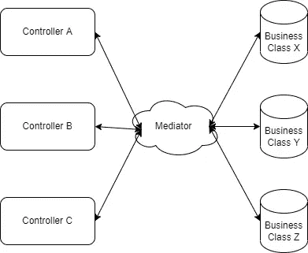

# 调解人模式:一个有能力的失败者？

> 原文：<https://medium.com/codex/mediator-pattern-a-capable-underdog-7eb82944a935?source=collection_archive---------6----------------------->

啊，我的 feed 上又多了一个设计模式博客？我打赌你也是这么想的。但是让我向你保证，你至少会明白为什么我同时称它为有能力的人和失败者。

我将在这里回答每个人在学习新模式时都会问的 4 个问题:**什么，为什么，什么时候和如何**？

让我们开始吧:

# 什么？

首先也是最重要的，听到一个新的模式时产生的问题是为什么？
当你已经有 20 多个众所周知的设计模式在项目的大部分时间里处于稳定状态时，为什么你还需要一些新的模式呢？

为了理解这一点，我们首先需要了解什么是中介模式？

如果我们按照维基百科的定义，它说:

> "中介模式定义了一个对象，它封装了一组对象如何交互."

过头了吧。别担心。

顾名思义，调解人起着调解的中介作用。但是调解谁呢？你猜对了。课间休息。换句话说，它提供了一个统一的、单一的实体来在类之间进行通信。现在让我们把它变得简单一些，它在核心 API 动作和它们所通信的各自的业务逻辑之间起中介作用。所以，这是一种行为模式。

你马上会问，当我们已经可以通过使用大量其他设计模式非常容易地在类之间进行通信时，为什么我们还需要一个中介，为了回答这个问题，让我们继续下一个主题。

# 为什么？

照片由[贝克特 P](https://unsplash.com/@bdp028?utm_source=medium&utm_medium=referral) 在 [Unsplash](https://unsplash.com?utm_source=medium&utm_medium=referral) 拍摄

假设机场是您的应用程序，您需要管理空中交通。

想象一下，如果地面上没有空中交通管制员，飞机需要通过与附近的几十架其他飞机进行交互来自行管理高度和速度，情况会怎样？

这会造成混乱，不是吗？

大多数传统的设计模式都是基于依赖关系的。假设有 3 个类依赖于 3 个不同的类来执行它们的业务逻辑。我们传统上所做的是解决它所消费的类的依赖性。这使得多对多的互动在某种程度上。这就造成了依赖关系的混乱。

传统的方式

现在想象你需要分离或者改变一些类的交互？

这就是调解人发挥作用的地方。

> 它的作用是，基本上处理交互。

这解决了几个问题:

1.  班级之间直接/紧密的交流。
2.  处理复杂的依赖关系管理。
3.  允许我们轻松地修改类之间的任何交互。

在中介模式中，上面的场景看起来像这样:

调解人的方式

很容易观察到，它不仅看起来干净，而且还提供了一个统一的界面来管理交互。

好了，现在我们知道了它是什么以及为什么要引入它，让我们检查一些用例，看看什么时候使用它，什么时候不使用它。

# 什么时候？

简单来说，当你需要摆脱依赖纠缠时，我们可以使用一个中介模式。当你有这么多相互依赖的类时，管理依赖关系会让人头疼。

当我们需要轻松地改变类之间的交互行为时，当我们需要一个 ATC 类型的单一实体来管理交互时，当我们需要封装正在通信的对象以便只有一个实体知道类之间的依赖关系时，我们可以使用它。

当然，它并不完美。这是有代价的。

与所有其他单一实体一样，它很容易失败。有太多依赖关系的复杂中介可能会成为单点故障。所以最好不要把它复杂化。

现在让我们跳到如何使用它？

# 怎么会？

别担心，我不会在这里粘贴整个解决方案。你可以在 GitHub 上查看这类项目的多个例子，比如这里的。

但是在基本环境中，您可以安装和配置 MediatR Nuget 包，创建与动作/工作流相关的模型和处理程序，然后通过向中介发送请求在动作中使用它。

# 与 CQRS 的调解员

如果你从上面访问过 GitHub repo，你会看到术语 CQRS-调解人模式。CQRS 和调解人经常互换使用，这是不正确的。

两者都有不同的用例以及需要解决的问题，但是将两者结合起来才是神奇之处。Nuget MediatR 为这两种模式的使用提供了便利，这也是这些术语可以互换使用的原因之一。点击了解更多关于 CQRS [的信息。](https://docs.microsoft.com/en-us/azure/architecture/patterns/cqrs)

# 能干的落水狗？

到目前为止，我们知道它为什么有能力，但为什么它仍然是一个失败者？

不幸的是，这个问题没有确定的答案，但是以我的观点和观察，原因可能是许多现有的项目使用了广泛接受的设计模式，比如 singleton 和 factory 模式。但是很明显，中介模式的使用已经被接受，并且正在增长，特别是在整个行业的新解决方案中。

快乐学习！！！