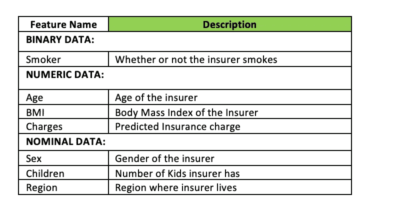
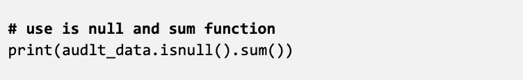
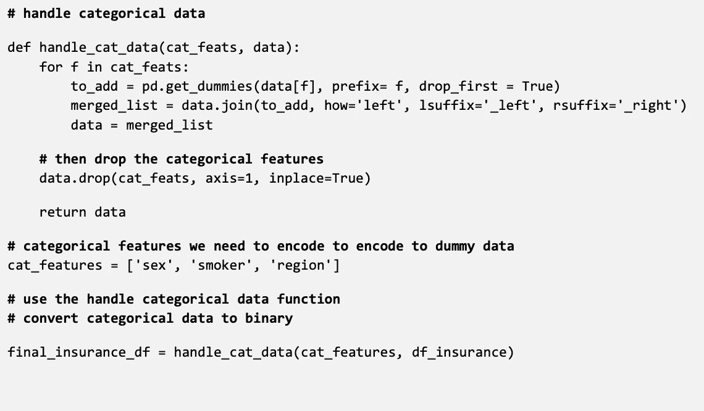
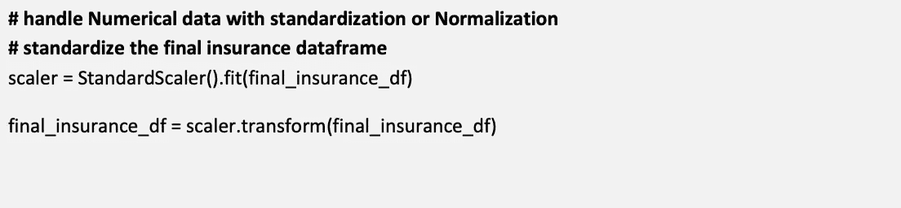
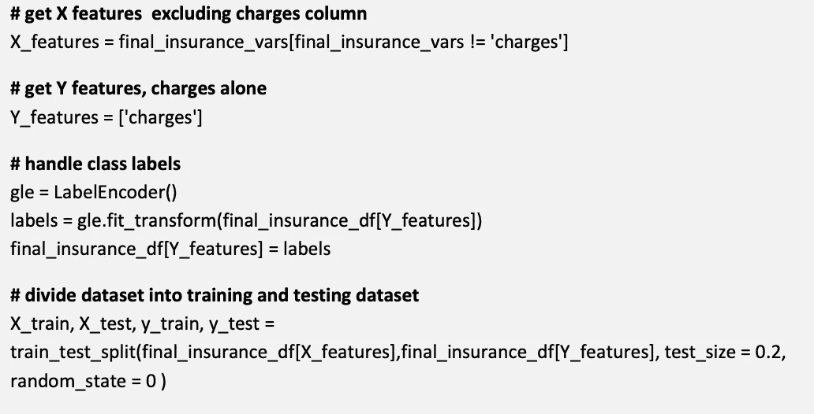
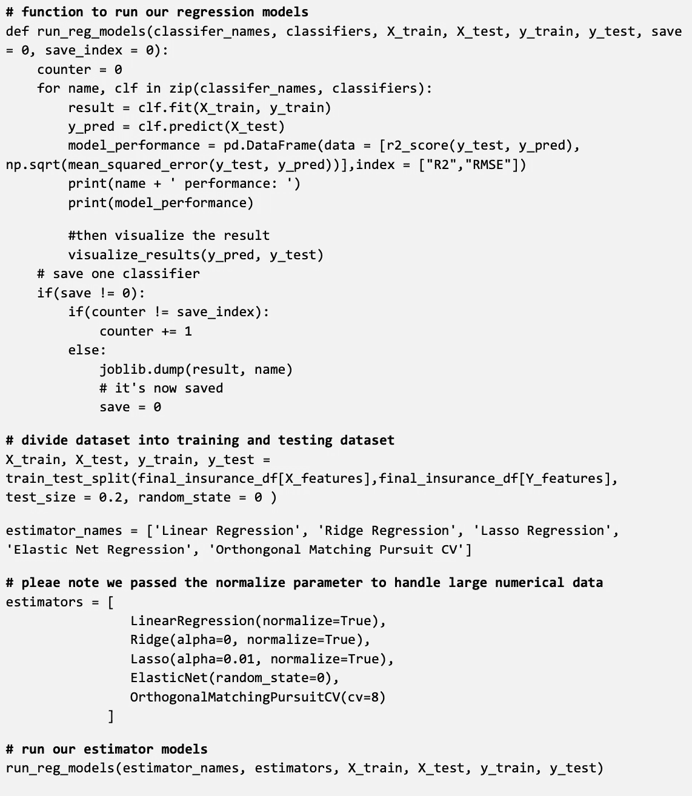
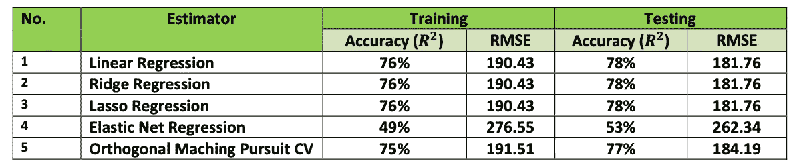
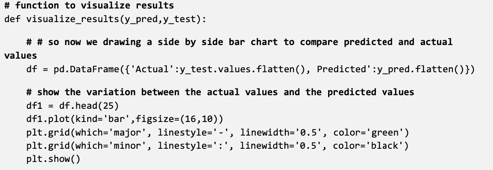
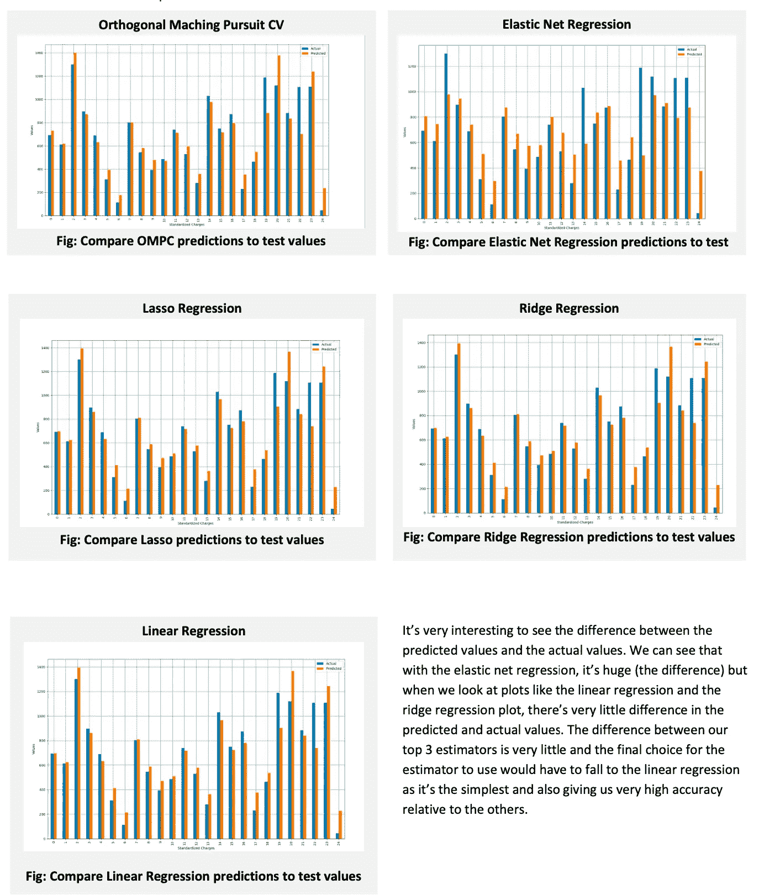

# 基于机器学习的医疗保险费用预测

> 原文：<https://medium.com/codex/medical-insurance-charge-using-machine-learning-896719a5cccb?source=collection_archive---------12----------------------->

**背景:**

随着时间的推移，大多数人现在都意识到为自己和家人购买医疗保险的必要性。根据医疗情况，保险公司每年收取保险费，但是由于受款人的各种健康状况以及影响受款人健康的其他因素，很难估计医疗费用。

然而，某些疾病在某些人群中更为普遍。这方面的一个例子是喉癌，吸烟者比不吸烟者更容易患喉癌，心脏病如心肌病可能更容易在肥胖人群中发生。

因此，保险公司投入大量的时间和金钱来开发准确预测医疗费用的模型。

**目标:**

该项目的目标如下:

1.  建立回归模型，为保险公司预测受款人的医疗费用

**数据集:** 该项目的数据集由 7 个不同的列组成；年龄、性别、身体质量指数(体重指数)、儿童、吸烟者、地区和费用。下表更好地描述了数据集列。

**数据预处理:** 在我们对数据集应用回归算法之前，我们首先需要对其进行预处理，并确保其格式能够让我们的算法产生最佳结果。

首先，我们使用 isnull 函数和 sum 函数检查空值，如下面的代码片段所示

幸运的是，这返回一个零；因此我们可以开始处理我们的分类数据。

**用虚拟数据处理分类数据:**

分类数据在线性回归中需要特殊操作；与连续数据不同，它们不能直接输入回归算法。有各种方法来处理分类数据；在这种情况下，我们创建一个使用 pandas get_dummies 函数的函数。它为每个分类值创建一个不同的列，也就是说，如果我们使用一个只有男性和女性值的性别列；它将创建一个类似 is_male 的列，该列可以接收 1 或 0 值。

下面的代码描述了我们如何实现这一点。

handle_cat_data 函数接受分类要素和整个数据集作为参数。它使用循环遍历数据集中的每一列，使用 pandas get_dummies 函数将每个相应分类值的每个值转换为一列，即在性别 _ 男性或性别 _ 女性的情况下。它还允许我们将 drop_first 作为参数传递，告诉 get_dummies 函数丢弃第一个值，即如果该值不是女性，则在该数据集中，它肯定是男性。

既然我们已经处理了分类数据，是时候标准化或规范化我们的大数值了。

**标准化处理大数值:**

在回归或分类之前，拥有像年龄这样的大值和像孩子这样的小值是一个坏主意。这是因为较大的值会使生成的模型倾斜，并且由于大小的不同而产生不公平的效果；因此，标准化或规范化这些值是一个好主意，这基本上是将这些值转换为 0 和 1 之间的值，从而最终减少差异。我们可以用下面的代码片段来标准化:

Sci-kit 学习器中内置的大多数回归算法都有内置的归一化方法，因此在大多数情况下，我们不需要使用上面显示的函数。

**将数据集随机分成 80%的训练数据& 20%的测试数据:**

为了避免过度拟合或使模型始终 100%准确，有必要将数据集分为训练和测试数据，我们使用训练数据集来训练模型，然后使用测试数据集来测试模型的准确性。下面的代码片段展示了这是如何做到的。

在上面的代码片段中，我们选择了除标签列之外的所有其他列，并将它们传递给 X 数据集，然后只将标签传递给 Y 数据集。之后，我们对数据集进行热编码，以进一步处理分类数据。我们进行了热编码，这样当>和< or = don’t apply to them. Afterwards we use the Pandas train_test_split function to split our dataset into 80% training and 20% testing.

**应用回归算法:**时，我们的分类器就不会将虚拟数据误认为是数字

这里我们创建了一个函数，它运行不同的算法并输出每个算法的结果，可以选择保存模型或检索保存的模型。

定制的 run_reg_model 函数采用一组估算器和估算器名称，如上所示。它还需要数据集和一个值(如果要保存或不保存)以及估计器的索引来更改。它拟合每个模型并输出其结果，然后将结果可视化，在分组条形图中比较测试结果和预测结果。

**成绩:**

从回归中注意到的最有趣的事情是，我们的训练数据集如何给出比我们的测试数据集略低的准确度分数。这很奇怪，因为我们期望用于训练的数据集比用于测试的数据集更准确。我猜这是因为训练数据集越来越大，从而导致更多的错误。如果两者大小相同，它将给出精确度和错误率。

不同估计量的性能差异不大，线性回归、岭回归和 lasso 回归的准确率都是 76%，弹性网回归和正交匹配追踪 CV 给出了不同的结果。弹性净回归给出了最低的结果。这很有趣，因为调整弹性网络回归的超参数，如果我归一化数据集；它甚至将性能降低到大约 0.02 的准确率。调整线性回归和岭回归的超参数没有什么区别。

另一件有趣的事情是，特征选择对我们的估计器的性能没有显著的积极影响；我用 RFE 特征选择方法和所有选择的估计量对此进行了测试。下一个阶段是用测试数据可视化我们的估计器的结果。

**用训练可视化模型&测试数据:**

自定义函数 run_reg_models 在完成估算后已经调用了 visualize 函数。下面的代码片段展示了 visualise 函数是如何工作的:

下面的代码片段描述了我们如何可视化结果:

下面的直方图描述了所有结果模型的性能差异。

**关于选定估计量的结论:**

我最后选择的估计量是线性回归，它是所有估计量中最简单的。它涉及到寻找相关性和符合属性之间相关性的最佳直线。我选择这个在它产生的最高分，连同岭回归进行调查。