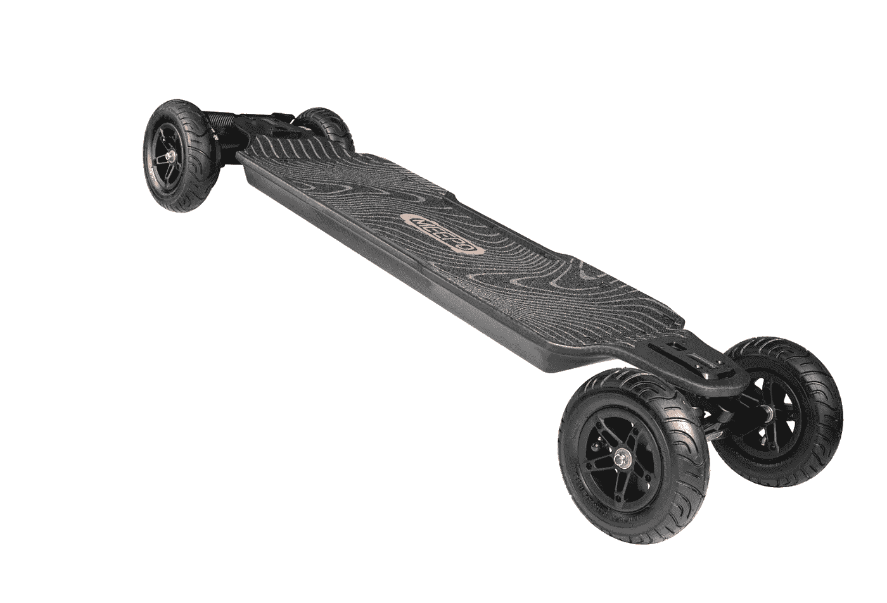

# 米波飓风:这个滑板不仅仅是它的名字！

> 原文：<https://medium.com/codex/meepo-hurricane-this-skateboard-is-more-than-its-name-bf7a7f518284?source=collection_archive---------3----------------------->

## 这款二合一电动滑板可以在陡峭的斜坡上滑行。

[米波飓风(米波媒体)](https://cdn.shopify.com/s/files/1/2096/3333/products/01_1400x.jpg?v=1660549532)

我写过几篇关于交通工具的文章，包括汽车、自行车、摩托车、飞机，甚至独轮车。我想为这篇文章写一个滑板，但是从哪里开始呢？名字像龙卷风，微风，Flex 和 Riot，我选择了…