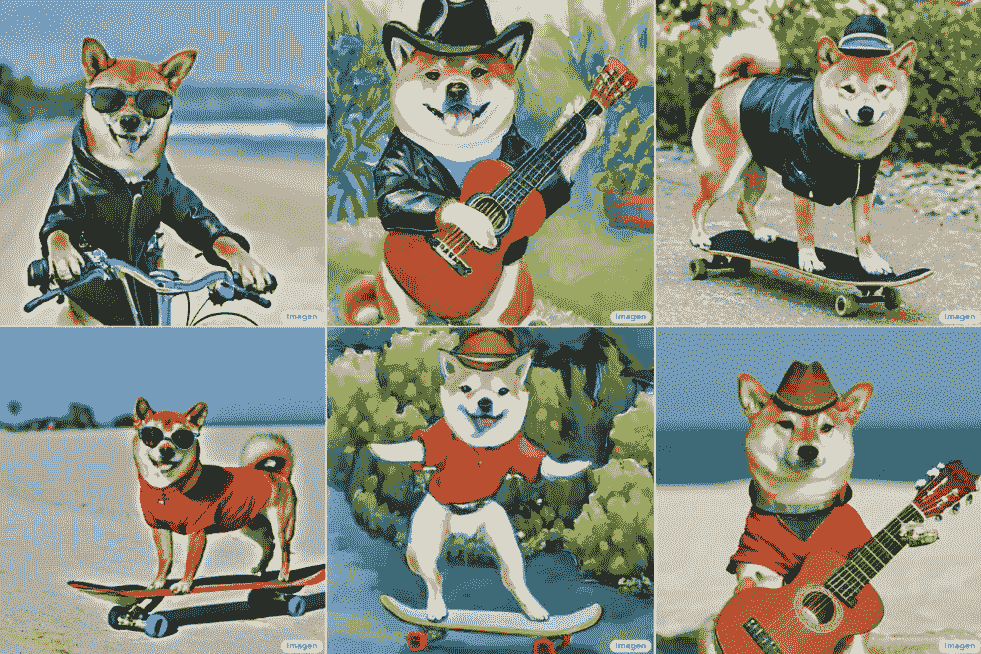

# 来看看谷歌的文本到图像人工智能生成器 Imagen

> 原文：<https://medium.com/codex/meet-imagen-the-googles-text-to-image-ai-generator-2b14deca46fe?source=collection_archive---------5----------------------->

## 谷歌吹嘘其文本到图像的人工智能提供了“无与伦比的照片真实感”

谷歌研究

文本到图像生成器是人工智能领域的一个新的热门话题。

到目前为止，该领域的领导者一直是 DALL-E，这是一款由商业人工智能实验室 OpenAI 开发的软件(4 月刚刚更新)。