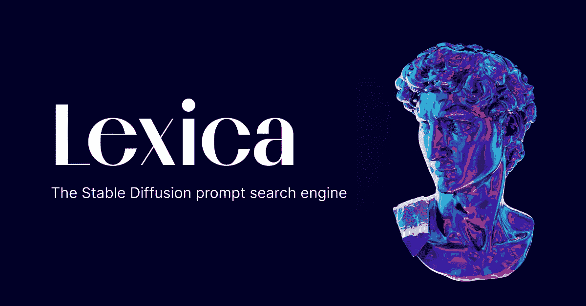

# 见见 Lexica:一个人工智能生成图像的大规模数据库——包括提示

> 原文：<https://medium.com/codex/meet-lexica-a-massive-database-of-ai-generated-images-including-prompts-24fa73028bd2?source=collection_archive---------0----------------------->

稳定扩散的字典图像数据库

如果你正在为你的下一个人工智能生成的艺术作品寻找灵感，你应该看看这个名为 [Lexica](https://lexica.art/) 的网站。

这是一个超过 500 万张[稳定扩散](/codex/stable-diffusion-finally-released-to-the-public-db1aa417d85b)图像的大集合，包括它的文本提示。

这个网络应用程序非常简单和整洁，有一个简单的不和谐链接，一个搜索框，和…