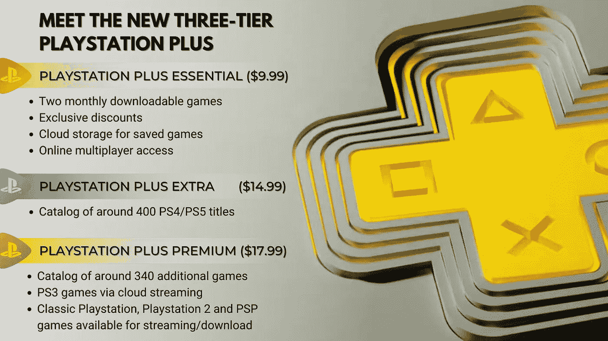
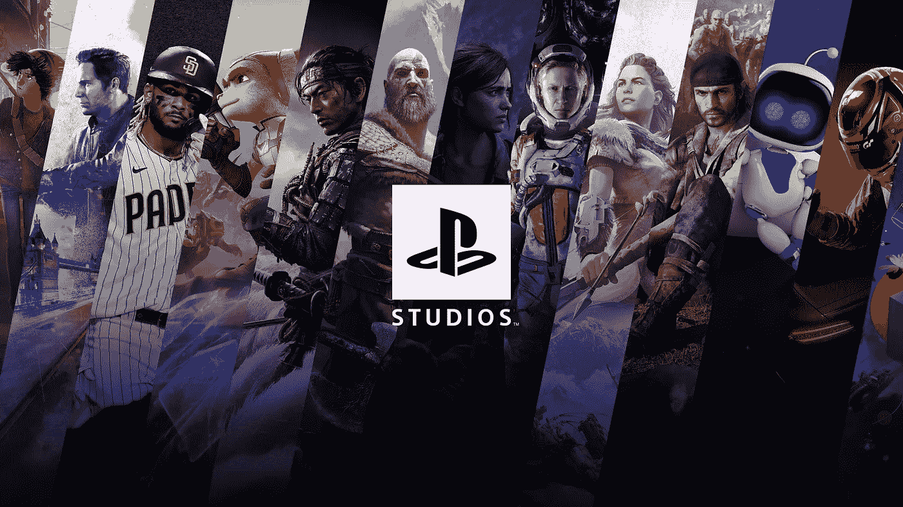

# 了解索尼新的三层 PlayStation Plus 服务

> 原文：<https://medium.com/codex/meet-sonys-new-three-tier-playstation-plus-service-bf59f3671f58?source=collection_archive---------12----------------------->

## PlayStation Plus 基础版、附加版和高级版将于今年 6 月发布

来源:图片由作者创作。

在传言索尼将反击微软的 Xbox 游戏通行证服务后，日本巨人终于亮出了底牌。

索尼承诺推出超过 700 款游戏，其决定合并 PlayStation Plus 和 PlayStation Now 流媒体服务并不令人惊讶。PlayStation Plus 的新三层方法是 PlayStation 5 制造商对微软[40 亿美元](https://www.businessinsider.in/tech/news/microsoft-is-quietly-bringing-in-billions-from-its-netflix-like-game-pass-service-as-subscribers-top-25-million/articleshow/88983470.cms#:~:text=With%20a%20minimum%20subscription%20price,between%20now%20and%20January%202023.)订阅基数的回应。虽然你不能像游戏通行证订阅一样选择加入一美元，但请放心，这只是一个开始。

PlayStation Plus 的每个新层级都达到了不同的价位，同时提供了可观的价值。

## PlayStation Plus 基本版

PlayStation Plus 的普通用户被聚集到 Plus Essential 服务中，其产品和价格保持不变，每月 9.99 美元。基本订阅可以让 PlayStation 所有者获得独家商店折扣，同时免费获得两个每月可下载的游戏。再加上用于游戏保存和在线多人游戏的云存储，很明显这里没有什么变化。

额外和高级订阅是值得你注意的。

来源:PlayStation。

## PlayStation Plus Extra

这一层每月 14.99 美元，与微软的 Xbox 游戏 Pass Ultimate 一样贵，后者捆绑了其在线 Xbox Gold 组件、250+ PC 和 400+ Xbox 游戏，以及其云流媒体服务。除了 Plus 基本的额外津贴，PlayStation Plus Extra 还为玩家提供了 400 多种游戏，既有来自索尼的第一方游戏，也有第三方产品。

虽然微软承诺第一天发布订阅，索尼尚未承诺同样的。

这不是苹果之间的比较，因为索尼尚未发布 PlayStation Plus 额外游戏的详尽列表。以下是索尼承诺通过额外订阅提供的一些图书:

*   死亡搁浅
*   战神
*   漫威的蜘蛛侠
*   漫威的蜘蛛侠:迈尔斯·莫拉莱斯
*   真人快打 11
*   退货

## PlayStation Plus Premium

其中最贵的是 PlayStation Plus 高级订阅服务，PlayStation 用户每月需支付 17.99 美元。Plus Premium 为玩家提供了 Plus Essential 和 Plus Extra 订阅的好处，还有一个奖励:复古游戏。

来自 PlayStation 令人羡慕的遗产的 340 个游戏没有什么可嘲笑的。

从 PlayStation、PlayStation 2 和 PSP 中选择的游戏将可以下载和/或播放，而 PlayStation 3 游戏将仅限于索尼的云播放。对于不支持游戏流媒体的市场，索尼计划提供 PlayStation Plus Deluxe。除了云流媒体之外，这种更便宜的产品承诺了除高级产品之外的一切。

这意味着你仍然会得到那些复古的游戏，只是没有 PlayStation 3 的种类。

来源:Videogichi。

## PlayStation Plus 新的额外和高级层级看起来很有前景

索尼承诺首先在亚洲进行 PlayStation Plus 改造，然后是北美、欧洲和世界其他地区。请记住，这些层级最初将在目前支持 PlayStation 网络的地方提供。除了将云服务扩展到新市场，索尼还希望在 2022 年上半年结束前覆盖大部分用户群。

微软不再是唯一一家提供订阅服务的游戏机制造商。

但在索尼列出将在其服务中推出的游戏之前，人们不能真正开始绘制 PlayStation Plus 和 Xbox Game Pass 之间的对比图表。在那之前，可以有把握地说，日本的产品将改变视频游戏行业的动态。

随着微软和索尼都提供订阅服务，游戏开发商将不得不重新思考一切，从赚钱到他们热爱的劳动的内容和功能。但是竞争对消费者来说是好事。争夺你钱包的公司将确保你不会吃亏。

我希望这也适用于游戏工作室。