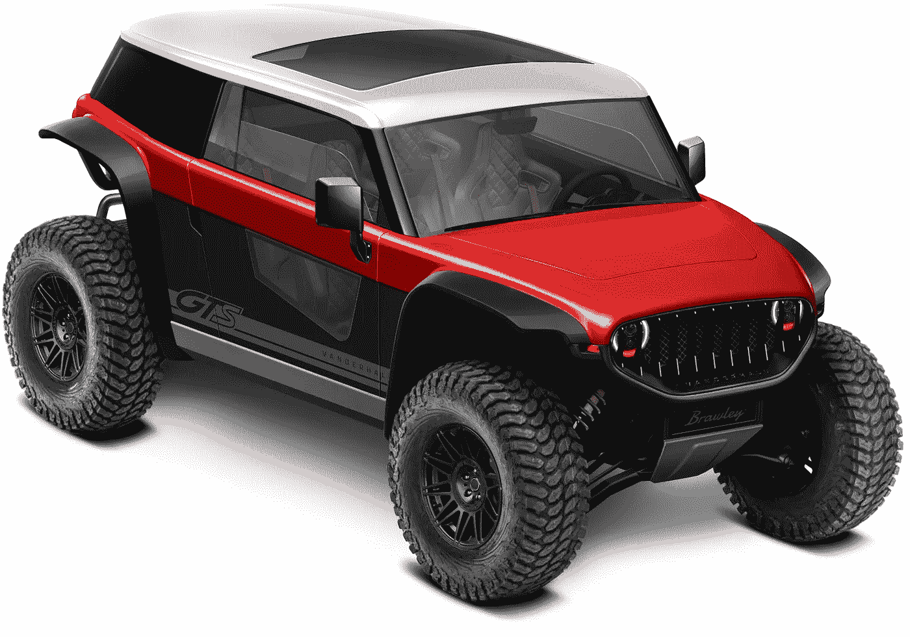

# 迎接布劳利电动越野车！

> 原文：<https://medium.com/codex/meet-the-brawley-electric-off-road-vehicle-3c9c6dffbb39?source=collection_archive---------5----------------------->

## 范德霍尔带来了支持这个名字的力量！

[布劳利(范德霍尔汽车厂媒体)](https://vanderhallusa.com/wp-content/uploads/2022/01/UTV-B-scaled-flares-brawley-gloss-fenders.jpg)

先从这款越野车的名字说起，Brawley。它立刻让人想起一辆内部有争斗的破旧汽车。一个四轮的寻求刺激的人，准备好处理任何抛给它的任务。除此之外，你还能如何描述一辆配备了电子坦克模式的汽车？*(稍后详细介绍)*