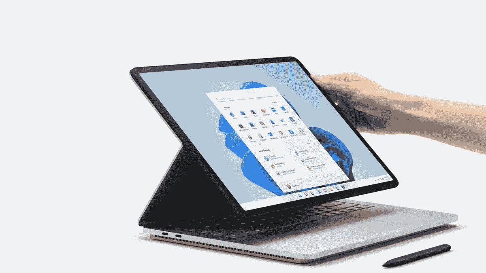
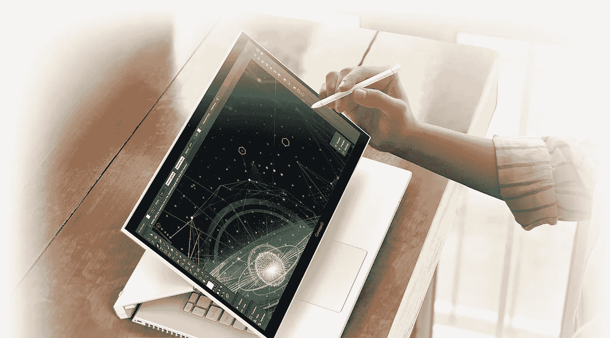
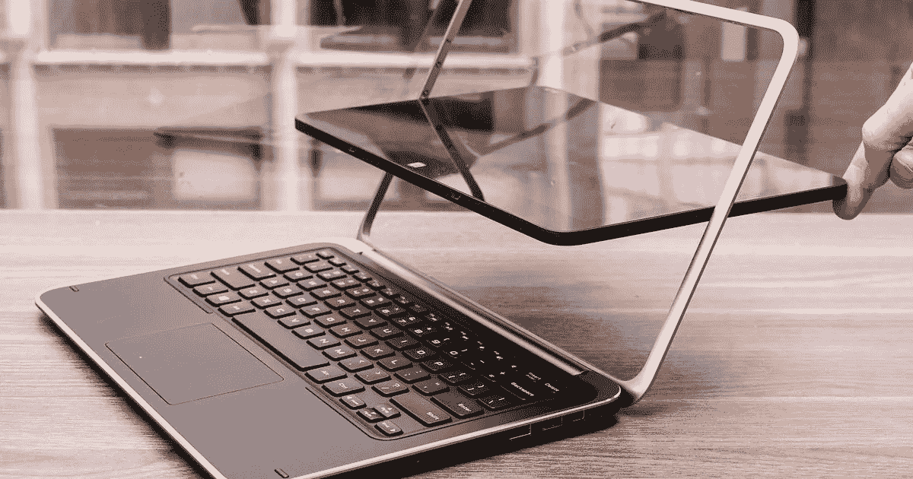
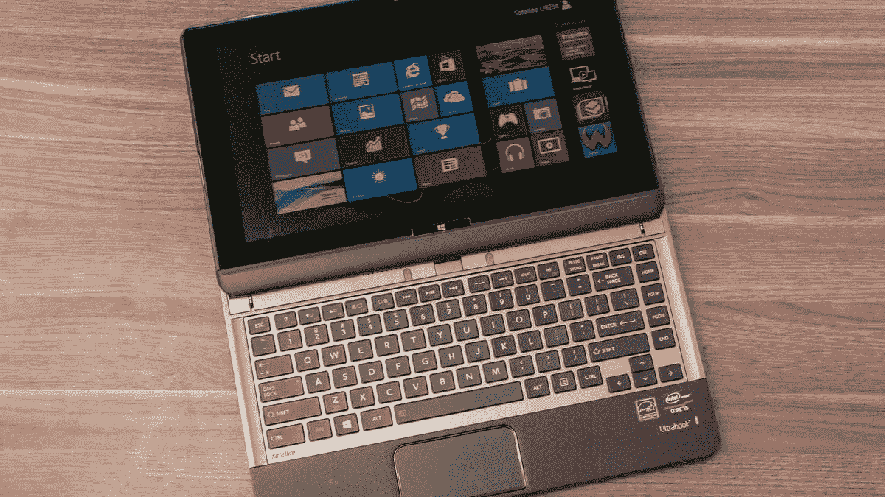
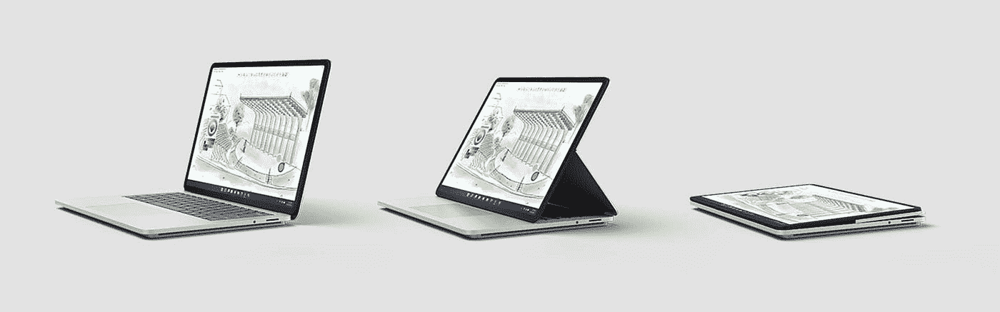

# 认识激发微软笔记本工作室灵感的笔记本电脑

> 原文：<https://medium.com/codex/meet-the-laptops-that-inspired-microsofts-laptop-studio-88ad43787ac5?source=collection_archive---------1----------------------->

## 古怪的设计在 Windows 家族中流行

来源:微软。

笔记本电脑工作室的展示让我思绪万千。

在微软多年来最有趣的展示中， [Surface Laptop 工作室成为了焦点。早期 Surface Books 的可拆卸底座被替换成了方便的旋转装置。撇开冷却垫式美学不谈，微软的旗舰笔记本电脑已经接受了相当大的调整。](https://www.microsoft.com/en-in/surface/devices/surface-laptop-studio?activetab=overview)

微软并没有抢先一步。

甚至在 Windows 8 承诺你可以触摸的未来之前，笔记本电脑制造商就已经在修补奇异的铰链了。宏碁和华硕因偏离传统笔记本电脑而臭名昭著。他们的努力没有像[微软的 Surface](https://www.forbes.com/sites/ewanspence/2020/01/30/microsoft-surface-quarterly-results-revenue-income-success-apple-macbook-pro/?sh=3e65c0976471) 那样创造出新的产品类别。

但是他们激发了雷德蒙巨人的最大潜能。

这里有几台笔记本电脑，它们的铰链既提高了价格，也令人惊讶。

认识一下宏碁强大的 ConceptD 7 Ezel。来源:宏碁。

## **宏碁的**[**ConceptD 7 Ezel**](https://www.acer.com/ac/en/US/content/conceptd-series/conceptd7ezel)**尺寸变大，显卡咕噜咕噜**

虽然苗条的皮革包裹的惠普 Spectre Folio 是笔记本电脑工作室的近亲，但宏碁走得更远。ConceptD 7 Ezel 将 RTX 3080 和六核英特尔处理器集成在一个合理的框架中，以完成渲染任务。虽然便携式工作室级电脑令人印象深刻，但宏碁第一次就没有做对。

2013 年，[宏碁 Aspire R7 的](https://www.cnet.com/reviews/acer-aspire-r7-review/)铰链与其说是牛逼，不如说是笨拙。

这款笔记本电脑的触摸板位置奇特，平板模式也不完美，没有达到宏碁的目标。虽然他们确实尝试了一些新东西，但宏碁花了几年时间才真正找到 Ezel 系列的立足点。但是宏碁并不是唯一一个像汉堡肉饼一样翻转屏幕的公司。

索尼的 [Vaio Duo 11](https://www.notebookcheck.net/Sony-Vaio-Duo-11-SV-D1121Q2EB.89121.0.html) 在 Surface Pro 的足迹上完成了同样的任务。

戴尔也参与其中。

戴尔 XPS 12 将平板电脑偷偷放在笔记本电脑的框架上。来源:CNet。

## **戴尔的** [**XPS 12**](https://www.cnet.com/reviews/dell-xps-12-review/) **采用了不同的路线:从两侧旋转**

凭借坚固的金属框架和大胆的设计方法，戴尔在 2012 年试图撼动笔记本电脑市场。片剂部分可以旋转 180 度以形成相当大的片剂。难怪传统的笔记本电脑模式最终成为 XPS 12 的强项。

华硕 Taichi 21 采用了双屏三明治来实现同样的效果。

虽然现在连[手机](https://www.gsmarena.com/xiaomi_mi_11_ultra-10737.php)都有带第二块屏幕的大猩猩玻璃盖，但华硕在 2013 年推出这款手机值得称赞。太极 21 又一次变成了一个看起来像笔记本电脑的笨重平板电脑。更糟糕的是，里面的屏幕不支持触摸。

笔记本电脑上的键盘滑块？东芝实现了这一点。来源:CNet。

## **东芝的** [**卫星 U925t**](https://www.cnet.com/reviews/toshiba-satellite-u925t-review/2/) **用一个键盘滑块渗出未来的乡愁**

今天的折叠手机模仿了过去的翻盖手机，具有讽刺意味的是，东芝的尝试走在了时代的前面。虽然东芝的滑动机制很笨重，但它让显示器在任何角度都保持稳固。撇开杂技不谈，这款笔记本电脑的粉丝和买家都很少。

毫不奇怪，这些笔记本电脑都没有发明新的类别。

这些努力获得的温和接待让我对 Surface Laptop Studio 的成功持怀疑态度。没错，微软的解决方案比之前的更优雅。但起价 1599 美元，他们并没有试图赢得所有人。

观看运行中的 Surface Laptop Studio。来源:微软。

## 微软的 halo 设备是为创造者设计的

虽然不是每个创作者都能负担得起，但笔记本工作室确实为自己提供了一个强有力的理由。强大的内部部件加上华丽的 120 Hz 显示屏，让苹果 Macbook 看起来很普通。但是人们喜欢平凡。

微软并不想分享苹果的那份馅饼。

相反，Surface 系列试图为笔记本电脑制造商设定一个基准。但就像谷歌的 Pixel 系列一样，它们很少与上述笔记本电脑制造商竞争。毕竟，微软花了很多年才接受 USB-C。

但这一次，笔记本电脑工作室重写了 Surface Book 的遗产。