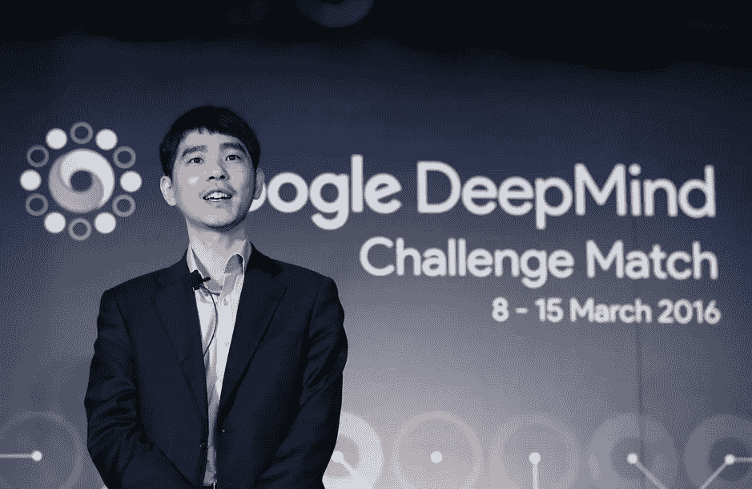
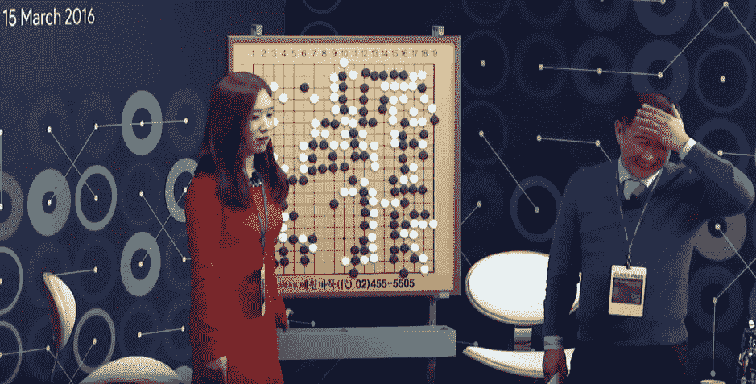
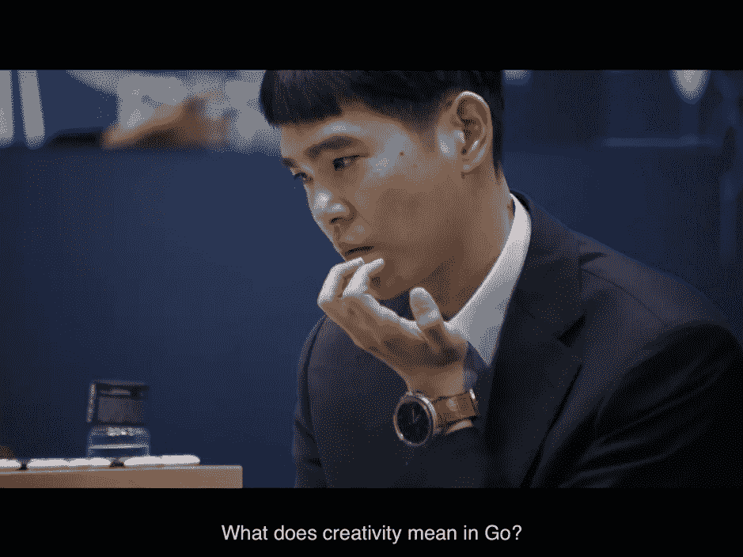

# AlphaGo vs Lee Sedol 的难忘比赛

> 原文：<https://medium.com/codex/memorable-match-between-alphago-vs-lee-sedol-d32038750579?source=collection_archive---------2----------------------->

## 如何看待“人工智能”的一个提示

谷歌深度思维挑战赛围棋大师李时斗

**以前不知道围棋，现在仍然不知道**

当我回顾从小学到初中和高中的时光，我记得我做了很多课外活动，感谢我的父母。

进小学之前就开始学钢琴，跆拳道，滑冰等东西。我上小学以后，每年都打网球，乒乓球，去滑雪，做美术。虽然由于我的天赋不足，他们都不能达到专业水平，但我认为我仍然对音乐和艺术感兴趣，因为我童年的经历。

我的很多朋友都下围棋和中国象棋。但是我没有靠近他们。特别是在围棋方面，我记得它被认为是只有“天才”才会做的事情，我的父母从未建议我学习围棋。也许他们对我的身体健康更感兴趣。

在大学期间，我经常看到许多高年级学生、同龄人和低年级学生聚集在俱乐部房间里玩围棋。即使在那个时候，我也从未想过自己下围棋。

从那以后，我脑海中出现的唯一关于围棋的事情就是世界著名的韩国围棋大师的名字，比如新闻和报纸上的赵勋铉和李昌镐。围棋从未比表面水平更能引起我的注意。

然而，比我想的更多的是，‘围棋’是韩国人熟悉的文化。根据 2016 年韩国盖洛普调查，近 1000 万韩国人表示他们知道如何玩围棋。80%的韩国人认为围棋对他们的孩子来说是一项有益的教育活动。在日常对话中，人们经常把生活和工作中的情况比作围棋。有相当多的围棋术语被用在诗歌术语中，如“replay”、“putting flags”、“Jeongseok”表示最佳实践，“Jachungsu”表示将自己逼入困境，“Daemabulpae”表示“太大而不能倒”，等等。

**2016 年 AlphaGo vs Lee Sedol 的围棋对决**

韩国是少数几个围棋流行的国家之一，对韩国人来说，2016 年 3 月 AlphaGo 和李世石(Lee Sedol)之间的比赛(正式名称为“谷歌深度思维挑战赛”)是一场激动人心的比赛，从“自信”和“好奇”开始，到“震惊”和“困惑”结束。

围棋评论员对 Alphago vs Lee Sedol 比赛的复杂情绪

当时我已经对“人工智能”这个话题很感兴趣了，尽管它充其量只是肤浅的。我饶有兴趣地看完了整场比赛。

在从第一场到第三场令人震惊的三连败后，大师 Lee Sedol 最终以第 78 石赢得了胜利，许多人将其称为“上帝之举”。(赛后，当李·塞多尔大师被问及搬家的原因时，他说:“除了那次搬家，我别无选择。”后来，在 2019 年 11 月宣布退出职业围棋生涯后的一次采访中，他说，“如果反应正确，它就不会工作，所以我仍然认为它是 AlphaGo 中的一个 bug，就像中国 AI Jeol-Ye 中的一个 bug。”)李·塞多大师的这场胜利仍然是人类战胜 AlphaGo 的唯一胜利。最后一局，AlphaGo 和李大师激烈交战，但比赛以李大师的落败而告终。

在人工智能与人类的历史性比赛以人工智能戏剧性的 4-1 获胜后，媒体和专家对这场比赛的意义提出了各种各样的意见。

迄今为止，它已经成为人工智能发展史上值得记录的事件，也是人们在谈论人工智能时最常提及的话题。

**对艾的态度，从围棋高手那里学来的**

我碰巧看了一部关于网飞的名为《AlphaGo》的纪录片。看了这部纪录片，我对 AI AlphaGo 战胜人类 Lee Sedol 意味着什么，以及如何接受未来 AI 与人类的关系有了一个认识。正是来自于李塞多尔大师在完成第五场后接受纪录片制作人采访时留下的评论。

在第二场比赛中，Alphago 下了 37 石后，大师 Lee Sedol 陷入了沉思

“(我对 AlphaGo 的 37 号石的印象是这样的。)我以为 Alphago 只是一台为获胜做概率计算的机器。但是，当我看到那个动作的时候，我意识到我错了。AlphaGo 的创造力很强。这是一个非常有创意的举动，真正表达了围棋的美妙之处。”

“令人惊讶的是，毕竟，我们认为我们拥有的创造力实际上被封闭在某种框架中。AlphaGo 可能会给围棋界带来重大变化。我认为通过这次经历，我变得更加成熟了。我会把它整理出来，这样我就可以在未来对它进行更多的开发。这是一次难忘的经历，感觉我(新)找到了(与 Alphago 的一场比赛后)下围棋的理由，并且更进一步，我选择围棋作为职业真的是一件好事。”。

在 Alphago 和 Lee Sedol 大师的比赛之后，许多关于结果以及人工智能和人类未来的分析文章以相当反乌托邦的语气呼吁人工智能将在“人机对抗”的框架中取代人类的位置，或者一些人以更安慰的语气呼吁人工智能不会压倒人类，但指望李大师的一场胜利。然而，可以被称为这场比赛的'失败者'的李时斗的话给了我巨大的震撼和兴奋。

以我对科技史的浅薄见识，我相信技术是朝着通过打破人类的身心束缚来增加人类繁荣可能性的方向发展的。技术通过 18 世纪的第一次工业革命和 19 世纪的第二次工业革命延伸了人类的体力。毫不夸张地说，通过第三次工业革命和 20 世纪以来众多新技术的发展，人类体力和智力的极限得到了极大的扩展。但公平地说，在此之前，技术所扩展的智力主要是在基于人类定义的规则的任务自动化领域。

Lee Sedol 大师正在通过与 Alphago 的比赛教导我们，与过去的任何其他技术不同，人工智能可以让我们有机会在预测、判断和创造力领域学习超越我们极限的新观点，这些领域一直被认为是人类独有的。1997 年，当国际象棋冠军加里·卡斯帕罗夫被 IBM 的“深蓝”击败时，大多数人认为在围棋上“机器赢不了人类”。我知道 AlphaGo 的胜利标志着第一种真正与人类“合作”的技术的出现，以便在人类的经验和限制之外给我们新的教导。

加里·卡斯帕罗夫说，“一个优秀的人类加上一台机器是最好的组合。”2016 年 3 月，AlphaGo 的第 37 颗石头带来了 Lee Sedol 的第 78 颗，这场比赛再次让 Lee Sedol 大师思考围棋比赛的新角度和视野。我真的很期待我们所有人都有类似李大师在人工智能方面的经历。

附注:我建议你查看以下内容:

[*人工智能的一步棋为人类树立了另一个起点*](https://www.sedaily.com/NewsView/1YXV1BGB0K?fbclid=IwAR0u1BmCWZA2c5603lQpbx5JPIuyQ0SFuwj2b7sehXIMi3d1lJUWldVKpv8) 我的朋友、首尔国立科技大学科技史教授 Choi Hyung-seop 写的一篇关于 AlphaGo 与 Lee Sedol 的文章。

[*不惧怕智能机器。和他们一起工作*](https://www.ted.com/talks/garry_kasparov_don_t_fear_intelligent_machines_work_with_them#t-903689) 加里·卡斯帕罗夫在 TED Talk 上的演讲

alpha goalpha go 与李世石对决的纪录片