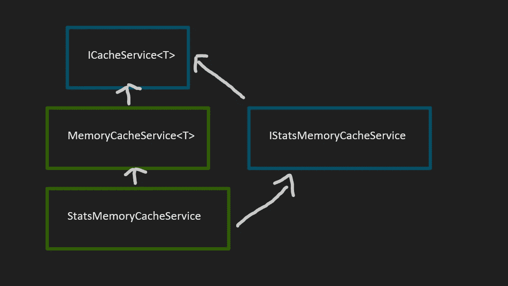
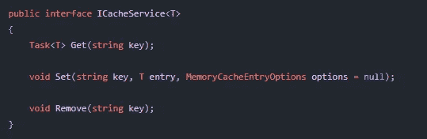
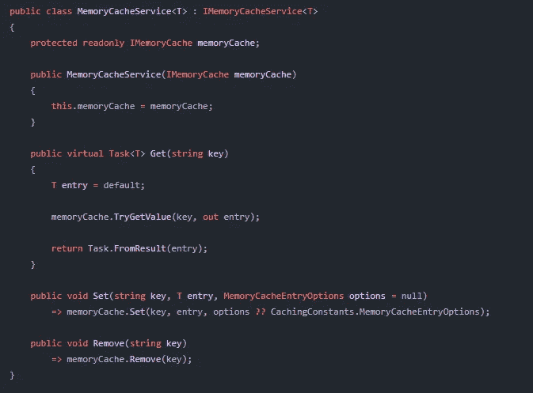
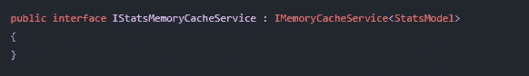
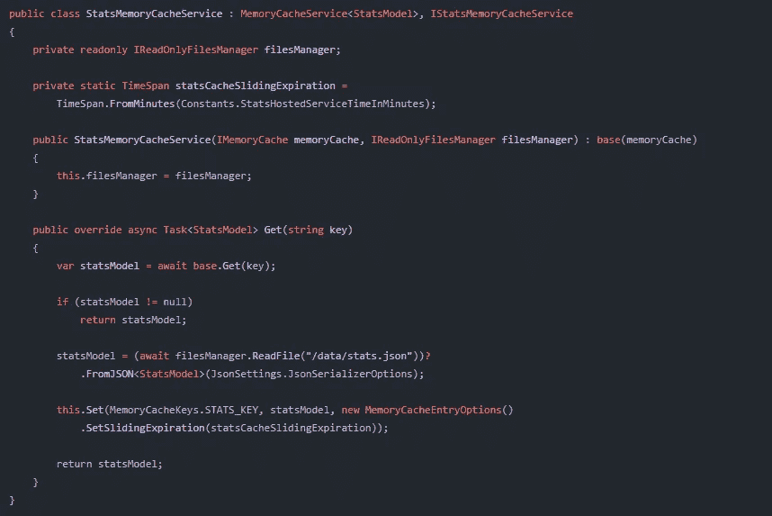
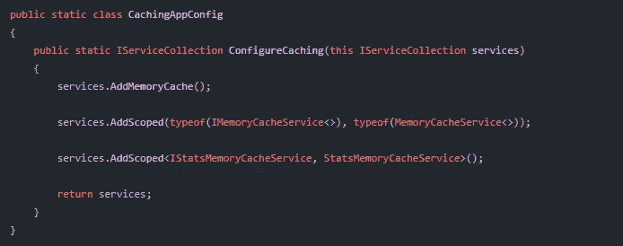

# 内存缓存输入。网络核心

> 原文：<https://medium.com/codex/memory-cache-in-net-core-c647379bafb?source=collection_archive---------0----------------------->

如何使用内存缓存的实用指南？网络核心应用

# 为什么要使用内存缓存？

我的假设是一个事实，我们中的大多数人——开发人员——不得不从外部资源读取一些数据。数据库、云存储或 API 过于频繁——数据几乎总是相同的。我必须诚实地承认，在许多情况下，我并不关心那个问题——毕竟，没有足够的数据来使它工作得不够快。🤔

这是一个非常短视的观点，因为我们不能假设在我们的应用程序中，未来不会有越来越多的数据需要获取，也不会有更多的用户“触发”过多读取外部数据源的事件。

内存缓存允许我们在应用程序的内存中存储一些变化很小的数据，并使得快速读取它们成为可能。我们把快速阅读归功于缓存使用的数据结构——字典(键值对集合)。此外，缓存从应用程序内存读取数据，而不是从外部来源读取数据——它总是比第二种方式更快。

# 理论结束，实施的时间到了

我将介绍我自己在。NET Core app。当然，实现总是依赖于需求，所以这只是某种如何实现的指南。

**我们使用的简单架构:**

蓝框—接口，绿框—类别

我们的基本抽象是 ICacheService 接口。它包含可以被任何其他类型(简单或复杂)替换的通用参数。

ICacheService 接口

它提供了三种基本的缓存操作:读、写和删除。异步读取数据很好，所以 Get 方法是任务的类型。

现在我们将准备实现 ICacheService 接口的 MemoryCacheService 类。该服务包含所有三种方法的默认实现:

MemoryCacheService 类

**A 使用我们还要补充:*使用微软。Extensions . Caching.Memory***

下面，我将描述每一种方法:

*   **Get** —读取存储在指定键下的值(缓存数据的名称，字符串类型)。如果指定的键不存在，返回 T 类型等的默认值。对于 integer，它将是 0，对于复杂的类模型，它就是 null。我将此方法标记为虚拟的，因为我想在自定义内存缓存服务实现中覆盖它。
*   **设置** —设置新的缓存条目或重写现有条目。如果我们想创建一个新条目，唯一的字符串键是必要的。此外，我们可以提供一些定制的 MemoryCacheEntryOptions。我为应用程序中的每个缓存对象使用默认设置，但当然我们可以覆盖 Set 方法中的第三个参数，并为每个条目提供自定义设置！
*   **移除** —移除缓存的对象及其关键字。

# 让我们创建自定义实现！

现在，我们能够扩展我们的基本实现并创建定制的 MemoryCacheService，它可以包含指定模型的更多逻辑。

在我的例子中，一些游戏服务器的统计数据被读取得太频繁了，所以我决定使用内存缓存并将这些数据存储在其中。

我从创建空的自定义接口开始，它继承了 base one。现在，我可以扩展基本功能，并只为指定的 StatsModel 类型添加一些方法。

空 IStatsMemoryCacheService

现在，看一下实现:

自定义 StatsMemoryCacheService 类

几乎所有的东西都以和基本类一样的方式使用，Set 和 Remove 方法完全一样。我唯一做的就是重写了 Get 方法。

首先，我试图找到我的缓存值，如果键不存在——从文件中获取统计数据并覆盖内存缓存条目。此外，我还使用滑动到期选项覆盖了内存缓存条目选项——我将在后面谈到这一点。

# 在应用程序中注册内存缓存服务

我们必须做的最后一件事是在 DI 容器中注册我们的内存缓存服务，以便将它们注入到我们的应用程序中。

我创建了一个简单的静态类，它扩展了 IServiceCollection:

现在，在启动时使用:

瞧，现在我们可以在我们想要的地方注入我们的内存缓存了！😎

# MemoryCacheEntryOptions 呢？

MemoryCacheEntryOptions 有一些设置可以使用，但我想描述一下最重要的设置:

*   滑动呼气
*   绝对呼气

长话短说，如果必须在一段时间后自动清空缓存，绝对过期是更好的选择。在滑动过期的情况下，内存缓存可以在指定的时间后被删除，但如果缓存被经常读取，它将不会被清除！在这种情况下，如果我们想在这段时间后刷新数据，我们可能会失望。(当然，我们仍然能够覆盖现有条目，但是旧值不会被清除，直到我们覆盖它们为止)😕。

# 结论

如果我们必须处理外部数据源，内存缓存是开发人员手中非常有用的工具。它加速并提高了我们应用的可扩展性。

我热情地鼓励您阅读关于内存缓存及其选项的 MS 文档:[ASP.NET 核心中的内存缓存|微软文档](https://docs.microsoft.com/en-us/aspnet/core/performance/caching/memory?view=aspnetcore-5.0)。

感谢您的阅读，祝您愉快，让代码与您同在！💻 ⌨️ 🖥