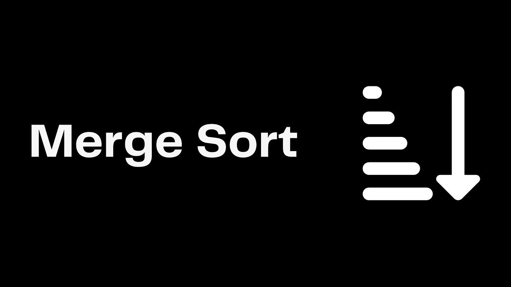
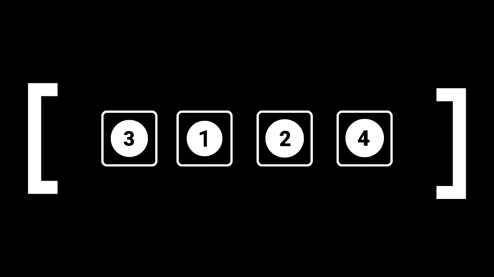
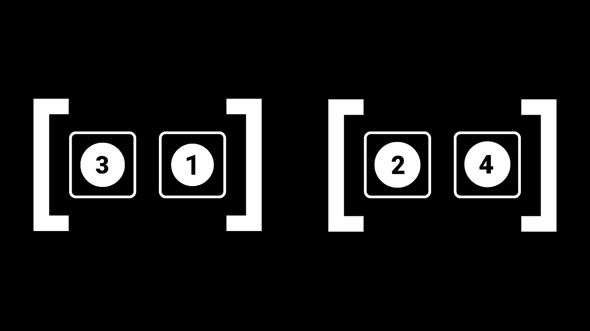
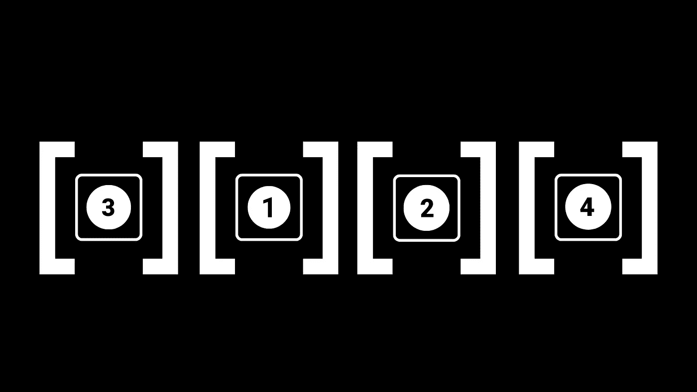
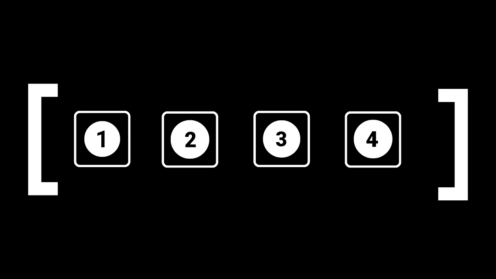
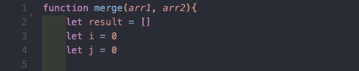
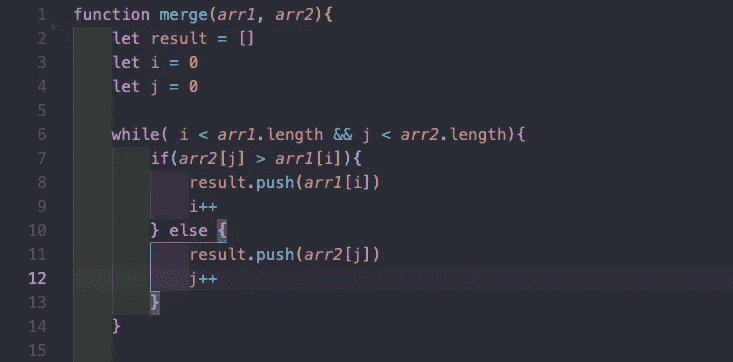
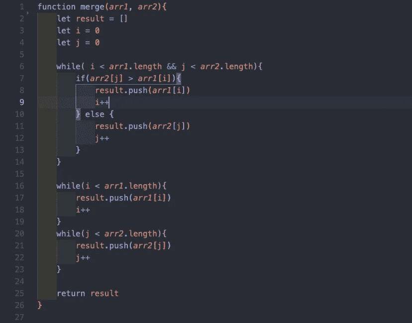
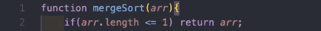
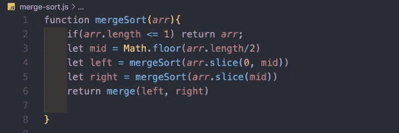

# 合并排序:逐行分解

> 原文：<https://medium.com/codex/merge-sort-broken-down-line-by-line-44361ae90c18?source=collection_archive---------4----------------------->

## [法典](http://medium.com/codex)



**简介**

大多数第一次学习算法的开发人员可能会在合并排序中遇到第一个算法障碍。合并排序不同于更基本的排序算法，因为它既需要一个帮助函数，又需要很好地理解递归。所以在本教程中，我会给你一行一行的分析，这样你就可以很好地掌握一个最常见和最基本的排序算法。**注意:**如果你想复制代码跟随它在底部。

我们试图用合并排序来完成什么？

这个问题的答案似乎显而易见。当然，我们试图创建一个算法，将排序数组。但真正的问题是，合并排序如何从一个无序数字数组变成一个完美排序的数组？它利用了一个简单的事实来做到这一点。事实是一个元素或更少元素的所有数组都被排序。例如，如果你有下面的数组，你想做四个排序数组。你会怎么做？



你很可能会把每个数字放在它们自己的数组里。Merge Sort 做同样的事情，但是它把数组分成两半，直到它像这样到达那里:



现在我们有四个独立的完全排序的数组。归并排序的作用是将这四个排序后的数组，合并成一个完全排序后的数组。直到我们剩下这样的东西:



**编写合并函数**

现在，您已经对 Merge Sort 打算对我们的未排序数组做什么有了一些清晰的理解。我们现在必须看看算法的第一部分，也是最长的一部分。为了比较我们的数组，并把它们按正确的顺序放在一起，我们必须首先弄清楚如何合并它们。

我们要做的第一件事是定义一个合并函数，它接受两个数组，并将它们合并在一起。我们将一行一行地检查这个函数，这样你就能理解我所做的一切背后的推理。

第 1 行和第 2 行:我们首先定义一个空数组，我们将使用它作为我们的结果。

第 3–5 行:我们创建了两个计数器变量来帮助我们分别遍历数组。



第 6 行:我们定义了一个 while 循环，它将比较每个数组的项，并按顺序将它们推送到我们的结果数组中。在这一行中，我们一直这样做，直到我们的计数器变量等于两个数组的长度。

第 7–15 行:然后我们比较两个数组中的项目，并以正确的顺序将它们推送到结果数组中。之后，根据项目来自哪个数组，我们递增其各自的计数器变量。



你可能认为我们已经完成了合并函数，但是假设我们有两个这样的数组`[1,2] [3,4,5,6,7,8]`。我们的结果数组将只有[1，2],因为我们的计数器变量将我们从循环中分离出来。因此，我们必须创建一个方法，将第二个数组的元素推入结果数组。



第 16–25 行:我们现在通过创建两个 while 循环来结束我们的函数。这两个函数都查看每个计数器变量，并将数组中尚未完全迭代的其余元素推送到结果数组中。

**合并排序功能**

既然我们有了合并事物的方法，我们现在可以创建合并排序函数。这个函数只有 5 行，但是每一行都非常重要，所以我一定会为你分解每一行。

第 1–2 行:在第一行，我们建立了递归中的基本情况。因为我们将数组分解为单个元素的数组，所以我们知道当它们最多只有一个元素的时候就返回它们。如果您回想一下前面的内容，包含一个项目的数组总是被排序的。



第 3 行:现在我们有了基础案例，我们需要建立一种方法来找到数组的中间，这样我们就可以开始把它分成两半。我们通过将数组的长度除以 2 并使用`Math.floor`将其向下舍入来实现。


第 4 行:现在事情开始变得棘手了。我建议复制代码并逐步完成每个递归步骤。如你所知，Merge Sort 把数组分解成单个的数组，然后把所有的数组合并到一起。在这里，我们分割数组的左边，直到我们得到左边的单个数组。

第 5 行:我们正在做和最后一行一样的事情，但是是在右边。

第 6 行:这里是所有东西汇集的地方。这一行之前的两行给出了我们的单项数组。现在我们使用合并函数来合并它们。假设我们有 4 个单项数组。调用 merge 后，我们将有两个排序后的数组，然后我们将再次调用 merge，这将最终给我们排序后的数组。**注意:**这一步很难，所以我建议你多走几遍，以了解到底发生了什么。



**代码**

```
function merge(arr1, arr2){
 let result = []
 let i = 0
 let j = 0

 while( i < arr1.length && j < arr2.length){
  if(arr2[j] > arr1[i]){
   result.push(arr1[i])
   i++
   } else {
   result.push(arr2[j])
   j++
   }
 }

 while(i < arr1.length){
   result.push(arr1[i])
   i++
  }
 while(j < arr2.length){
   result.push(arr2[j])
   j++
  }

 return result
}function mergeSort(arr){
 if(arr.length <= 1) return arr;
 let mid = Math.floor(arr.length/2)
 let left = mergeSort(arr.slice(0, mid))
 let right = mergeSort(arr.slice(mid))
 return merge(left, right)

}
```

**结论**

就是这样！您现在已经理解了 Merge Sort 中的每一行是做什么的，以及如何编写它。恭喜你，祝你面试好运！