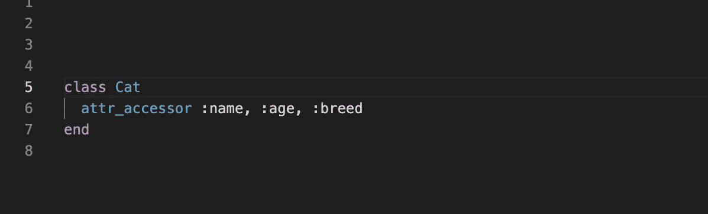
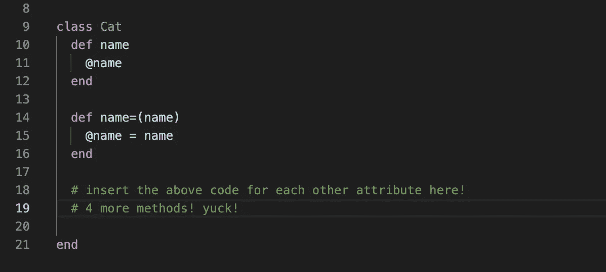
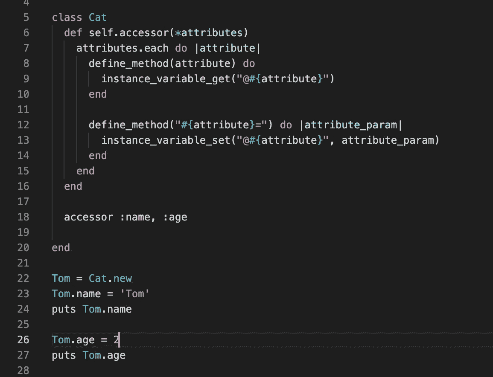
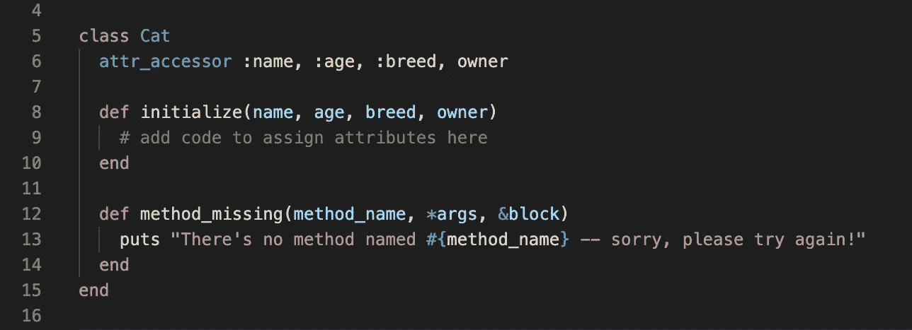
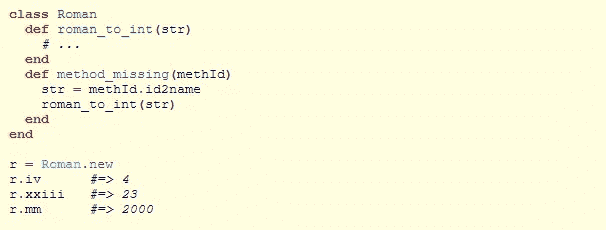
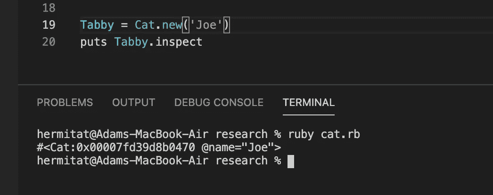
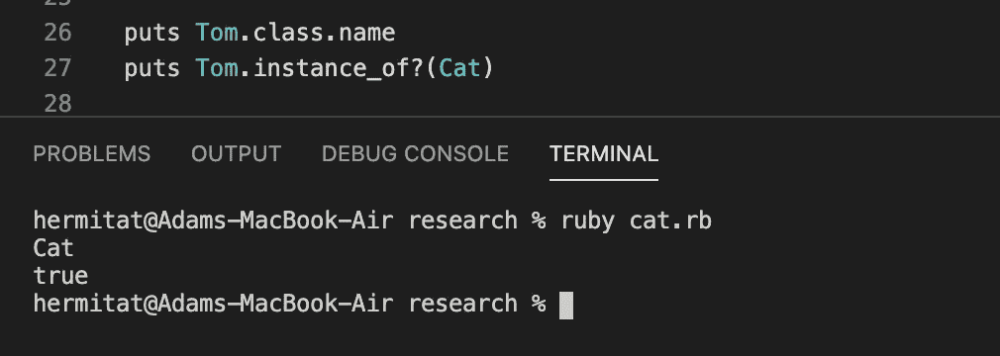
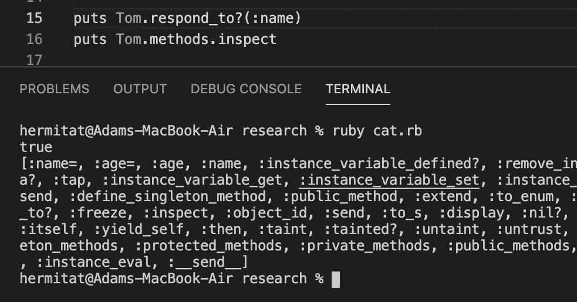

# Ruby 中的元编程

> 原文：<https://medium.com/codex/meta-programming-in-ruby-87afa97db59e?source=collection_archive---------2----------------------->

## [法典](https://medium.com/codex)

术语元编程可以翻译成*自引用编程*，它描述了可以读取、生成、分析和转换自身或另一个编程的编程。在 Ruby 中，这个概念及其应用通常被描述为该语言在运行时动态定义和重定义方法和类的能力，但它并不局限于这种实现。这种在运行时定义方法和转换程序的能力使我们能够编写避免重复且通常可重用的动态代码。Ruby 中处处都在使用元编程，理解 Ruby 如何使用元编程来创建更简洁的代码的核心概念是成为一名更自信、更全面的 Ruby 开发人员的重要组成部分。通过使用一些编码示例，我希望简化元编程，并揭示使用 Ruby on Rails 时所发生的“魔力”。

# 获取和设置:引擎盖下

Ruby on Rails 让开发人员可以访问充满方法和常量的模块，这些方法由 Rails 提供支持，通常是幕后开发人员工作的所谓“魔力”的来源。方法 **attr_reader** 、 **attr_writer** 和一个名为 **attr_accessor** 的方法既做 reader 方法的工作，也做 writer 方法的工作，这在最基本的 Ruby 应用程序中很常见。这些方法只占用单行代码，并允许用户访问与给定类相关联的已定义属性变量。

图一

在图 1 的*中，变量 name、age 和 breed 作为参数传递给 Cat 类的每个新实例的方法 **attr_accessor** 。这个方法在幕后做什么是不可见的，但是在实践中，这个方法调用使类能够访问实例变量，这些变量是以传递给它的属性和用于“获取”和“设置”这些变量的相应方法命名的。在*图 2* 中，我们可以看到如果我们自己编写代码会是什么样子:*

图 2

attr_accessor 让我们不用写出那些定义，但是我们仍然不知道这个方法是如何为我们定义它们的。我们可以深入研究创建我们自己版本的 **attr_accessor** ，我们可能会进一步使用 Ruby 模块中可用的实用方法，比如 **define_method。**这个恰当命名的方法用于定义这些动态使用的方法。我们不会更深入，但是我们将能够对 **attr_accessor** 正在做什么有一些抽象的概念，遍历它传递的每个属性，并在运行时为它们定义‘setter’和‘getter’方法。*图 3* 显示了我们自己版本的 **attr_accessor** 方法，以 **instance_variable_get** 和 **instance_variable_set** 的形式使用了更多“神奇”的实用方法。这些方法允许我们获取和设置我们不知道名字的变量，这创建了一些非常动态的代码，可以在任何应用程序中使用。

图 3

图 3.5 ->图 3 的输出，显示姓名和年龄已经设置好，可以检索。

如*图 3.5* 中的输出所示，该函数与 **attr_accessor** 一样有效。即使不深入解释这些方法做什么的原始代码，我们也知道发生了什么，这要归功于我们使用的方法的名称。Ruby 是一种语言，其中许多方法的命名几乎完美地描述了它们的用途，比如 **define_method。它们可以很直观地与我们一起工作。我们只需浏览一下名称，就能找到适合手头任务的理想方法。这些方法中的大部分都是为了利用元编程在幕后生成代码行而设计的，这使得 Ruby 代码表面上看起来更加模块化、动态和简洁。**

# 全包桶

Ruby 为开发人员提供的另一个惊人的方法是 **method_missing** ，它用于路由任何在相关类中未定义的方法调用。未定义的方法调用，连同它们的参数和块，作为参数传递给 **method_missing** ，在这里我们可以定制和创建一个无所不包的处理程序。我们可以使用这种方法来优雅地打印这些方法调用的自定义错误，如下面的*图 4* 所示:

图 4

我们可以在 **method_missing** 中定义行为，改变我们的类对未定义方法的响应方式，而不是返回这个自定义错误。*图 5* 摘自 **method_missing** 的官方文档，其中给出了一个奇妙的例子，说明 **method_missing** 已经被定制为将罗马数字转换为整数。在这个实现中，开发人员不需要调用他们自己定义的 **roman_to_int** 方法，而是可以直接将未定义的方法作为参数传递给 **roman_to_int** 。我们使用另一个名为 **id2name，**的方法将该方法名转换成一个字符串，正如 **roman_to_int** 所要求的那样。然后，这个定制方法将翻译该字符串，如图 5 中的*所示，方法调用及其输出中的*:

图 5

在不使用 **method_missing** 的情况下，在我们的实例上调用未定义的方法会带来 *NoMethodError* ，声明我们试图调用的方法对于正在讨论的实例对象是未定义的。因此， **method_missing** 已经转换了这个类的预期行为，并允许我们调用未定义的方法。可以说这个功能太宽泛了，因为它没有考虑那些可能不能很好地转换成罗马数字的方法，所以这些包罗万象的技术的实现是有限制的。开发人员需要理解和考虑负面的可能性，并且至少在实现这些元编程方法之前处理它们。

# Ruby 中的内省

我们可以使用元编程来动态地改变我们的程序，但是我们也可以用更简单的方式来应用这个概念。在 Ruby 中，调用方法来帮助我们了解代码的做法被称为自省。在下面的*图 6* 中，调用 **inspect** 方法将会以可读的形式返回对象——名为“Joe”的 Cat 类的 Tabby 实例。

图 6

这个简单的动作，以及许多其他不转换我们代码的方法，仍然使用我们程序的状态来解析它们的动作，正因为如此，它们属于元编程的范畴。当调用像 **class.name** 这样的方法时，我们可以使用内省来确定某个东西是什么类型的类，它以字符串的形式返回类名。**实例 _ 的？**是一个方法，它接受一个类名作为参数，确定它所调用的实例对象是否是给定类名的实例。在*图 7* 中，我们看到了一些关于 Cat 类和 Tom 实例的进一步内省。这个例子揭示了元编程是多么简单。

图 7

利用这些内省的方法可以让我们对我们的程序有更好的理解。我们可以深入研究这些类，以确定关于它们有哪些可用方法的信息，例如 **methods.inspect.** 我们仍然使用 **inspect** 方法，但是指导检查显示与该类相关联的所有方法，在一个数组中返回。这种方法的结果并不总是以易读的形式返回，如图 8 中的*所示，因此并不总是建议将 **puts** 与这些方法一起使用。要检查一个类是否能响应给定的方法，我们可以使用 **respond_to？**它接受一个方法名作为参数，并根据该方法名是否为该类定义返回一个布尔值。同样，Ruby 中的大多数方法都有令人难以置信的直观名称，这使得我们在决定使用哪些方法时很容易。*

图 8

自省是一个惊人的概念，用来检查我们的程序和类的状态。这些方法在调试时会很有用，可以揭示程序中有哪些类、方法和实例变量可供我们使用。使用自省将有助于通过我们对程序及其组成部分的增强的知识来产生更干净的代码。

# 总结想法

理解可用方法的深度将有助于 Ruby 开发人员在实现他们的功能时编写更少的代码，因为我们使用单行代码提供的内置实用程序。即使对这些方法的理解只是抽象的，对每个方法调用期间将会发生什么有一些想法，并考虑预期的结果，将会改进我们处理 Ruby 代码的方式。提高我们识别程序将如何被读取、生成、分析或转换的能力将允许我们充分利用元编程。这看起来像是“魔法”在幕后发生，但我们只是利用了前几代 Ruby 开发者的工具和创新。我们可以利用这些工具和优势进一步推动创新，为我们之后的 Ruby 开发人员铺平道路。

在使用 Ruby 以及许多其他语言和框架进行开发时，元编程一直都在发生。当程序把它们自己的程序当作它们的数据时，我们可以创建在运行时自我转换的功能。编写极其动态和模块化的代码的能力允许重用，并允许开发人员将更多的时间花在进一步的功能上。具有这些特征的代码在技术行业中可以被认为是理想的，正是元编程允许这种理想的软件和代码存在。

感谢阅读！你是一块宝石！

**参考文献**:

https://apidock.com/ruby/BasicObject/method_missing

【https://ruby-doc.org/core-2.4.0/Module.html# 

[https://ruby-doc.org/core-2.5.0/NoMethodError.html](https://ruby-doc.org/core-2.5.0/NoMethodError.html)

[https://www . leighhalliday . com/ruby-introspection-元编程](https://www.leighhalliday.com/ruby-introspection-metaprogramming)

[https://ruby monk . com/learning/books/2-元编程-ruby/chapters/32-元编程入门/lessons/75-being-meta # solution 3969](https://rubymonk.com/learning/books/2-metaprogramming-ruby/chapters/32-introduction-to-metaprogramming/lessons/75-being-meta#solution3969)

[https://dev . to/aurangzaibdanial/meta programming-with-ruby-468 e](https://dev.to/aurangzaibdanial/metaprogramming-with-ruby-468e)