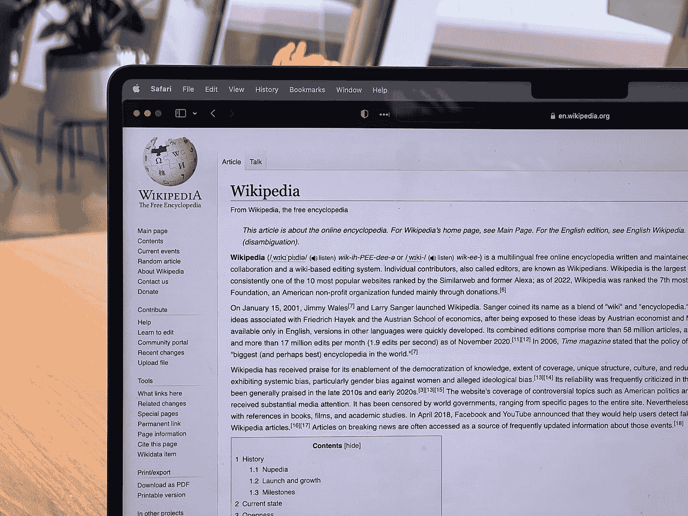

# Meta 想取代维基百科

> 原文：<https://medium.com/codex/meta-wants-to-replace-wikipedia-d2f403cb2ed3?source=collection_archive---------17----------------------->

## Meta 首次推出 Sphere，这是一个基于免费网络材料的人工智能知识工具，最初用于验证维基百科的引用

ober on Copeland @ very informed . com 在 [Unsplash](https://unsplash.com?utm_source=medium&utm_medium=referral) 上的照片

Meta 已经推出了一个开源人工智能，有可能取代维基百科:Sphere 利用网络的信息语料库作为非结构化和未删节的全球知识来源。