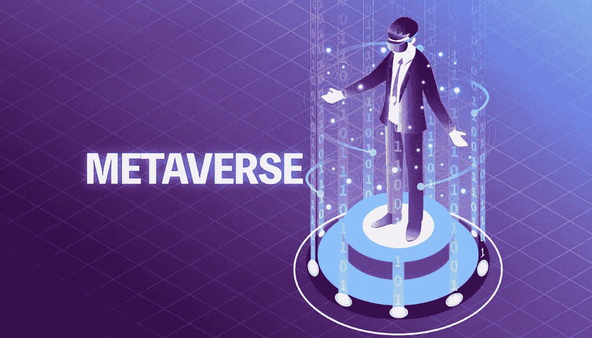
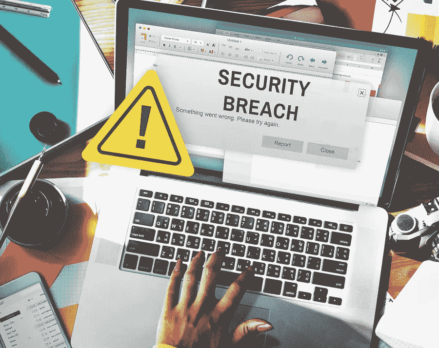
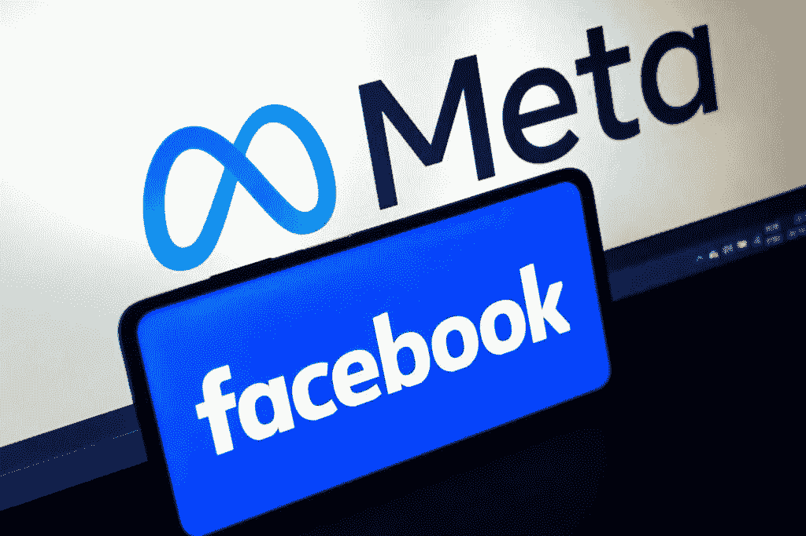

# 元宇宙:未来

> 原文：<https://medium.com/codex/metaverse-the-future-a09d8531816c?source=collection_archive---------3----------------------->

## 技术的未来

你梦想过拥有超能力吗？想象一下你有能力随时随地传送到你想去的地方。你可以环游世界，参加你最喜欢的艺术家的展览，在你方便的时候会见你的朋友和家人。听起来不可能，不是吗？

这就是技术和元宇宙概念介入的地方。

[来源](https://www.techidence.com/metaverse-seven-facts-to-understand-the-new-internet-experience/)

# **什么是元宇宙？**

M etaverse 或“超越宇宙”是各种技术元素的结合，其中包括[虚拟现实(VR)和增强现实(AR)](https://in.pcmag.com/vr/109911/augmented-reality-ar-vs-virtual-reality-vr-whats-the-difference) 通过这些技术可以创建一个 3D 虚拟世界网络。用户可以在被称为“化身”的数字化角色的帮助下穿越这些虚拟世界。很困惑，不是吗？

我通过一个例子，用更简单的方式给你解释一下。

我们都看过电影' [Avatar](https://en.wikipedia.org/wiki/Avatar_(2009_film)) '，在这部电影中，人类试图殖民潘多拉星球，面临当地部落的抵抗。然后，人类在科技的帮助下，远程控制一个泛多利安人的身体与部落互动。

现在想象你在一个虚拟世界中控制一个数字角色，在这个虚拟世界中，你可以自由地做任何你想做的事情。这就是元宇宙的概念。

# 元宇宙的必要性？

技术和互联网本身的进化应该足以回答这个问题。

几十年前，我们常常写信和寄信，与住在远方的人交流。然后是电话的发明，它可以用来与人进行远距离通话，没有任何麻烦。随着互联网的实施，这种交流体验被带到了一个全新的真实水平。这为我们提供了视频通话等功能，在这些功能中，我们可以在自己舒适的家中与任何人通话。这给了我们与他人互动的非常真实的体验。

现在更进一步，想象你自己进入一个虚拟的房间，在这里你可以和世界各地的人互动，就好像他们和你坐在同一个房间里一样。你可以交谈，看到和感觉到他们的存在。

随着这种技术的发展，不仅交互的体验和便利性提高了，而且生活的整体质量也提高了。

[来源](https://www.shutterstock.com/image-vector/technology-development-networks-tag-cloud-1155109918)

# 元宇宙的利弊

现在，元宇宙仅仅局限于改善人与人之间的互动吗？不，元宇宙在生活的其他领域也有巨大的潜力。其中一些将在下面讨论。

***房产:*** 在元宇宙的帮助下，购买房产的体验可以变得简单方便得多。你不必亲自去那么多不同的房产去看看你喜欢哪一个，你只需戴上你的虚拟现实耳机，就能感受到房产，就好像你就在那里一样。

***旅行:*** 有了在元宇宙的帮助下，你可以去所有你梦想去的地方旅行，而不会有伴随旅行而来的大笔开销。您可以计划与您的朋友和家人在元宇宙内旅行，然后在元宇宙的帮助下在几秒钟内到达这些地方。

***教育和工作:*** 参加讲座和通过视频电话开会变得很无聊，不是吗？不再是了。在元宇宙的帮助下，你可以参加来自世界各地你最喜欢的教育专家的讲座，就好像你和他们坐在同一个房间里一样。您可以在家舒适地参加在元宇宙的会议，而不必浪费时间去办公室。

元宇宙还有数不清的其他优势，其中一些可以在这里阅读。

[来源](https://venturebeat.com/2022/01/07/ces-2022-eyeing-an-enterprise-metaverse/)

就像世界上任何事物一样，有利也有弊，元宇宙也不例外。下面简要讨论元宇宙的一些主要缺点。

***接触先进而昂贵的技术:*** 要进入元宇宙，你需要虚拟现实和增强现实等技术，以及极其稳定和快速的互联网连接。许多人可能买不起或买不起这些东西。

***身份盗窃:*** 因为在元宇宙，你使用你的虚拟形象进行互动，所以很容易有人冒充另一个人。

***隐私侵犯:*** 任何技术都存在被黑客攻击的风险，这可能导致敏感信息泄露。

虚拟现实和真实现实之间的细微差别: 人们可能会沉浸在元宇宙中，以至于对他们在虚拟世界之外的生活造成伤害。

你可以在这里阅读更多关于元宇宙的缺点。

[来源](https://www.recordnations.com/wp-content/uploads/2016/09/business-identity-theft-data-breach-how-plan-prevent-protect.jpg)

# 元宇宙的未来会怎样？

随着 NVIDIA、Epic Games、ROBLOX 等科技巨头在元宇宙投入大量资金，元宇宙的未来看起来比以往任何时候都更加光明。甚至脸书也完全将自己重新包装为“Meta ”,以表明他们对元宇宙的关注。马克·扎克伯格在最近的一次采访中说，元宇宙是互联网的未来。

*“我认为我们基本上正在从 FACEBOOK 第一变成元宇宙第一”*这是扎克伯格在重塑脸书品牌之前说的话。

[来源](https://www.hitc.com/en-gb/2021/10/29/will-the-facebook-app-change-to-meta-and-will-the-platform-see-changes/)

# 元宇宙对经济的影响

随着元宇宙的发展，公司开始需要有技能的人来创建或维护元宇宙。这将为许多人带来各种新的就业机会。

随着虚拟世界(如元宇宙)的发展，我们将需要一些数字支付手段来进行各种交易。NFT 货币和加密货币将成为元宇宙的重要交易手段。

对元宇宙加强的领域的投资将大幅增加。游戏、在线购物等领域将变得比以往任何时候都更大。

# 结论

随着技术的快速发展，没有什么是不可能的，即使是一个被称为元宇宙的 3D 虚拟世界。在这个世界里，你可以做任何你想做的事情，那些你从未想过会有机会做的事情。

元宇宙仍处于早期阶段，所以我们不能确定它对整个社会来说是资产还是负债。到目前为止，我们还不能对它抱有任何期望。

我们所能做的就是坐下来，放松，看着元宇宙疯狂的发展。