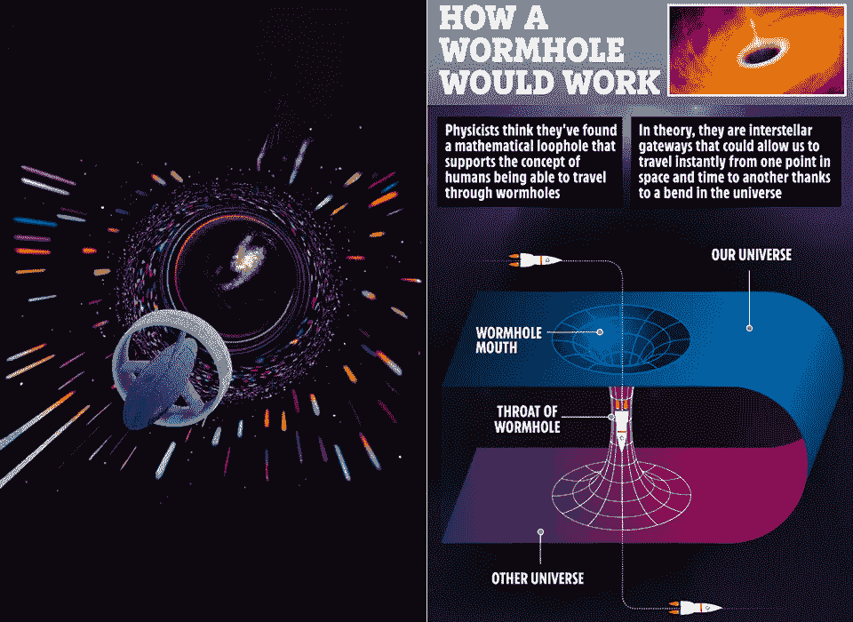
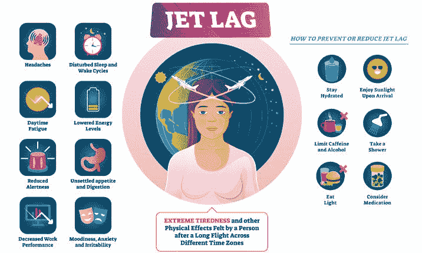
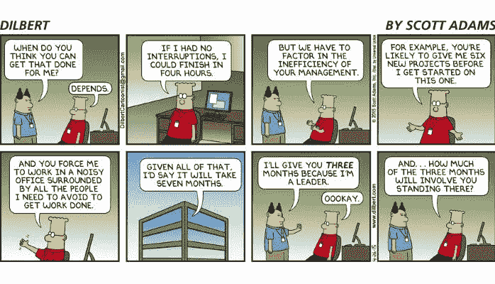

# 元宇宙事物:现实之间的语境转换

> 原文：<https://medium.com/codex/metaverse-things-context-switching-between-realities-e4c259a3964d?source=collection_archive---------11----------------------->

我什么时候？我在哪里？

当我走出新加坡樟宜机场，在国外生活了两年半后回到我的祖国时，我带着这些问题。当我看着窗外，景象，声音和男孩，热！他们都感到如此熟悉，却又如此陌生。我告诉一个朋友，“就好像我是一只猫，新加坡生活是我过去的生活——而我现在在这里！”这是一种奇怪的感觉，我至今无法解释。

## 这种奇怪的感觉是什么？

我轻松度过了第一周，与时差作斗争，跟着家人到处出差。有点奇怪。我的大脑无法理解。我的心也不能。我想这是一件我只能沉浸其中并拥抱旅程的事情。有时候我觉得当我在新加坡时，我的生活(主要是在瑞典)暂停了。虽然这不是真的，但我仍然在新加坡做事，与我爱的人重新联系，处理日常事务和工作。

当我思考这种独特的感觉时，它让我思考了很多关于交替现实的问题。我和贝弗利聊天，我们开始谈论平行宇宙。像往常一样，我把它推断为平行维度和交替现实，把它比作我此刻的感觉。这种奇怪的感觉不是坏事。我只是觉得筋疲力尽，很难理解到底发生了什么。也许我只是'[上下文切换](https://www.loom.com/blog/cost-of-context-switching)，并适应自己身在新加坡，承认自己的“前世”。

## 我们能跟上即时的上下文切换吗？

这就引出了一个问题，当增强现实(AR)和虚拟现实(VR)的世界完全进入，我们发现自己无缝地融入和脱离沉浸式体验和替代现实时，会发生什么？我们能跟上即时的上下文切换吗？我们谈论超可靠的低延迟连接(URLLC)以及 5G 和连接未来的承诺中减少或没有延迟。设备、软件、基础设施正逐步跟上这些要求。但是我们人类有能力像宇宙飞船穿越[虫洞](https://en.wikipedia.org/wiki/Wormhole)那样穿越现实吗？

来源:[太阳](https://www.thesun.co.uk/tech/12542385/humans-travel-through-wormhole-theory-proposed/)

## 时间旅行和跨现实旅行有什么共同点？

穿越时区就像穿越时间一样。我经常告诉人们我穿越了时间，穿越了半个世界。你着陆了，提前了一天，损失了几个小时——你穿越到了未来。你回头，突然你又开始重复这一天——你回到了过去。我们的身体试图适应，以光作为我们的指示器，这就是我们所知的时差现象。前几天我还在想，如果我在的地方是星期一，而我正在与之交谈的人在的地方是星期天，我们是在星期一还是星期天？我们什么时候？

来源:[伊丽莎白山医院](https://www.mountelizabeth.com.sg/healthplus/article/7-ways-to-overcome-jet-lag)

进出存在于同一时间平面上的不同现实可能会带来许多需要适应的东西，而不仅仅是光和天气。不管是不同的社会支持系统，不同的习惯，社会暗示和社会行为，要重新适应身体和精神都是相当多的任务。这需要相当多的上下文切换。所以我想我想知道的是，我们到了吗？社会支持系统准备好接纳那些可能跟不上未来许多现实的人了吗？政策是否足以抵御互联网络的广泛性？我们能同时处理地球生命(我们熟知的生命)和元宇宙生命吗？

来源:[斯科特·亚当斯的《呆伯特》](https://dilbert.com/)

## 我们准备好迎接元宇宙和另一层“现实”了吗？

我对连接、软件和硬件的结合有信心。不过，我们是否能在情感上跟上，是否能足够快地建立“现实安全”，还有待观察。毕竟，仍然有一吨的火绒骗子和网络骗子在那里，你会认为它会很容易与今天的技术来保护受害者和打击犯罪…我想，我们会看到。