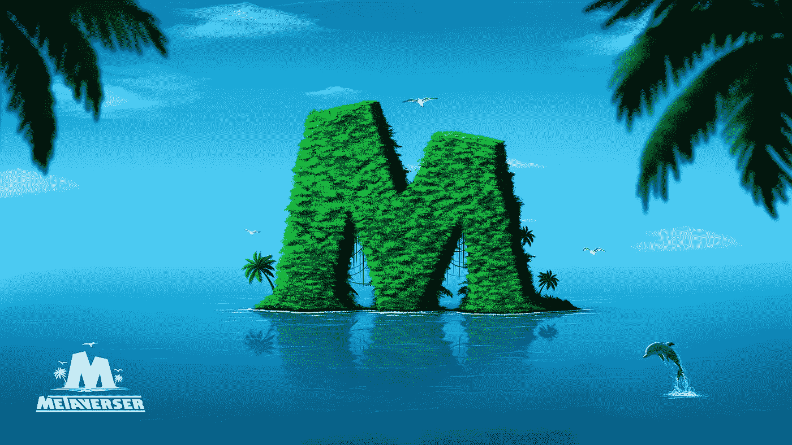

# Metaverser 将游戏带到了新的高度；原因如下。

> 原文：<https://medium.com/codex/metaverser-is-taking-gaming-to-new-heights-heres-why-c81804da29a4?source=collection_archive---------25----------------------->

元宇宙是关于创新的。从最初的概念，元宇宙已经发展成为一个相当大的虚拟生态系统，包括各种项目和独特的产品。在这些项目中，有几个显示出独特的效用和有前途的产品。在这一系列产品中，我们开发了一个独特的游戏项目 Metaverser。

Metaverser 是一个虚拟世界，使您能够在我们的元宇宙内享受我们的一系列有趣的游戏，同时赚取收入。我们引以为豪的一件事是，我们是极少数几个元宇宙游戏之一，具有高图形与你的身体特征的 3D 界面。所以让我们来看看一些把我们和大众区分开来的特征。

**进入 Metaverser！**

我们是一个多样化的项目，在我们的生态系统中融入了各种功能。我们利用 NFT 和我们的本地可替换代币为我们的玩家创造有利可图的机会。下面是 Metaverser 的一些主要特性。

*   您可以参加我们的“玩即赚”游戏挑战，在集会中竞争，并使用您的战略能力赢得战斗和获得奖品。
*   您可以购买和赚取可以在平台内和第三方平台上交易或销售的 NFT。
*   每个月，我们都会为所有 NFT 车主组织赛车联盟，三名获胜者将获得不同的奖品。
*   你可以用 Metaverser 投资加密采矿，获得有利可图的回报。
*   您可以使用我们的 NFTs 投资不同的行业，如电力行业、交通行业、广告行业、交通行业等等。

除此之外，我们还将在 Metaverser 上推出 Crypto Valley，举办重大影响者活动，将加密行业的领导者带入我们的生态系统。加密谷是我们元宇宙的一个虚拟空间，你可以在那里建立你的办公室。加密谷有 24 栋建筑，其中三栋位于市中心。我们还在进行三栋两层建筑的赠送活动。

Crypto Valley 是一个功能丰富的空间，能够在现场音乐厅、时尚中心、美术馆和夜总会等场所组织活动。除此之外，一般功能包括:

*   办公楼外部的标志。
*   办公楼外部的大型广告牌，可选择自用或出租。
*   视频投影仪放置在办公室内合适的位置，用于显示视频。
*   电视在办公室显示视频。
*   社交媒体展台提供了一个吸引人的空间来展示社交网络的地址，以增加受众。
*   见证墙
*   证书墙
*   手纺车

Metaverser 是一个发生的地方，并准备成为元宇宙的枢纽。

**关于 Metaverser**

Metaverser 是一个虚拟世界，它使用户能够在玩元宇宙的同时获得乐趣，并从不同的游戏中赚取收入。Metaverser 是在大多数现代标准的基础上开发的，利用了 NFTs 和平台的本机可替换令牌。Metaverser 的玩家可以与来自世界各地的人进行竞争、挑战和社交。Metaverser 背后的驱动力是它的目标是通过为每个人提供一个地方，让他们聚集在一起，享受乐趣，从而使虚拟世界更加真实，无论他们的属性或种族如何。

了解更多关于 Metaverser 的信息，请访问:

[网站](https://metaverser.me/) | [电报](https://t.me/metaversergame) | [推特](https://twitter.com/metaversergame?lang=en) | [不和](https://discord.gg/8Kar3RDwWE)