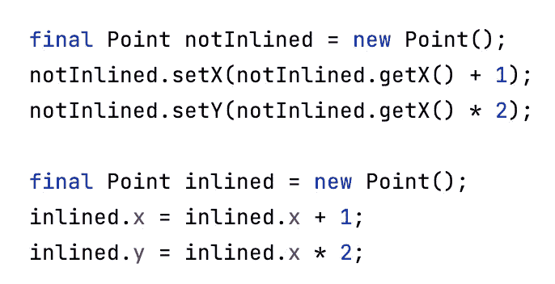

# Java 中的方法内联

> 原文：<https://medium.com/codex/method-inlining-in-java-84caec9b3e18?source=collection_archive---------5----------------------->



方法内联示例。

本文旨在介绍方法内联并演示其效果。

**TL；默认情况下，DR** 方法内联是启用的，不应该禁用。这是一种编译器优化，本质上是用方法的内容替换方法调用。

让我们来谈谈 Java 中的编译器优化。HotSpot JVM 实时(JIT)编译器可以执行大量的优化，例如但不限于:

*   何时在主存上使用寄存器存储值。
*   跳过方法查找。
*   转义分析(-XX:+DoEscapeAnalysis，-XX:-DoEscapeAnalysis)
*   内联(-XX:+内联，-XX:-内联)

## 方法内联

使用以下标志激活/禁用它(默认情况下激活)。大多数 java 真/假标志使用-XX:[+，-]FLAG 的语法来设置真或假[1]。

```
-XX:+Inline (enables)
-XX:-Inline (disables)
```

内联是一种优化，在这种情况下，编译器确定不需要某个方法，并用简单的语句替换了该方法调用。编译器基本上执行了与我在下面的**例子中手动完成的相同的优化。**

“手动”方法内联

在 Java 的早期版本中，执行这种手动内联曾经是获得更好性能的常用方法。显然我们不应该再这样做了，因为编译器已经为我们处理了。

那么，这能带来多大的改善呢？我构建了一个极端的例子来演示其效果，见下文。

方法内联测试代码。

代码基本上执行了大量的获取和设置，主要是设置值(注意 Point#setX 和 Point#setY 内部的循环)。

**内联启用**

如果我们不带任何参数运行这个例子(-XX:+Inline 默认启用)，我们可以看到执行时间接近于 0。

```
> javac MethodInlining.java> java MethodInliningRunning pid: 41301
Elapsed time (ms): 0
Point[x=49995000, y=49995000]
```

**内联被禁用**

让我们将其与禁用内联进行比较。

```
> javac MethodInlining.java> java -XX:-Inline MethodInliningRunning pid: 41303
Elapsed time (ms): 9754
Point[x=49995000, y=49995000]
```

测试现在花了将近 10 秒钟。).这里我们有一个极端的例子，方法调用开销占用了大部分时间。显然，您不会在野外看到这种情况，但是，如果禁用了内联，您可能会看到 30–50%的性能下降[2]。

## JVM 中的日志内联

为了深入了解 JVM 以及它何时内联方法，可以使用一些标志。

```
> javac MethodInlining.java> java -XX:+UnlockDiagnosticVMOptions -XX:+PrintInlining MethodInlining...
@ 22   MethodInlining$Point::setX (19 bytes)   inline (hot)
  @ 9   MethodInlining$Point::setXInside (6 bytes)   accessor
...
@ 32   MethodInlining$Point::setY (19 bytes)   inline (hot)
  @ 9   MethodInlining$Point::setYInside (6 bytes)   accessor
...
```

这告诉你编译器已经内联了这个方法。运行没有内联的示例，我们可以注意到不同之处。

```
> javac MethodInlining.java> java -XX:-Inline -XX:+UnlockDiagnosticVMOptions -XX:+PrintInlining MethodInlining...
@ 9   MethodInlining$Point::setXInside (6 bytes)   not inlineable
@ 9   MethodInlining$Point::setYInside (6 bytes)   not inlineable
...
```

最后，方法什么时候被内联？这取决于这个方法有多热门(它被调用的频率)以及它的大小。如果一个方法被确定为热的并且适合内联，那么当它小于下面的标志(以字节为单位)时，它将被内联。

```
> java -XX:+PrintFlagsFinal -version | grep FreqInlineSizeintx FreqInlineSize = 325 {pd product} {default}openjdk version "13.0.2" 2020-01-14
OpenJDK Runtime Environment (build 13.0.2+8)
OpenJDK 64-Bit Server VM (build 13.0.2+8, mixed mode, sharing)
```

或者，只有当它小于下面的标志(以字节为单位)时，才有资格进行内联。

```
> java -XX:+PrintFlagsFinal -version | grep MaxInlineSizeintx MaxInlineSize = 35 {product} {default}openjdk version "13.0.2" 2020-01-14
OpenJDK Runtime Environment (build 13.0.2+8)
OpenJDK 64-Bit Server VM (build 13.0.2+8, mixed mode, sharing)
```

**参考文献**

[1]Java HotSpot VM Options
[https://www . Oracle . com/Java/technologies/javase/VM Options-JSP . html](https://www.oracle.com/java/technologies/javase/vmoptions-jsp.html)

[2] Java 性能 Scott Oaks 的权威指南