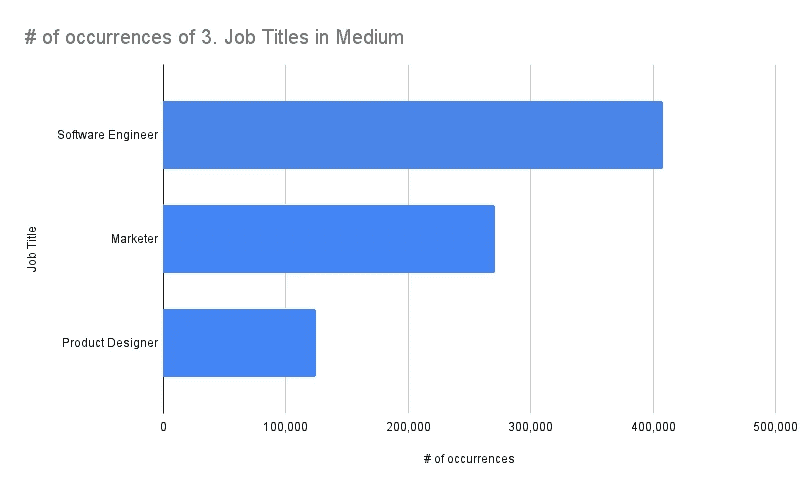
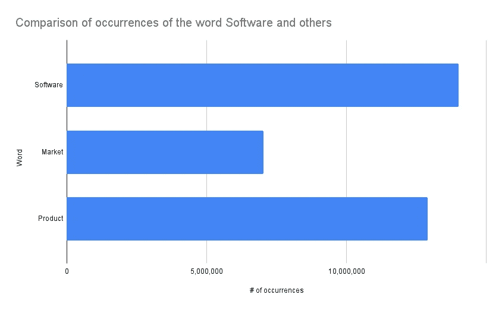
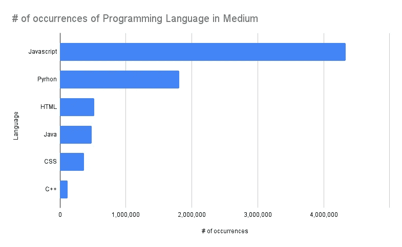
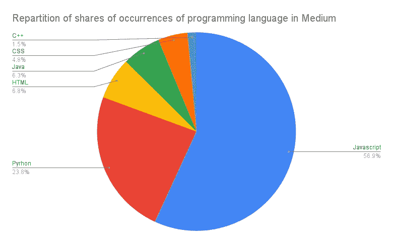
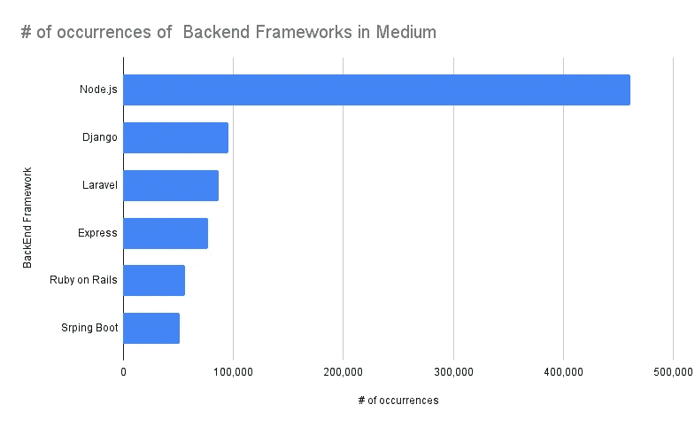
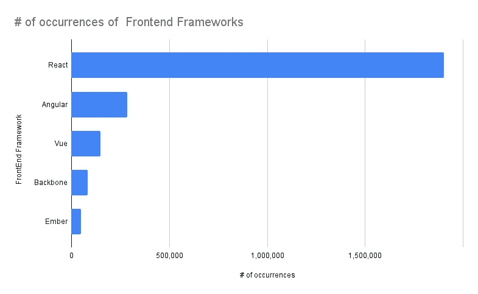
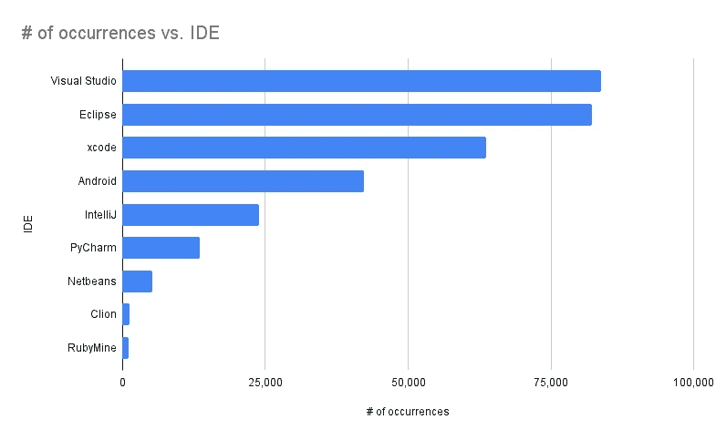
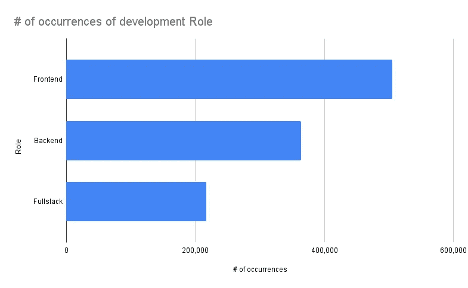
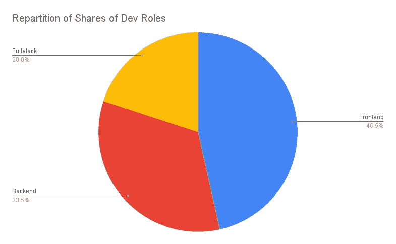

# 软件词汇的度量

> 原文：<https://medium.com/codex/metrics-about-words-of-software-97d855af3bbe?source=collection_archive---------11----------------------->

## 媒体中词语出现的另一种分析

照片由[áRPád Czapp](https://unsplash.com/@czapp_arpad?utm_source=medium&utm_medium=referral)在 [Unsplash](https://unsplash.com?utm_source=medium&utm_medium=referral) 上拍摄

我用马克·安德森创造的这句话介绍了我的上一篇文章，他说软件正在吞噬世界这句话，我问这个世界是否还没有完全进入软件这个未填满的胃。在本文中，我将尝试向您展示一些关于软件词汇的指标，但如果您认为应该获得全球指标，请原谅我，因为我将展示的指标并不关注整个万维网，而只关注您实际用于阅读本文的发布平台。

第一个事实是，软件在我们每天做的任何事情中，甚至在写作和发表文章中，都变得越来越重要，你可以考虑下面的第一个图表，它显示了与营销人员和产品设计师相比，软件工程师这个职位出现的次数。

你可以看到“软件工程师”这个词被媒体中的作者频繁使用，我们可以根据这些指标猜测媒体中的软件工程师比其他头衔中的多，但是这个简单的事实不能证明我所做的最后一个假设。单词 Software 在 medium 中出现了将近 1400 多万次，而单词 Marketing 正如我们在这篇名为[的文章中所看到的，市场营销单词的度量](https://mkrdiop.medium.com/metrics-of-words-of-marketing-in-medium-68af3e5bf9c9)超过了 400 万次，而单词 Market 出现了 700 多万次。

现在，很明显，软件在我们的日常生活和在线发表的文章中是一个非常重要的术语，特别是在媒体中，现在让我们来看看一些关于软件的特定关键术语的衡量标准。我们将分析的第一个术语是编程语言名称，但是我应该请你原谅，因为在我的分析中，我没有包括像 Ruby、Perl 和其他语言。我唯一考虑过的语言是我认为更重要的语言，也许这是错误的。对我来说，Perl 是一门重要的语言，我还没有学过，但是随着函数式编程重要性的恢复，Perl 可以成为一门值得学习的语言。这篇文章不是关于比较编程语言，而是分析软件中出现的单词，比如编程语言名称，这里是我选择的语言的度量标准。

我过去读过的几乎所有关于编程语言的调查都强调了由于网络革命和越来越多的使用 javascript 进行网络开发的框架，javascript 的应用越来越广泛。javascript 的发展已经到了涉足服务器操作的地步，这并不是它的第一个目的，因为 javascript 最初是作为一种由浏览器执行的客户端语言而设计的。你会发现，javascript 利用了这一商业理论，建议企业家在进入更广阔的市场之前，先专注于利基市场。这就是 javascript 所做的，从开发人员需要小型客户端操作的利基市场开始，直到 Node.js 这个服务器端开发语言的领导者，你可以在下面的图表中看到，它展示了后端框架在 Medium 中的出现

上面的图表显示 Node.js 是迄今为止最受欢迎的后端框架，至少从在 Medium 上发表文章的作者的兴趣程度来看是如此，因为 Node.js 一词的出现次数比 Django 一词的出现次数多 5 倍，Django 是一个非常有趣的 python 框架，我喜欢使用它。在 Node.js 之后，其他框架如 Laravel、Express、Ruby on Rails 和 Spring Boot 也受到了 medium 作者的同等关注，因为它们的出现次数在 5 万到 10 万之间。

我们已经发现了后端框架名称的度量标准，但是前端框架呢？在显示前端框架名称出现次数的图表之前，注意到几乎所有这些前端框架都使用 javascript 作为主要语言是很重要的，这似乎是解释为什么 javascript 比我们在关于编程语言的图表中研究的其他语言更受欢迎的事实之一。这是在 Medium 中前端框架出现的图表

这里你可以看到，当我们考虑 React 这个名字出现的次数时，脸书技术栈背后的前端框架 React 在 Medium 中更受欢迎。如果我们做一个考虑整个互联网的分析，这应该是正确的，但是我现在没有足够的资源来做这样的分析，我已经在这篇文章中说过资源对我来说是多么的稀缺。但是，希望我仍然在这里通过写一些我认为可能对你有用的知识来与你分享，同时等待这台强大的计算机，它将允许我跳到我的 IDE 上来编程所有这些游戏想法和平台，我也将与你分享。说到 IDE，下面的图表显示了 IDE 名称在 Medium 中出现的次数。

对于 ide 来说，Visual Studio、Eclipse、Xcode 是领先于 android studio 的 peloton。编程当然不是关于像我们使用的 IDE 这样的工具，但是一个好的 IDE 肯定可以提高软件工程师的生产力，但是我会让你自己判断什么是最好的 IDE，因为这篇文章是关于软件词汇的度量。

如果你正在阅读这篇文章，你很可能对软件感兴趣，或者你可能是一名软件工程师，我认为以软件工程的作用的度量标准来结束这篇文章会很有趣，但这些数字只是关于在媒体上发表的文章，而不是整个万维网。

希望这篇文章对你有用。如果你需要更多关于任何特定领域或主题的指标，或者你在自己的文章中使用的词语的指标，你可以使用[这个表格](https://forms.office.com/Pages/ResponsePage.aspx?id=DQSIkWdsW0yxEjajBLZtrQAAAAAAAAAAAAMAAC-dfGdUN0lJR0VRMFcyTFpZNThMSVQ1OTBKUUdGMS4u)告诉我。