# 逻辑回归的度量

> 原文：<https://medium.com/codex/metrics-for-logistic-regression-db5bf6dee450?source=collection_archive---------2----------------------->

上图描述了如果您只是部署您的模型，而没有用合适的度量来度量它，这是多么罪恶。

对于一个机器学习专业人员来说，能够评估不同模型的性能与能够训练它们一样重要。衡量分类模型性能的最简单方法是计算其准确性，但准确性并不能反映全部情况，因为有些模型显示出很高的准确性，但却不是好模型，因此我们在本文中讨论以下指标:

*   准确(性)
*   回忆
*   精确
*   灵敏度
*   特征
*   f 分数
*   受试者工作特征曲线
*   罗马纪元

## 混淆矩阵概述:

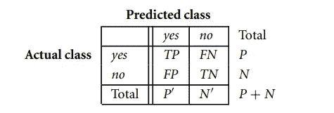

图 1:混淆矩阵

*   TP →真阳性。
*   TN →真阴性。
*   FP →假阳性(1 型错误)。
*   FN →假阴性(2 型错误)。
*   P →实际正类之和。
*   N →实际负类之和。
*   P **'** →预测正类之和。
*   N **' →** 预测负类之和。

> 注-: P **' +** N **' =** P + N

让我们试着用不同场景的例子来理解上面的缩写:

**场景-1:** 分类器检测一个人是生病还是健康。

**真阳性:**被诊断为患病的患病者。

**真阴性:**被诊断为健康的健康人。

**假阳性:**被错误诊断为患病的健康人。

**假阴性:**被错误诊断为健康的患病者。

**场景-2:** 分类器检测我收到的邮件是垃圾邮件还是垃圾邮件。

**真阳性:**一封被正确归类为垃圾邮件的垃圾邮件。

**真阴性:**被正确分类为火腿的火腿邮件。

**误报:**被错误归类为垃圾邮件的火腿电子邮件。

**误报:**被错误归类为火腿的垃圾邮件。

> 注意-:在场景 1 中，假阴性的代价更大，因为很明显这是危险的，如果我们预测一个病人是健康的&建议不要服用任何药物，这将花费某人的生命。
> 
> 而在场景 2 中，误报的成本更高，因为试想一下，如果你收到一封录用信&你的分类器预测它是一封垃圾邮件，它会让你丢掉工作。

因此，区分优先级、假阳性或假阴性完全取决于数据背后的故事。

## 准确性:

准确性是所有数据点中正确预测的数据点的数量。

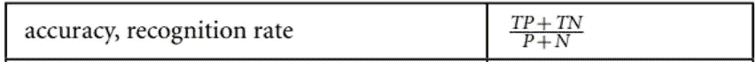

图 2:精确度公式

类似地，我们还使用术语“错误率或错误分类率”来记录所有数据点中不正确预测的数据点的数量，即(1 —准确性)。

> 注意:如果我们有不平衡的数据集，那么我们永远不能使用准确性作为衡量标准。

现在的问题是，当我们有一个不平衡的数据集(即欺诈检测或乳腺癌数据集)时，为什么我们不能使用准确性？

下面我们来解释一下上面的问题→在一个不平衡的数据集中，感兴趣的主要类总是很少的。也就是说，数据集分布反映了绝大多数的负类和少数的正类。

为了理解上面的陈述，让我们举一个例子，比如在欺诈检测应用中，感兴趣的类别(或正面类别)是“欺诈”，它比负面的“非欺诈”类别出现的频率低得多。在医学数据中，可能存在一个罕见的类，比如“癌症”。假设您已经训练了一个分类器来对医疗数据进行分类，其中类标签属性是“cancer ”,可能的类值是“yes”和“no”。97%的准确率可能会使分类器看起来相当准确，但是如果只有 3%的训练元组实际上是癌症呢？显然，97%的准确率可能是不可接受的——例如，分类器可能只正确地标记了非癌症元组，而错误地分类了所有的癌症元组。相反，我们需要其他度量，这些度量访问分类器能够多好地识别正元组(癌症=是)以及它能够多好地识别负元组(癌症=否)。

为此，可分别使用**灵敏度**和**特异性**测量。那么接下来让我们讨论一下**灵敏度&特异性。**

## 敏感性和特异性:

**灵敏度** →确定分类器正确识别的阳性元组比例。

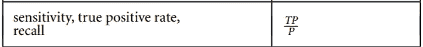

图 3:灵敏度公式。

**特异性** →确定分类器正确识别的阴性元组的比例。

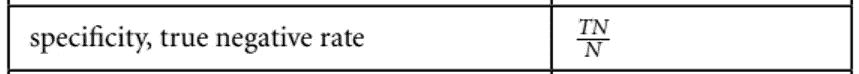

图 4:特异性公式。

现在让我们举一个例子，了解一下敏感性和特异性有什么不同。

例子:

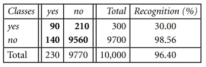

图 5:癌症=是和癌症=否的混淆矩阵。

分类器的准确率为 9650/10000 = 96.50%

分类器的灵敏度是 90/300 = 30.00%

分类器的特异性为 9560/9700 = 98.56%

注意，虽然分类器具有高准确度，但是鉴于其低灵敏度，其正确标记阳性(罕见)类别的能力较差。它具有高特异性，这意味着它可以准确地识别阴性元组，但不能识别阳性元组。

因此这个分类器**不好😦**因为它不能预测实际患有癌症的患者(即其灵敏度非常低)。这意味着这个模型有更多的假阴性，如果我们建议一个人不接受任何治疗，即使他实际上患有癌症，这也是危险的。

现在考虑另一种情况，分类器检测到垃圾邮件。这里“是”表示这是一封垃圾邮件，是肯定的类别,“否”表示这是一封垃圾邮件，是否定的类别。

让我们假设我们得到了同样的准确性、敏感性和特异性。

所以这一次我们可以说这个分类器是好的，因为它有很高的特异性，意味着我们的重要邮件都不会被默认发送到垃圾邮件，因此我们不会错过收件箱中的任何重要邮件。但是是的，因为敏感度较低，所以我们的收件箱中可能会收到一些垃圾邮件。

> 注意:在癌症数据集中，如果我们有太多的“假阴性”,分类器是不好的，因为我们预测癌症患者是非癌性的。而在垃圾邮件数据集中，如果分类器有太多的“假阳性”，则分类器是坏的，因为这样我们会将垃圾邮件预测为垃圾邮件。

因此，要使用的指标总是取决于数据集和数据背后的故事。😃

## 精确度和召回率:

**精度** →它测量被分类器预测为阳性的数据实际上是阳性的百分比。

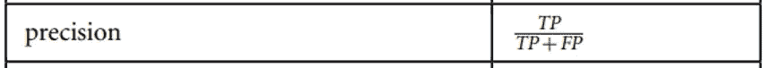

图 6:精度公式

让我们举一个例子&理解精度→参考图 5，其中第一列中总共有 230 个被分类器预测为+ve。但是为了找出有多少实际上属于+ve 类，我们使用 precision，因此根据公式 **(90/230)** 是 precision 的计算值。

**召回(与敏感度相同)** →确定分类器正确识别的阳性元组比例。

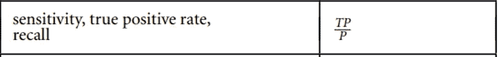

图 7:召回公式

类似地，参考图 5 回忆，假设我们知道总共 300 个数据点实际上属于+ve 类。那么召回或灵敏度实际上告诉我们+ve 元组被分类器正确标记(或预测)的百分比。

这意味着在图 5 中，在总共 300 个实际+ve 数据点中，有 90 个+ve 数据点被分类器正确预测。因此，根据召回公式，我们将其计算为(90/300)。

***关于召回的重要说明&精度 WRT False -ve & False +ve 举例-:***

**回想一下** →衡量我们的模型在假阴性情况下表现如何的指标(例如:在冠状病毒测试中，我们更关心假 ve 而不是假+ve，因为我们不想告诉一个人是-ve，而实际上他是+ve)。

这种模式不能有太多的错误。

例子:

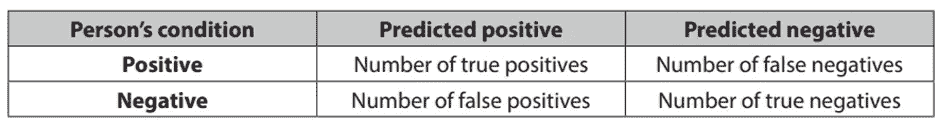

图 8:冠状病毒测试的混淆矩阵。

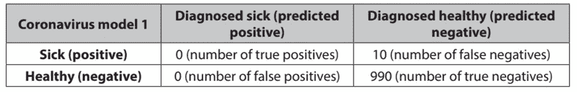

图 9:模型 1

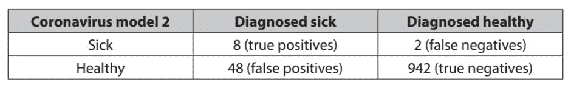

图 10:模型 2

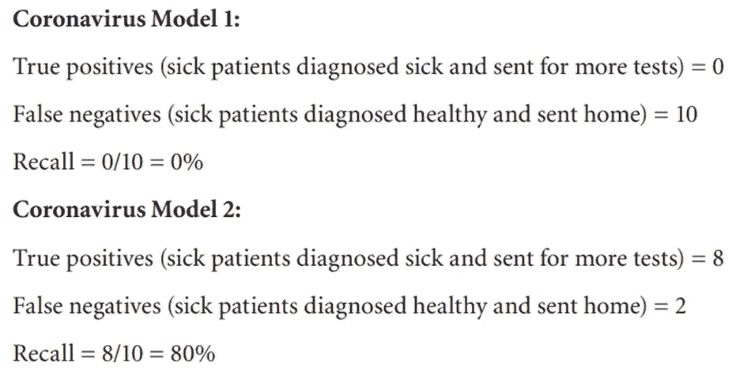

> 注意:从上面的例子我们可以得出结论，如果我们有太多的错误值，或者召回不能承受太多的错误值，召回值就会下降。

**Precision →** 衡量我们的模型在误报情况下表现如何的指标(例如，垃圾邮件分类器，它将垃圾邮件检测为阳性场景，因此误报意味着分类器将重要邮件分类为垃圾邮件，这将对我产生更大的成本，而不是 false -ve，在 false-ve 中，我只会额外读取垃圾邮件)。

这种模式经不起太多的假+ve。

例子:

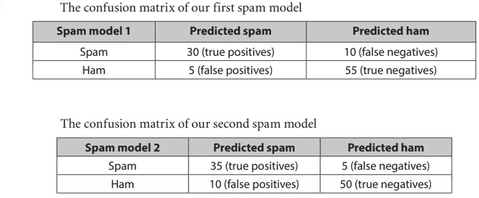

图 11:分类器模型 1 和模型 2

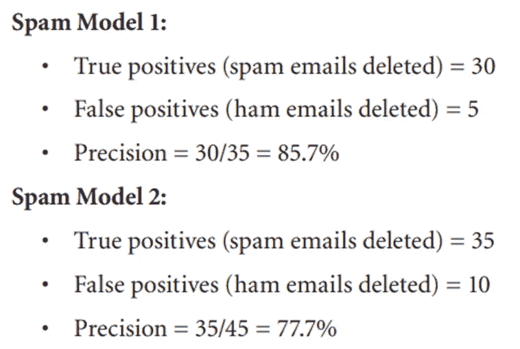

> 注意:从上面的例子我们可以得出结论，如果我们有太多的假+ve 或者精度不能承受太多的假+ve，精度值就会下降。

## f 分数:

这是“精确度”和“召回率”的调和平均值，将这两个指标都考虑在内。

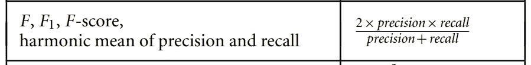

图 12:F 值公式

这里我们用调和平均值代替简单平均值，因为简单平均值不会影响极值，但是调和平均值会影响极值。

举个例子吧→

假设一个模型给出，precision = 1.0 & Recall = 0.0。

— — — — — — —

简单平均值计算= (1+0)/2 = 0.5

调和平均值计算= [2*(1*0)]/(1+0) = 0

— — — — — — —

因此，我们得出结论，当任何一个值(精确度或召回率)较低时，调和平均值总是降低总体 F 值。F-score 惩罚具有低召回率或精确度值的模型。

## Fβ分数:

Fβ score 使用一个称为β(希腊字母β)的参数，它可以取任何正值。β的作用是作为一个刻度盘，我们转动它来强调精确性或回忆性。更具体地说，如果我们将β刻度盘滑动到零，我们得到完全的精度；如果我们把它滑动到无穷大，我们就能完全回忆起来。一般来说，β值越低，我们越强调精确，β值越高，我们越强调召回。

所以现在，你可以通过拨“β”旋钮来决定是惩罚你的模型精度低还是召回率低。

Fβ分数定义如下(其中精度为 P，召回率为 R):

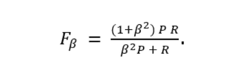

图 13: Fβ分数公式

## ROC 曲线:

基于 0 和 1 之间的各种阈值绘制接收器操作特性曲线，其中改变该阈值可以增加或降低特异性和灵敏度。

在我们预测二元类的逻辑回归中，我们选择一个阈值，如果分类器预测的概率大于阈值，那么我们选择一个类，或者如果分类器预测的概率小于阈值，那么我们选择另一个类。这个阈值实际上有助于调节 ROC 曲线中的特异性和敏感性。

当我们将阈值从低到高(即 0 到 1)移动时，灵敏度降低，特异性增加。

这意味着，在冠状病毒测试中，如果我们想要降低 false -ve，那么我们必须选择较低的阈值，而在垃圾邮件分类器中，如果我们想要降低 false +ve，那么我们需要选择较高的阈值。

下图显示了随着阈值从(0 到 1)的增加，灵敏度如何降低，特异性如何增加。

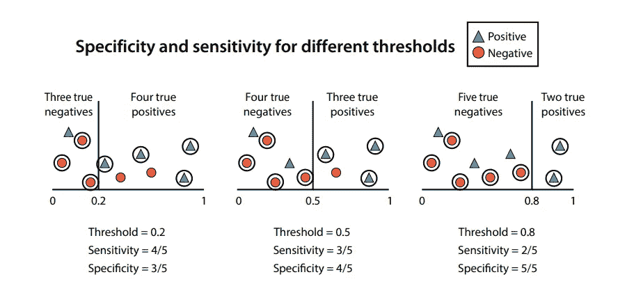

图 14:不同阈值的特异性和敏感性

下图显示了曲线图中的 ROC 曲线，X 轴和 Y 轴分别为灵敏度和特异性，阈值从 0 到 1，每个点由时间步长→

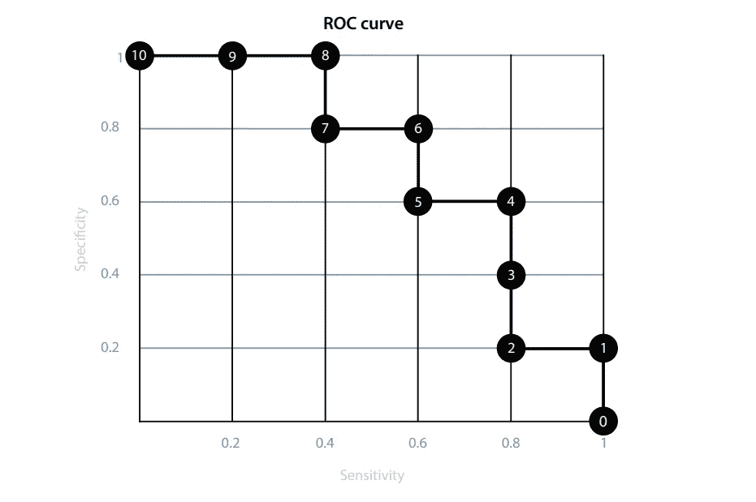

图 15:在这里我们可以看到与我们正在进行的例子相对应的 ROC 曲线，这给了我们模型的大量信息。突出显示的点对应于通过将阈值从 0 移动到 1 而获得的时间步长，每个点都由时间步长标记。在水平轴上，我们记录模型在每个时间步的敏感性，在垂直轴上，我们记录特异性

简而言之，ROC 曲线有助于我们获得模型的最佳阈值。

## AUC(ROC 曲线下面积):

AUC 是分类器区分类别的能力的度量。它测量从(0，0)到(1，1)的整个 ROC 曲线下的整个二维区域(想想积分学)。

在下面的图 16 中，我们可以看到三个模型，其中预测由横轴给出(从 0 到 1)。在底部，你可以看到三条相应的 ROC 曲线。每个正方形的大小都是 0.2 乘以 0.2。每条曲线下的方块数分别为 13、18 和 25，相当于 0.52、0.72 和 1 的曲线下面积。注意，一个模型能做的最好的事情是 AUC 为 1，这对应于右边的模型。一个模型能做的最坏的事情是 AUC 为 0.5，因为这意味着这个模型和随机猜测一样好。这对应于左边的模型。中间的模型是我们原来的模型，AUC 为 0.72。

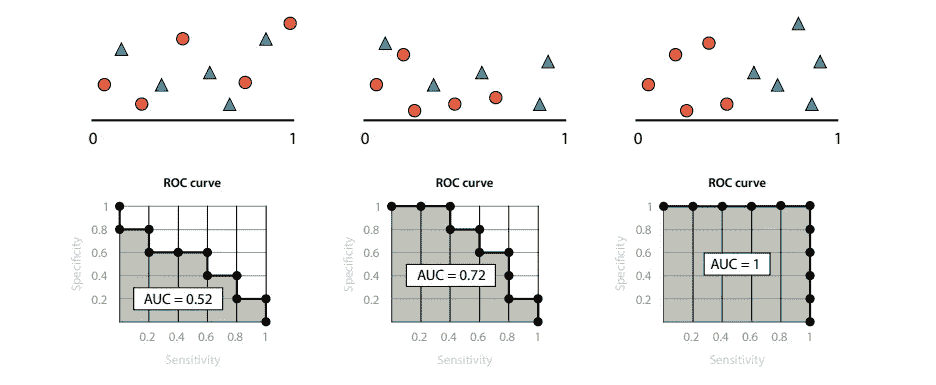

图 16:在这个图中，我们可以看到 AUC，或者曲线下的面积，是一个很好的度量来决定一个模型有多好。AUC 越高，模型越好。在左边，我们有一个 AUC 为 0.52 的坏模型。在中间，我们有一个很好的模型，AUC 为 0.72。在右边，我们有一个 AUC 为 1 的伟大模型。

类似地，我们可以将 ROC 和 AUC 结合在一起，如下图图 17 所示，我们可以看到，如果我们希望我们的模型具有高灵敏度，我们只需将阈值向左推(即降低阈值),直到我们到达曲线中具有所需灵敏度的点。注意，模型可能会失去一些特异性，这是我们付出的代价。相比之下，如果我们想要更高的特异性，我们将阈值向右推(即，增加它)，直到我们到达曲线中具有我们想要的那么多特异性的点。在这个过程中，我们又失去了一些敏感性。曲线准确地告诉我们我们得到和失去了多少，所以作为数据科学家，这是一个很好的工具来帮助我们决定我们模型的最佳阈值。

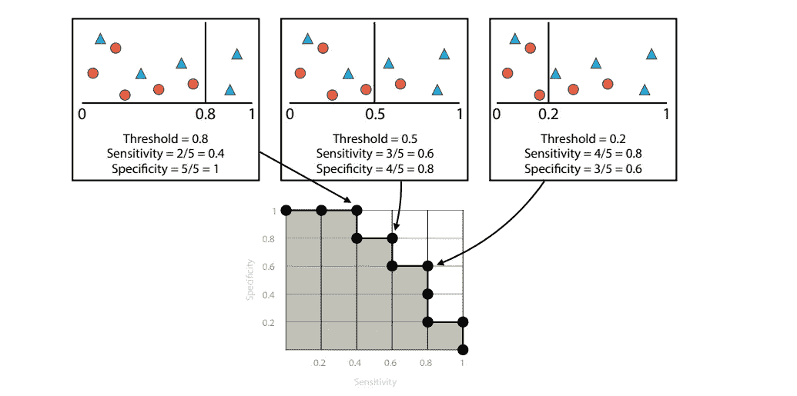

图 17:模型的阈值和 ROC 之间的平行关系。左边的模型具有高阈值、低灵敏度和高特异性。中间的模型具有中等的阈值、灵敏度和特异性。右边的模型具有低阈值、高灵敏度和低特异性。

参见下图图 18，该图区分了高特异性和高敏感性。

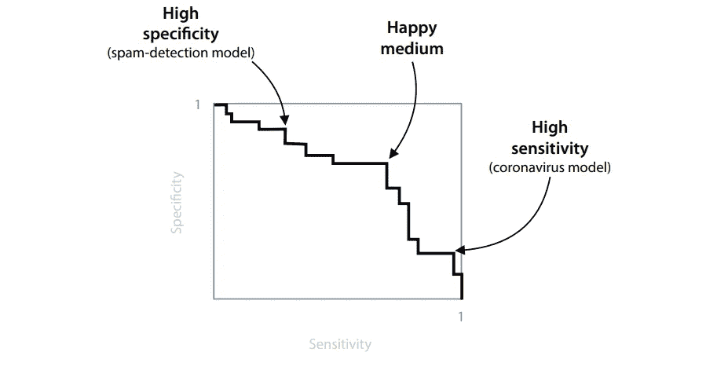

图 18:在这个更一般的场景中，我们可以看到一条 ROC 曲线，曲线上的三个点对应三个不同的阈值。如果我们想选择一个给我们高特异性的阈值，我们选择左边的那个。对于灵敏度高的模型，我们选右边的。如果我们想要一个既有很好的灵敏度又有很好的特异性的模型，我们就选择中间的那个。

如果我们需要一个高灵敏度的模型，比如冠状病毒模型，我们会选择右边的点。如果我们需要一个高特异性的模型，比如垃圾邮件检测模型，我们可以选择左边的点。然而，如果我们想要相对高的灵敏度和特异性，我们可以选择中间点。作为数据科学家，我们有责任充分了解问题，从而做出正确的决定。

最后，我们完成了，让我们以这篇文章的总结作为结束。

## 总结:

*   鸟瞰中的混淆矩阵→

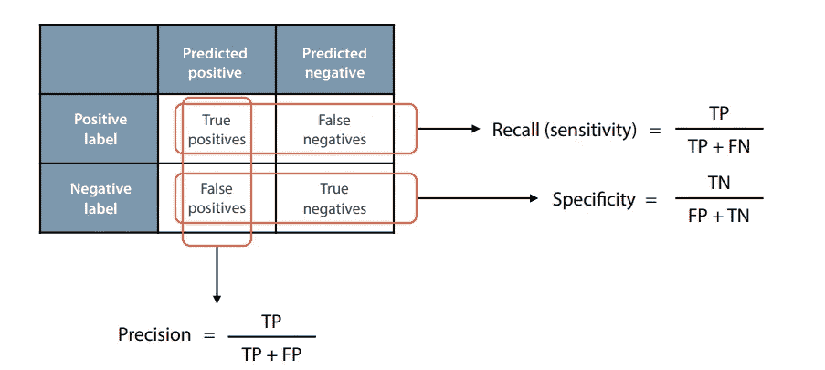

图 19:混淆矩阵的顶行给出了我们的回忆和敏感度:真阳性的数量与真阳性和假阴性的总和之间的比率。最左边的一列给出了精确度:真阳性的数量与真阳性和假阳性之和的比率。最下面一行给出了特异性:假阳性的数量与假阳性和真阴性的总和之间的比率。

*   公式→

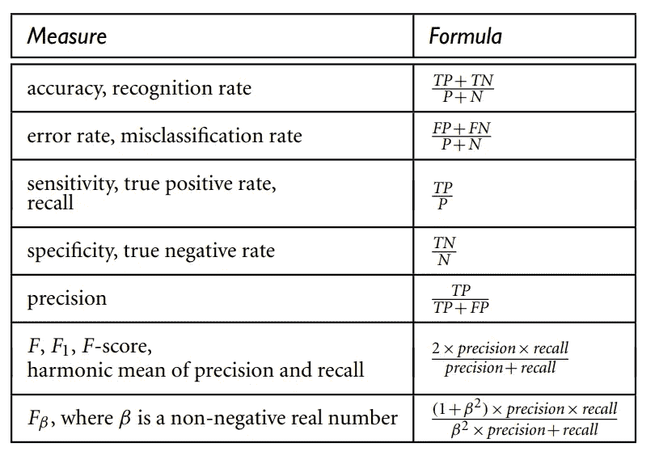

图 20:评估方法。请注意，有些度量有多个名称。TP、TN、FP、P、N 分别指真阳性、真阴性、假阳性、阳性和阴性样本的数量。

我们完成了，谢谢你的时间。如对本文有任何建议，请发邮件至我的邮箱“arijitbarat11m@gmail.com ”,并在 medium 上关注我。

快乐学习。😃。