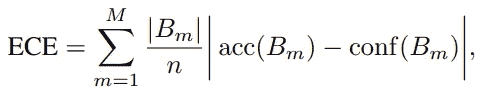
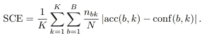
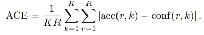
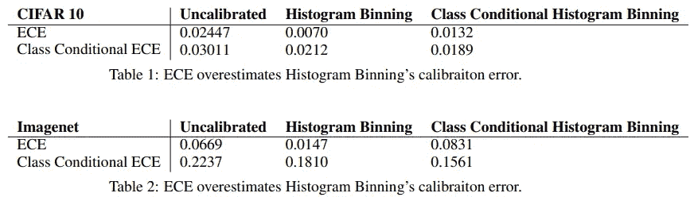
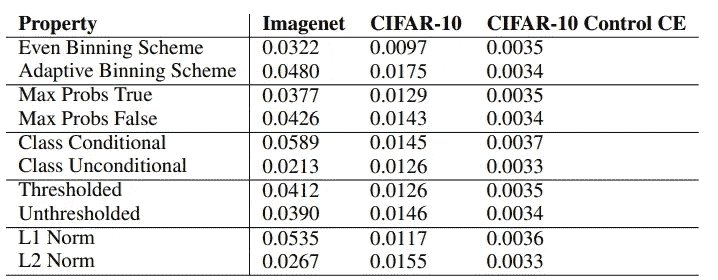
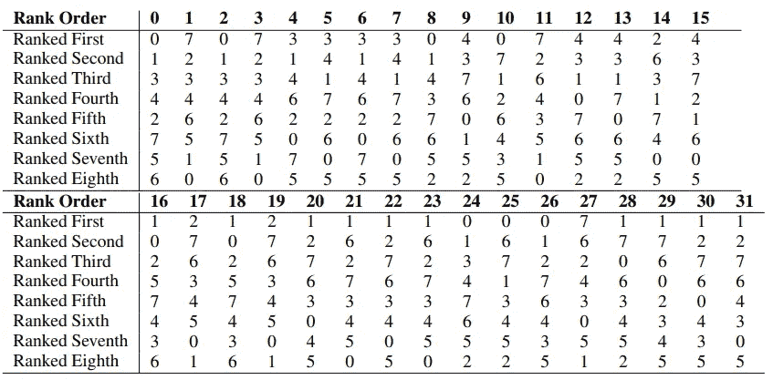

# 深度学习中测量校准的度量

> 原文：<https://medium.com/codex/metrics-to-measuring-calibration-in-deep-learning-36b0b11fe816?source=collection_archive---------1----------------------->

莉安娜·米卡在 [Unsplash](https://unsplash.com?utm_source=medium&utm_medium=referral) 上的照片

在[之前的一篇文章](/codex/predicting-the-true-probability-in-neural-networks-confidence-calibration-fa6c6d712ff)中，我们回顾了深度神经网络中的置信度校准问题。非正式地说，置信度校准意味着如果一个模型以 90%的概率预测一个类，该类应该在 90%的时间内出现。我们回顾了测量和改进校准的方法。我们还讨论了为什么深度学习通常表现出较差的校准性能。

校准问题通常使用可靠性图来可视化，校准误差用预期校准误差来评估。最近的研究发现，这一措施是有问题的，原因有 4 个，并提出了衡量校准误差的替代指标。

*本帖基于论文* [*深度学习中的测量校准*](https://openaccess.thecvf.com/content_CVPRW_2019/papers/Uncertainty%20and%20Robustness%20in%20Deep%20Visual%20Learning/Nixon_Measuring_Calibration_in_Deep_Learning_CVPRW_2019_paper.pdf)

## 预期校准误差(ECE)

由于校准无法直接计算，我们使用 ECE 等替代指标来评估网络校准。我们首先将概率区间[0，1]分成多个*箱*。ECE 被计算为跨箱的准确度/预测误差的加权平均值，并根据每个箱中样本的相对数量进行加权。

ECE 通常用作标量度量来评估实验中的校准。但是本文发现，ECE 作为校准的一种度量是有根本缺陷的，并且一些成功优化 ECE 的校准方法没有得到适当的评估。欧洲经委会的问题包括

**不计算所有预测的校准** : ECE 设计用于二元分类，当扩展到多类分类时，仅使用预测类的概率来测量校准。该度量固有地忽略了模型如何预测其他 K-1 个概率。ECC 成为更差的校准度量，因为超出预测的类别预测更重要。

**固定校准范围**:ECE 指标根据每个箱中样本的相对数量进行加权。因为网络预测通常非常可信，所以右侧的几个条柱对 ECE 的贡献最大。ECE 仅关注于确保校准更有把握的样本。

**偏差-方差权衡**:箱数是一个超参数，涉及校准测量偏差和方差的权衡。较大数量的箱将改善将范围细分为低偏差测量，但是由于较少的样本被分配到每个箱中，它们将具有较高的方差。因为某些仓比其他仓更稀疏，所以这个问题与之前的固定校准范围问题相结合。

**静态宁滨方案中的病态**:显然，网络似乎可以“黑掉”ECE 指标。当过度自信和欠自信预测出现在同一个仓中时，可能出现接近 0 的校准误差。然而，考虑到深度学习中的校准问题通常是过度自信，这似乎有点极端，也许不切实际。

> 例如，假设数据集是 45%阳性的，我们可以简单地为阴性实例输出(0.41，0.43)范围内的预测，为阳性实例输出(0.47，0.49)范围内的预测，以创建一组具有 1.0 AUC，0 ECE 但未校准的预测。

为了解决 ECE 度量的问题，本文提出了对 ECE 的修改。

## 阶级制约性

我们可以分别计算每个类别的误差，然后对其进行平均，以计算最终的校准误差。这允许我们独立于模型在类别频率中的不平衡来评估类别之间的校准误差。这证明了错误，特别是当我们有一个类不平衡(一个类比另一个类太多)或者当模型预测有偏差时。

## 最大概率

类条件性通过考虑多类输出的每个概率而不是仅一个概率来扩展 ECE。它计算所有类别以及所有条块的加权平均值。这旨在解决*不能跨所有预测计算校准的问题。*它还将类别权重倾斜固定到一个最有把握的输出。等式很简单(K: # classes)。

## 适应性

自适应校准范围修改箱间隔，因此每个箱包含相同数量的样本。自适应性是通过从预测精度的排序数组(N: # data，R:范围数组)中对大小为[N/R]的批次进行采样来实现的。这种自适应方案解决了*偏差-方差权衡问题。*

## 标准

比较准确度和置信度的标准可以被测量为 L1 标准|acc-conf|或 L2 标准 sqrt((acc-conf))。众所周知，与 L1 常模相比，L2 常模对异常值更敏感。这种选择似乎有助于校准指标的有效性。

## 阈值处理

通过使用 softmax，输出变得极小(> 0，但非常小)，并且可以清除校准分数。尤其是在应用 SCE 时，大多数模型预测应该有一个微小的值。这类似于*固定校准范围*问题，其中置信度是偏斜的。我们可以通过只考虑阈值ε以上的预测来解决这个问题。虽然这种对小类概率的忽略可能类似于只关注最大概率，但选择小ε保证了重要的次级预测不会被拒绝。

## 实验(显示 ECE 中的缺陷)

直方图宁滨和普拉特缩放等校准方法在之前的[文章](/codex/predicting-the-true-probability-in-neural-networks-confidence-calibration-fa6c6d712ff)中有所描述。

因为直方图宁滨实际上优化了 ECE 的概念，所以该方法似乎更倾向于 ECE 度量。上表显示直方图宁滨在 ECE 指标中表现更好。ECE 校准误差是 class 条件变量的三分之一到五分之一。根据下图中绘制的每个类别的校准误差，误差在各个类别之间是不一致的。所有这些都表明 ECE 给了直方图宁滨不公平的优势。

上表比较了对 ECE 指标上的温度标度参数的学习目标的多次修改的效果。在“属性”目标上优化用于温度缩放的温度参数，并测量 ECE。ECE 似乎受到小属性的影响，而不是评估一般校准性能。例如，ECE 建议优化 L2 范数而不是 L1 范数可以将 Imagenet 上的校准误差减半。

ECE 对箱的数量非常敏感。在实验中，测量了不同宁滨超参数的相同校准度量的等级。自适应校准度量在平均秩相关方面显著优于经典的均匀分仓度量，表明自适应宁滨方案在分仓数量方面更稳健。诸如最大问题、类条件性、阈值和 L2 范数之类的其他度量恶化了平均等级相关性。令人失望。

上表描述了 8 种校准技术在 32 个指标上的排名。一般来说，在校准指标的排序中发现了不一致性。虽然没有明显更好或更差的技术在所有指标上都表现良好，但我们可以发现每种技术的一些有利指标。改变校准误差度量将导致关于哪种方法实现最佳校准的不同结论。很容易对后处理校准方法做出错误的结论。

## 结论

本文研究了用于评估校准的度量的不确定性和局限性。它使用 ECE 指标识别问题并对问题进行分类。我们还审查了对 ECE 指标的修改，以解决所指出的局限性。最后，我们讨论了用于评估校准性能的度量标准的怪异现象。

测量校准和评估校准的未来指标必须解决本文提出的挑战。为了在校准方面取得实际进展，我们首先需要明确定义校准。这篇论文表明，这并不像我们想象的那么容易。

我认为深度学习的校准非常怪异，而且研究不足。这是学习算法中的一个重大缺陷，同时它是不一致的，推理也不清楚。