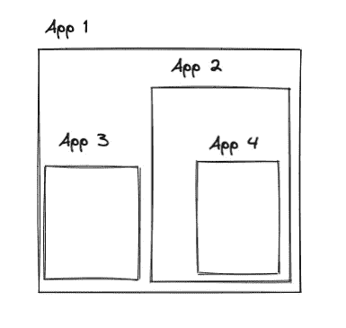
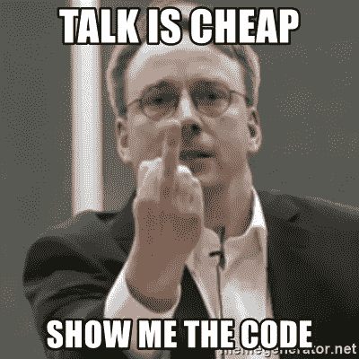

# 微前端—内容、原因和方式不到 7 分钟| ELI5

> 原文：<https://medium.com/codex/microfrontend-what-why-and-how-under-7-mins-eli5-58041f726bbe?source=collection_archive---------7----------------------->

这将是我尽可能用最好的方式解释网络内容的众多故事之一(像我一样解释给我听)。所以坚持住，不会太久的。

因此，正如标题所暗示的，让我们一次一个地讨论一下微前端是什么、为什么、如何工作的。

# `***The What***`

*微前端*，现在已经被各行各业广泛采用，已经有一段时间了。这基本上意味着让你不同的前端应用程序，协同工作，让它感觉/行为像一个单一的应用程序。

> 如果你来自后台，并且你编写服务，你应该熟悉微服务架构。微前端基本上就是这样，但是对于前端来说。

在这里，您可以绑定多个前端应用程序，最终用户会感觉他们在使用一个 web 应用程序。



在这里，终端用户只知道 App 1。(此处应用 1 是主机应用)

这里，您有 4 个不同的应用程序，它们在后台协同工作。这 4 个可以是任何前端应用，用任何框架构建，可以完全隔离。(假设我们在 app4 中有一个 angular 应用程序，在 app2 中有一个 react 应用程序，在 App1 中有一个 vue 应用程序)。

# ***这个为什么***

假设您有一个用于电子商务业务的 web 应用程序，它展示了登录页面、一些产品和价格。
现在，你需要一个支付门户，你意识到这将是一个至关重要的功能，你希望你的客户能有一个流畅的体验。你也意识到你已经拥有的应用程序是一个遗留软件，现在很难维护。

现在你想改造你的整个产品，但你没有时间或资源去做。所以你决定继续前进，平台上的任何新特性都将是你最近遇到的这个超级酷的框架。

此外，您不希望破坏当前的客户体验。

你是做什么的？

你所做的就是在你的平台之外做微前端。你雇佣了一个团队致力于这项功能(在我们的例子中是支付)——为此建立一个单独的应用程序，并将其放在你的主应用程序中。

你基本上是给你的用户一个全新的应用程序与现有的集成。

现在，这个功能将会非常快，因为它不像你的主应用程序那样有一万亿个依赖项，具有非常小的包大小(与你的主应用程序相比)和非常美观的外观和感觉(取决于你设计它 lol)。

但是你还问什么？

拥有一套不同的应用程序有助于你独立运行不同的团队，每个团队的核心焦点更加集中。
此外，由于它们是独立的应用程序，你的应用程序 2 干扰应用程序 3 的机会显著减少(不是零，因为你有时确实有一个共享状态)。

您的团队可以并行工作，而不必担心其他团队在做什么。

但是公司真的用这个吗？是的，他们有。宜家、Spotify、SoundCloud、Upwork 等等。


如果它有那么好，每个人都应该使用它，对吗？

嗯，套用本叔叔的话，伟大的架构带来了巨大的复杂性。

因为你要把你的应用程序分割成不同的小程序，所以在它的状态管理中需要做一些工作。状态基本上是数据，应用程序用它来做一些操作。

这方面的一个基本例子是:假设您的支付应用程序需要某种令牌来验证支付。或者它需要用户数据来生成发票。现在你不能让你的用户每次访问任何新的微前端应用时都登录。这显然会泄露你可爱的小建筑，更重要的是，一些可怕的 UX。

因此，必须有一种方法在不同的应用程序之间共享状态，对吗？—或者至少是你的微前端应用之间的某种通信。

让我们看看“如何”部分。

# 怎么做

我们将采用不同的方法来微前端化你的应用。随着 [Webpack 5 的模块联盟](https://webpack.js.org/concepts/module-federation/)的发布，微前端获得了进一步的流行。这涉及到调整您的配置以适应这种架构。但是我们将走一条不同的路线。一个非常著名的公司 Hubspot 使用的。

***iframes***

对于那些不知道 iframe 是什么的人来说，它基本上是一个与你的网站不同的网站。你可以有你的作品集网站，你可以把 google.com 放在你的网站里。它就像一个容器。
你可能见过一些地方，youtube 视频被嵌入到不同的网站中，就像这个。

继续检查视频上的元素，您会看到一个叫做的东西。这有助于轻松地将这个视频或任何网站放入您自己的网站。

如果你不知道 youtube，你会认为这个视频是这个网站的一部分。还有 tada！这基本上是微前端:D 的症结所在

但是这里很简单，因为这个网站和 youtube 之间没有数据交换。那么，如果你需要分享一些数据，或者换句话说，与子应用程序(在这种情况下是 youtube)进行交流，那又如何呢？

你可以使用 [PostMessage API](https://developer.mozilla.org/en-US/docs/Web/API/Window/postMessage) 来完成。您可以将数据模型传递给子应用程序，并且可以监听子应用程序发出的事件。

在我们的支付案例中，我们可以将用户对象和令牌传递给子应用程序，一旦支付完成，子应用程序可以发出一个事件，让主机/父应用程序知道支付完成。然后父应用程序可以重定向并生成发票。

好吧好吧。你是怎么做到的呢？



所以为了让 Linus Torvalds 冷静下来，我将向您展示一些关于如何开始的基本片段。

在您的主应用程序中，您想要呈现子应用程序的地方，您只需要一个容器(最好是一个 div ),然后在 iframe 中托管您的子应用程序。为了与应用程序交流，我们将使用 [Postmate](https://www.npmjs.com/package/postmate) ，但也可以随意使用您选择的任何其他库。

*主应用的典型设置*

```
<template>
  <div
    id="childapp"
    ref="childapp"
    style="height: 100vh; width: 100%; border: none"
  ></div>
</template><script>// Postmate sets up an handshake with your child app new Postmate({
        container: this.$refs.childapp,
        url: `${url-of-your-child-app}`,
        name: 'child-app-name',
        model: {
          // any data that you need to pass to your child.

          sampleData: 'tokenABC' },
      }) .then((child: any) => { // Handshake with Child is complete /* 
            now that your handshake is setup, you can listen
            to events from your child app. 
          */ child.on('getRefreshedTokenId', async () => {
            const tokenId = await this.getTokenId() /* 
             you can also call any child app's function that is 
             exposed by the child app. 
            /* child.call('setTokenId', tokenId) })
        }) .catch(async (err: Error) => {
          // catch errors if any.       })</script>
```

现在让我们看看子应用程序，以及它如何与父应用程序通信。

子应用程序的根级组件:

```
<script> 
 new Postmate.Model({ setTokenId: setTokenIdFromParentApp, // this function is
                                              exposed to parent app
        }) .then((parent: any) => {
        console.log('Handshake with parent complete.')
        const { model } = parent// model has all the data that is passed down from parent. 

        // you can also emit to parent using

        parent.emit('getRefreshedTokenId') // name of the event })</script>
```

您也可以将您的连接/握手保存到一个变量中，并在应用程序中使用，以防止创建超过 1 个连接。
只需使用 parent connection = new post mate . model()或 child connection = new post mate()
并在以后使用它们。

一旦完成，也就是说，当您路由到一个不同的 url 或组件时，您可以使用

```
childConnection.then(child => child.destroy())
```

还有…差不多就是这样。

如果您希望您的子路由显示在浏览器 url 上，那么会有一些与路由相关的复杂情况。这超出了本文的范围，我将让您自己解决。如果你遇到这个问题，可以亲自联系我，我很乐意帮助你。

现在，如果你在想，为什么使用 Postmate 模型将数据传递到子应用程序中，而不仅仅是使用浏览器本地存储或 cookies。

这是因为由于你使用 iframe，你的孩子应用程序无法访问你父母的本地存储。或者饼干。

希望这能澄清一些事情，让你学到一些新的东西。如果这是真的，一两个掌声将不胜感激！

我知道这可能有点超过了 ELI5，在未来我会试着打破常规。

要阅读更多 ELI5 系列中与网络相关的东西，你可以在这里关注我的作品！

> 谢谢你走了这么远！！！

*可以在上面联系我，*[*github*](https://github.com/baibhabmondal)*，*[*linkedIn*](https://www.linkedin.com/in/baibhab-mondal/)*。或者* [*碎碎念*](https://twitter.com/baibhabmondal)