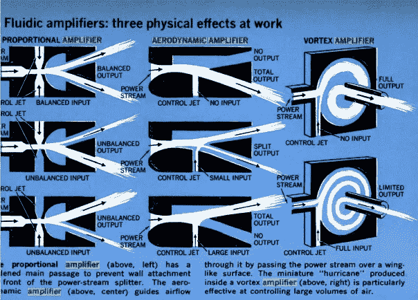

# 空气中运行的微处理器？

> 原文：<https://medium.com/codex/microprocessors-running-on-air-a47a702dd41f?source=collection_archive---------0----------------------->

## 药典

## 曾经有一段时间，现在被遗忘了，人们期望计算机将依靠流体而不是电流运行。

基于射流的系统的基本构件。

逻辑门几乎可以用任何方式制造。今天，我们用晶体管的组合来建造逻辑门，如“与”、“或”、“与非”和“异或”门