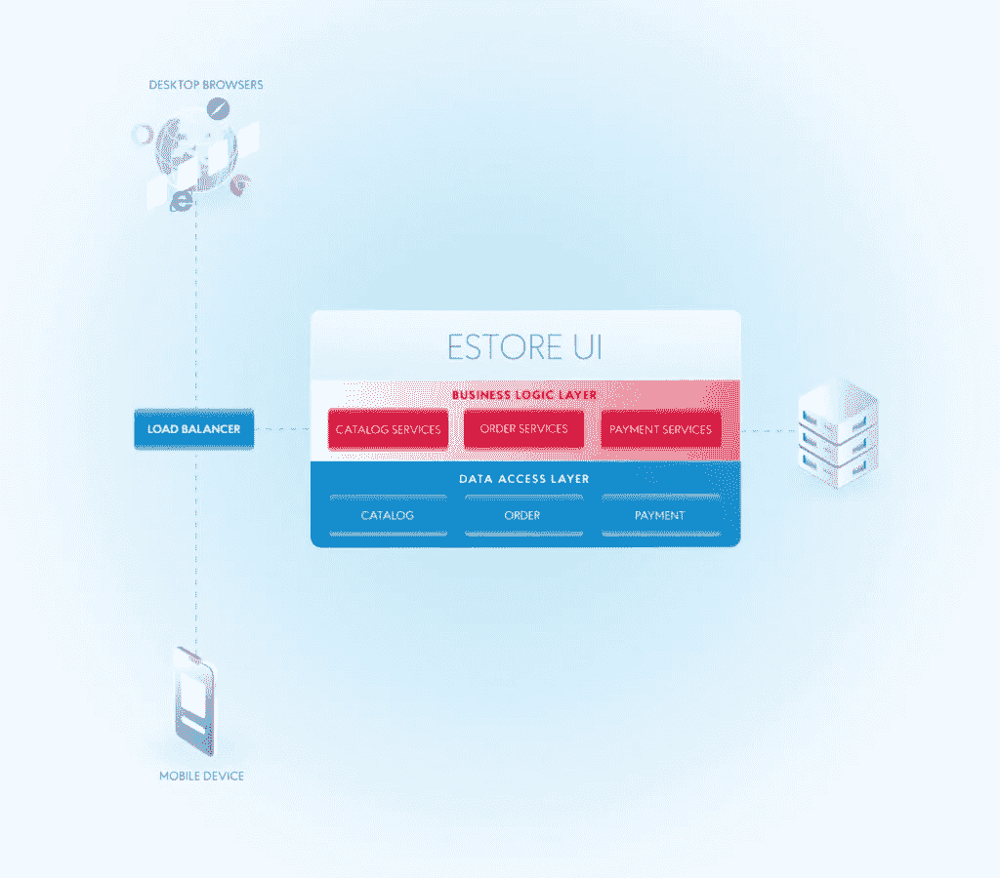
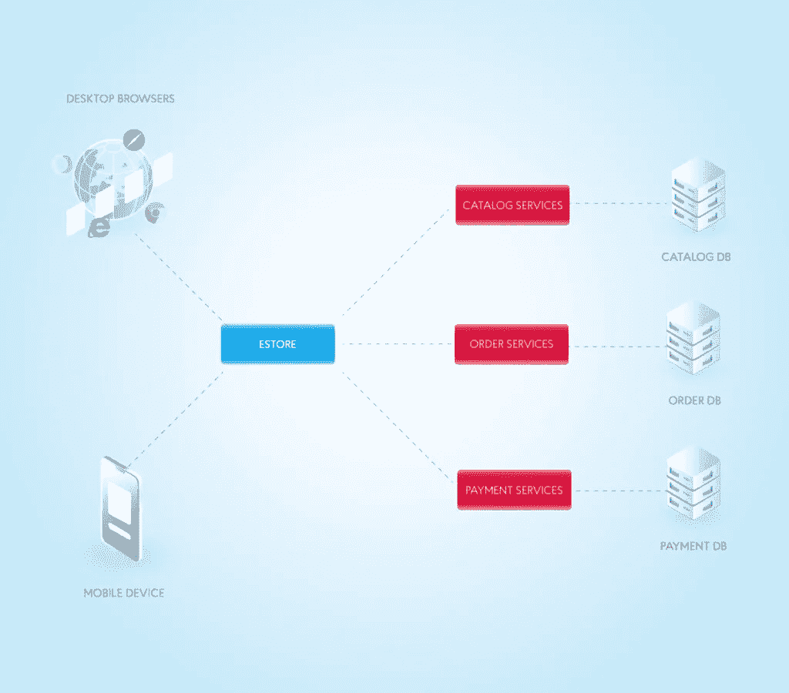
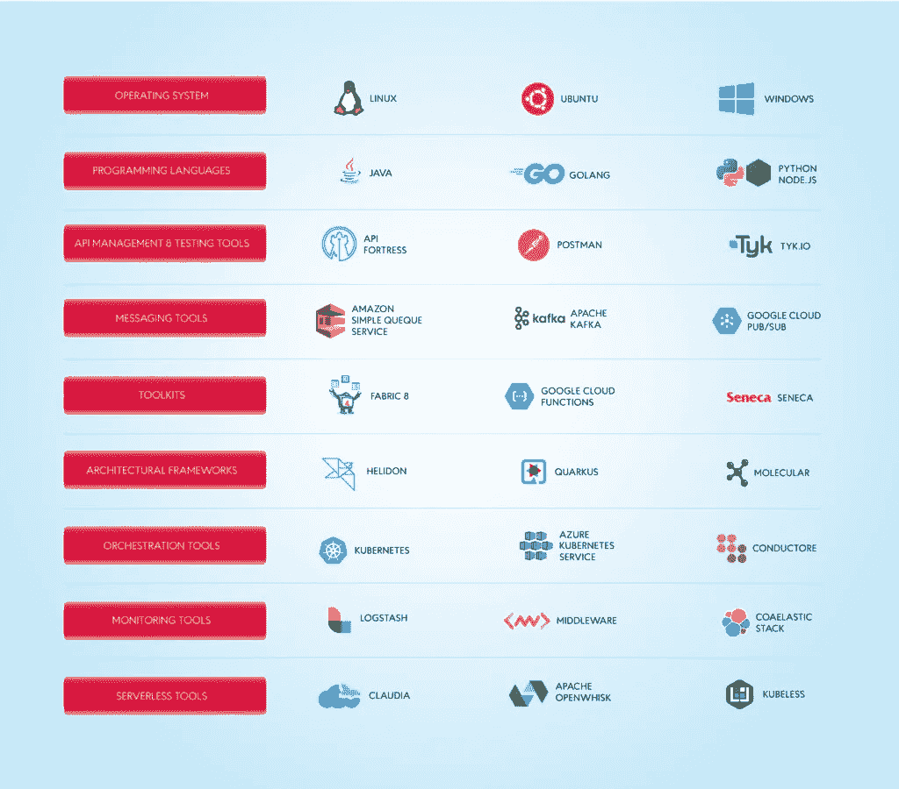

# 微服务架构:优点、缺点、示例和最佳实践— NIX United

> 原文：<https://medium.com/codex/microservices-architecture-pros-cons-examples-and-best-practices-nix-united-59da215dec93?source=collection_archive---------8----------------------->

虽然大白鲨可能是海洋中最可怕的生物，但在很多情况下，一群鱼比一个个体更有可能存活下来并茁壮成长。成功的合作是整个动物王国的制胜策略:蚁群、蜂箱和狼群都从系统中分配控制权和实现共同目标的工作中受益。如果群体、蜂巢或族群中的一员死亡，其他成员可以继续生存并弥补损失。

微服务采用这种方法，并将其应用于软件开发和系统架构。其思想是，单独创建一组功能或服务通常比在一个独立的、完全互连的系统中安装相同的功能更快、更容易、更安全、更高效。让我们看看微服务架构的特点、优缺点、可用工具、最佳实践，以及它如何帮助许多公司，包括优步、网飞，甚至亚马逊。今天，我们将确保企业转向[软件开发服务](https://nix-united.com/services/software-engineering/)以过渡到微服务架构的时候到了。

# 整体开发的缺点

在回答什么是微服务这个问题之前，有必要记住与之相对的另一种应用——monolithics。这些是作为一个整体构建的应用程序。当然，monoliths 可以有一个模块化的结构——包含独立的类、函数和名称空间(取决于所选择的编程语言)。但是这些模块之间的联系如此紧密，以至于改变其中的任何一个都不可避免地会影响整个应用程序的运行。

想象一堵砖墙。它是由独立的积木搭建而成的。在建造过程中，砖块仍然可以相互分离，但随着时间的推移，当水泥硬化时，它们就变得密不可分了。你可以沿着其中一个方向继续建造，但是要从根本上改变之前建造的墙，你很可能需要使用一把大锤。

以一家正规的网络零售商为例。一个三层架构将由一个单片应用程序使用，它由一个用户界面组成，服务器部分负责应用程序的业务逻辑、数据访问和数据库。

我们看到应用程序的业务功能非常多样化:使用产品目录和购物车、处理订单、支付交易、跟踪它们的状态等。但是在应用程序级别，它们都被组合成一个整体块。部署时，各种功能的代码驻留在同一服务器上。在不同的物理服务器上的多个实例中运行一个应用程序是扩展它所必需的。这种整体架构方案的缺点是显而易见的:

*   构建和部署完整程序的新版本的需求来自于哪怕是对一个业务操作的最小修改
*   您必须扩展整个应用程序，即使对于性能最低的单个组件也是如此。在我们的例子中，我们可以假设对产品目录的调用将比下订单更频繁——也就是说，为这个功能分配额外的资源是值得的，但这在单一架构中是不可能的
*   由于程序中的相互依赖性，一个模块的故障通常会影响整个工作。因此，解决这个问题的成本会更高
*   开发人员受限于为应用程序选择的技术堆栈，尽管对于某些组件，使用其他技术可能是有效的
*   它需要一个相当大的、难以管理的员工队伍，其结构很可能与所选择的体系结构相对应:用户界面、业务逻辑和数据库方面的不同专家。这些团队中的每一个都需要具备所有业务职能方面的专业知识，随着时间的推移，这将变得越来越困难
*   因为更改会影响整个应用程序，所以调试和测试它们的时间会增加，这导致更新的发布不频繁，并且在一个发布中发布的更改数量会增加，这反过来会增加风险
*   任何数据库更新都会对整个应用程序产生影响，并且需要大量的代码修改

对于小型的、不经常更新的应用程序，这种架构可以很好地工作。但是随着功能的增加，整体模块中的模块间连接将不可避免地增加并变得更加复杂，一些模块中的变化将越来越多地影响其他模块；结果，这种系统的进一步发展变得极其困难。这将是考虑微服务的最佳时机。

# 微服务到底是什么？

现在让我们更清楚什么是微服务架构。与 monoliths 不同，这个应用程序是作为一组小型的、松散耦合的组件(微服务)构建的，可以独立于彼此进行开发、部署和维护。

如果一个整体应用程序最容易比作砌砖，那么微服务就像乐高积木。你有很多有明确标准界限的零件要连接。您可以随时更换或移除一些组件，而不会影响其余组件。而这是微服务架构所有优势中最重要的。

每个服务负责一个特定的业务任务，有自己的数据存储，并通过 API 与其他服务通信以解决更复杂的任务。在我们的场景中，我们可以区分用于管理产品目录、使用购物篮、下订单、支付和其他任务的微服务。

这为工程团队和业务本身提供了灵活性。比如基于微服务的应用更容易扩展。单个服务的开发和部署通常比单一的应用程序更快。在这里，微服务架构的优势才刚刚开始。

# 微服务架构的优势

微服务解决了发展中企业出现的许多问题；以下是微服务架构的主要优势。

# 易于扩展

从单个组件构建的项目更容易扩展。每个组件都有特定的用途，因此当应用程序需要扩展以执行新的或更复杂的功能时，开发人员可以将微服务作为起点。可伸缩软件能够更好地响应功能或客户需求的变化。

# 独立部署的可能性

应用程序中的每个微服务都是独立部署的。这意味着开发团队可以有选择地部署和测试单个服务进行故障排除，而不是测试整个应用程序。因此，测试、调试和更新应用程序的成本更低，而且还可以增加灵活性。

# 小团队

由于微服务的分离和结构化，开发团队可以在小组中工作。与拥有数百名参与者的大型团队相比，小型团队可以实现更好的沟通、组织和结果质量。小团队可以分配更专业的任务，专注于特定的产品或服务，并进行调试，而不是一次性处理整个程序。

# 编程选项

使用单一的方法，所有的系统组件都需要用开发团队开始使用的语言来编写。如果这不是最佳的行业实践，除了重构整个代码之外，没有其他选择。另一方面，使用微服务可以让开发者选择最方便实用的技术(编程语言、框架等。)对于每一个特性或者过程，最终的产品都会完美的工作。

# 稳定性增强

由于微服务是彼此独立部署的，因此应用程序对变化或问题的适应能力更强。开发团队分别关注每个微服务，以确保它在不干扰其他部分的情况下继续运行。这有助于节省时间和金钱，因为它减少了在一项服务扩展或需要修改时更新整个应用程序的需求。

# 微服务的缺点

尽管微服务架构有其发展趋势和大量优势，但它也有缺点，包括以下几点:

# 开发过程的复杂性

与整体架构相比，微服务增加了复杂性，因为不同地方的多个团队创建了越来越多的服务。如果蔓延得不到适当的控制，它会减慢开发速度并降低运营效率。

# 基础设施支出增加

每个新的微服务可能需要自己的一套测试、部署指南、托管资源、监控工具等。

# 额外组织费用

为了规划升级和接口，团队需要额外的协调和合作。

# 调试问题

每个微服务都有自己的一组日志，这使得调试变得复杂。当在多台机器上执行单个业务流程时，可能会出现其他问题。

# 缺乏标准化

在缺乏单一平台的情况下，语言、日志标准和监控系统的数量可能会增加。

# 所有权不明确

随着新服务的出现，开发新服务的团队数量也在增加。随着时间的推移，确定团队可以使用哪些服务以及联系谁来获得支持变得越来越困难。

# 微服务工具

创建微服务架构需要工具和流程的组合来执行构建和维护共享基础架构的基本任务。下面列出了其中的一些工具。

# 操作系统

创建应用程序所需的最基本的工具之一是操作系统(OS)。先说个例子。想象一下，在您的 web 开发团队中，一个人在使用 MacOS，另一个人在使用 Windows，而团队中的第三个成员认为他最好使用 Debian。每个开发人员浏览 20 页各种库和编程语言的安装说明，然后开始工作。这三个人都使用不同的环境来开发相同的应用程序，并且每个环境都需要独特的设置。但是，微服务架构保证了库和语言在这三种不同的开发环境中不会冲突。

# 编程语言

使用微服务架构的好处之一是，您可以在应用程序中为不同的服务使用不同的编程语言。根据微服务的性质，不同的编程语言部署了不同的实用程序。

# API 管理和测试工具

在使用微服务架构构建应用程序时，各种服务必须进行交互。这是通过应用程序编程接口(API)实现的。为此，API 管理和测试解决方案是必要的，因为为了让 API 如预期的那样高效地运行，它们必须被持续地监控、维护和测试。

# 消息传递工具

消息传递工具允许微服务进行内部和外部通信。微服务系统可能会使用 RabbitMQ 和 Apache Kafka 这样的通信工具。

开发人员可以使用各种工具包，每个工具包都有专门的功能，用于构建和开发程序。微服务工具包 Fabric8 和 Seneca 就是两个例子。

# 建筑框架

用于开发基于微服务的应用程序的框架提供了实用的解决方案，并且通常带有可用于创建和部署应用程序的代码库和其他资源。

# 编排工具

容器是运行微服务所需的可执行文件、代码、库和文件的集合。像 Kubernetes 或 Openshift 这样的容器编排工具为微服务架构系统提供了一个管理和优化容器的框架。

# 监控工具

一旦微服务应用启动并运行，您应该持续监控它，以确保一切顺利运行。监控工具帮助开发人员监控应用程序性能，避免潜在的错误或崩溃。

# 无服务器工具

无服务器工具通过消除对服务器的依赖，进一步提高了应用程序中各种微服务的灵活性和可移植性。这有助于简化应用程序任务的合理化和分离。

# 微服务什么时候能受益？

如果您正在使用一个整体应用程序或启动一个新的应用程序，并且列表中至少有一项适合您或您的项目，请考虑使用微服务:

**大团体。**不同的微服务开发团队不必在某一点上同步他们关于工具、步骤和其他细节的所有决策。新功能的并行开发和立即发布也是可能的。

**大型复杂建筑项目。**更新和维护单个模块比管理变更对整个系统的影响要简单得多。

**а适用于动态环境的应用程序。**如果您的产品在特殊场合或销售中被更频繁地使用，微服务将使您快速成长并降低系统故障的可能性。此外，您无需为仅在高峰消费时段需要的额外设备付费。

**需要频繁更新的应用程序。**只需要修改和调试你想要更新的模块。这大大减少了开发时间，加速了发布。

# 微服务最佳实践

了解使用微服务的最佳实践可以帮助您的应用程序充分利用微服务架构的优势。以下是一些可以考虑的最佳实践:

# 使用с电路断路器实现快速故障转移

当微服务依赖来自其他服务的响应前进时，响应时间会受到影响。为了防止速度变慢并提高应用程序的健壮性，请使用断路器设置呼叫超时。

# 使用 API 网关

API 网关可能为每个客户端公开几个 API，而不是提供一个通用的 API。例如，网飞 API 网关运行特定于客户端的适配器代码来交付最适合每个客户端需求的 API。API 网关还可以包括安全措施，例如确认客户端发出请求的授权。

# 为您的微服务使用单独的数据库

微服务的目标是防止或减少集中化。微服务保持独立，通过使用单独的数据库存储请求，通过不同的 API 网关发送请求。

随着时间的推移，每个微服务都会更新到新版本，但最大限度地减少版本数量有助于减少开发人员的编码问题。您还可以删除旧版本或将流量重定向到新版本。

# 注重权力下放

分散化有助于团队将项目分成多个部分，以实现更好的数据管理和安全性。它还有助于在设计过程中提供更多的自主权，并通过设计管道更有效地移动项目。

# 微服务示例

如今有许多公司已经通过采用现代微服务架构迁移到云，包括亚马逊、谷歌、IBM、LinkedIn、耐克、Nordstrom、Orbitz、PayPal、Spotify、Target 和 Twitter，微服务架构的例子不胜枚举——其中一些公司甚至在这个术语被创造出来之前就已经在使用模块化系统了。

网飞是首批迁移到云并实施微服务的公司之一。这就是为什么现在几乎每篇提到微服务的文章都会提到网飞。

像大多数公司一样，网飞有一个单一的系统，当时它不是一个在线流媒体服务，只是邮寄 DVD。2008 年，一个数据库错误导致整个服务中断了几天。然后决定把旧系统打造成微服务。正因为如此，企业能够更快地采用改进措施并解决缺陷。由于网飞系统非常庞大，因此创建了一个名为 Conductor 的新应用程序来在它们之间安排许多微服务。

网飞在 2011 年 12 月完成了向微服务架构的过渡。这种向微服务架构的过渡使网飞能够克服可扩展性问题，并为全球数百万人提供服务。文件资源管理器使网飞能够集中管理(暂停或重启)和扩展微服务。该计划是基于一项名为 Decider 的服务。Mantis(流处理)、Dynomite(数据存储)和 Vizceral(流量直觉)是网飞的进一步产品，旨在与微服务配合使用。

网飞目前在全球拥有 2.1 亿用户，并且正在扩张，没有遇到任何重大的运营问题，这在很大程度上是因为使用了微服务。

另一个微服务架构的例子是流媒体服务 Spotify。Spotify 在日常发展中不得不面对的问题是强大的竞争。音频流媒体市场以一些世界上最大的 IT 公司为特色，包括亚马逊、苹果和谷歌。同时，由于用户数量的增加，开发人员不得不不断满足不断增长的需求，并遵守某些商业规则(例如，许可权)。为了让 Spotify 能够对竞争对手的新进展做出快速反应，并更快地发布他们的创新，微服务是理想的选择。

例如，一个让用户一输入搜索词就能收到建议的功能是一个独立的微服务，由专门的团队负责。此外，Spotify 还受益于微服务架构的健壮性:如果一个微服务出现故障，整个产品不会变得不可用。总共有超过 800 个微服务活跃在 Spotify 上。对了，流媒体服务大部分微服务都用 Java。然而，这并不意味着微服务不能用不同的编程语言编写。这与工作流有关:开发人员不断地从一个团队转移到另一个团队，如果每个人都使用相同的语言，这就更容易了。

我们微服务架构示例列表中的下一个是 Amazon。在世纪之交，亚马逊的零售网站是一个整体，在分层服务之间和内部有紧密耦合的链接。这意味着开发人员必须小心翼翼地工作，以确保每次需要进行更新或升级时不会出现任何问题。然而，随着其受欢迎程度的增长，亚马逊雇佣了更多的开发人员，代码库变得更大。这使得架构更难改变，增加了过程开销，并且减慢了软件开发生命周期。

2000 年代初，亚马逊的客户群增长迅速，其开发团队总是跟不上。延迟、服务相互依赖和编码问题限制了 Amazon 满足其扩展需求和跟上其客户群快速增长的能力。

Amazon 已经将其单片应用程序分解成小的、独立的、专门的应用程序。该过程从开发人员分析源代码并突出显示执行相同功能的代码块开始。已经为产品页面上的购买按钮开发了一个单独的服务。另一个是为税收计算器创建的。一旦完成，这些块就被包装在一个 web 服务接口中。最后，每个独立的服务都被分配给一个开发团队，这样可以更详细地了解开发瓶颈，并提供快速有效的解决方案。

与亚马逊一样，由于增长受阻，优步也决定放弃其单一结构。该共享平台面临的问题包括新功能的开发和推出效率低下，无法快速修复漏洞，以及整合其快速增长的全球业务的问题。应用程序的复杂架构需要有经验的开发人员对系统进行微小的修改和更新。

为了解决与单一应用程序相关的问题，优步将其分解为云微服务。很快，为乘车和乘客管理等业务功能开发了单独的微服务。这些服务通过 API 网关相互通信。

最后但同样重要的是微服务架构的例子:易贝。像大多数系统一样，这个销售平台一开始是一个整体——它在一个文件中有 340 万行代码。易贝决定打破垄断，在 Java 开发微服务。在易贝上，各个服务也通过 REST 相互通信。

易贝和许多其他公司已经成功地从整体架构过渡到微服务架构的事实证明了这种方法的价值。在一个在线项目的早期阶段，一个 monolith 足够完美，只有少量的活跃用户和一系列可管理的服务，但是随着需求的增长，它变成了一个令人窒息的怪物。

# 最后的想法

最近微服务对软件开发产生了不可估量的影响。由于这种替代长期主导软件开发的整体架构模型的方式，团队现在有了一种更直接的方式来创建、管理、部署和扩展云上的各种应用。

微服务可能不适合所有人。虽然微服务架构对适当的用例有好处，但过渡可能会很棘手。如果一个遗留的单块应用程序能够完美地工作，就没有必要把它分成几部分。然而，随着公司的发展及其应用需求的增加，微服务架构可能是有益的。

如果您正在寻找方法来扩展您组织的技术能力，并克服停机时间、缓慢的性能和地理挑战，那么最好雇用经验丰富的开发人员，他们可以使用微服务架构来创建卓越的产品。

*原载于 2022 年 11 月 30 日*[*【https://nix-united.com】*](https://nix-united.com/blog/everything-you-need-to-know-about-microservices-in-simple-terms/)*。*