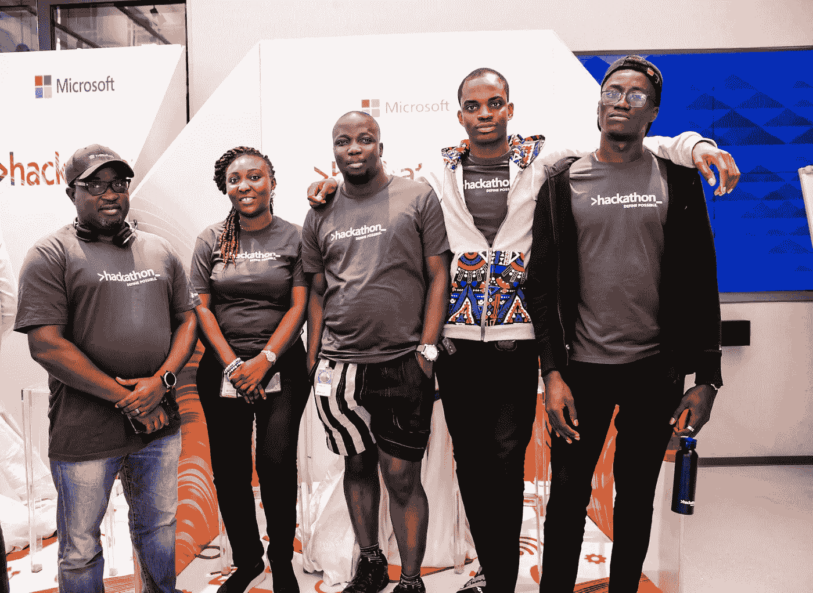

# 微软全球黑客马拉松 2022

> 原文：<https://medium.com/codex/microsoft-global-hackathon-2022-a9b479766cd9?source=collection_archive---------5----------------------->

> "**定义可能！**

微软有一个传统，每年举办一次全公司范围的为期一周的黑客马拉松，由“[车库](https://www.microsoft.com/en-us/garage/)支持。这项活动邀请来自世界各地的员工与团队、组织和/或学科的同事合作，分享激发他们灵感的想法。

微软尼日利亚黑客在车库西非

我喜欢黑客马拉松！从创意到 [MVP](https://en.wikipedia.org/wiki/Minimum_viable_product) 的旅程是一次快速而惊险的冒险。这可能需要几个小时或几天的时间，但看到一个想法在很短的时间内变成一个功能性的产品是令人惊讶的！去年，我被动参与，但今年决定推动 2 个项目。这一经历虽然令人疲惫，但却令人大开眼界，并激起了对工程经理和项目经理的新的尊重。

一点背景，我是一名工程师，因此对建筑有强烈的偏见。我宁愿开始构建一些东西，任何东西(在初步研究之后)，并在过程中调整它以符合预期，而不是花费长时间和无数次会议试图找出要构建的完美产品。

我谦卑的自己，为项目 2 的每个团队成员大声疾呼

另一方面，项目经理偏爱有用的产品。他们热衷于为特定受众打造完美定制的解决方案。因此，为了平衡项目，我与两位项目经理合作。

# 黑客马拉松前的活动

## 团队形成

我联系了两位项目经理，Bobby Nwokonneya 和 Doyinsola Olawuyi，希望从项目经理的角度了解情况，并寻求他们的帮助，幸好他们同意了。谢谢！🙌

我在官方的黑客马拉松网站上创建了这些项目，向黑客发出号召，并建立了群聊来进行交流。

L-R:我自己，阿莫斯，诺菲萨特，阿达奥比，伊亚诺卢瓦，阿比奥顿，阿比奥顿，奥卢瓦约，奥古斯汀，奥卢瓦托因，索菲，奥卢瓦雷米

## 需求收集

首要任务是采访主要利益相关方，深入了解他们的运营情况，以及我们如何最好地解决他们的问题。这是非常重要的一步，因为我们不想最终为即将潜水的人建造一架最先进、超音速、豪华且近乎科幻的飞机。我不喜欢这部分。

我不得不在会议上多坐一个小时，问问题和回答问题，这对我内心的工程师来说是一个更痛苦的要求。对我来说，这是必要的邪恶。谢天谢地，车上有人喜欢驾驶这辆车。

L-R:阿莫斯、多因索拉、奥拉昆勒、我自己、阿德巴约

## 思维能力

PM 团队分析来自利益相关者的反馈，将它们分类成有意义的块，突出机会并提出可能的解决方案。

工程师们从技术角度评估了这些提议，(考虑到我们的时间表，)并就我们应该建造什么达成了一致。

L-R:我自己，Chinedu，Muhammad，Amos，Tejumade，Olakunle，Adebayo，Sophie，Augustine，Omojo，Doyinsola

# 黑客马拉松活动

## 砍

黑客马拉松于周一正式开始。我们已经详细说明了 MVP 的构建，所以接下来的步骤是分成子团队，定义责任，里程碑并开始破解。

作为两个项目的项目负责人，我的主要职责是激发活力、确定优先事项、提供清晰性并保持团队高昂的士气。考虑到眼前的挑战，我不得不擅长讲鼓舞人心的故事，放大低沉的声音，为每个人腾出说话的空间。这是为了确保每个人都感到自己的贡献被包含、被倾听和被重视。

我的工作区

我的计划是加入一个工程小组来处理这两个项目的后端，但是在一整天的努力之后，我已经筋疲力尽了。我打开我的 [IDE](https://en.wikipedia.org/wiki/Integrated_development_environment) 写了一些代码，但就是写不出来，人员管理可不是闹着玩的。

意识到在管理团队和编写代码之间切换是多么耗费脑力，我决定专注于管理团队和做一些 DevOps/DB 管理工作。我每天与团队进行同步，管理存储库，并负责将解决方案部署到云服务器。

L-R:阿比奥顿、伊亚诺卢瓦、奥卢瓦雷米、奥卢瓦托因、本人、鲍比、阿达奥比、阿莫斯

到周三，我们开始看到来自不同子团队的输出——模型、内容、API 端点和应用程序的粗略版本。从那时起，我们在构建和评审之间摇摆不定，直到黑客马拉松的最后一天。

## 科学展览

位于微软拉各斯站点的 Garage-West Africa 在黑客马拉松周的周四举办了一次科学博览会，并邀请所有项目(拉各斯站点的黑客活动)来现场观众展示。

阿达比为项目 1 做演示

直到今天，黑客马拉松在很大程度上是虚拟的(由于我们现在生活在一个混合的世界里)，但黑客马拉松的一个美妙之处是让这么多聪明的人在同一个物理空间里集思广益，共同建设，由饮料、小吃、快餐、游戏和音乐提供动力。那种氛围在虚拟世界中几乎无法复制。

在科学博览会上，每个项目都有一个展位，有机会展示，观众投票选出最佳项目。

西非车库的项目展位

接下来是游戏、饮料、小吃、快餐、卡拉 ok、音乐和舞蹈。每个人都在身边真是太棒了。

游戏游戏游戏！

## 项目演示视频

对于正式提交，每个项目都要创建一个演示视频，详细说明他们解决的问题，他们提出的解决方案，他们的原型演示，使用的技术，目标受众和业务前景。

我和几个人密切合作，我们都为我们所做的工作感到自豪。

L-R:阿莫斯，我自己，罗紫琳，佩鲁米，奥莫霍，奥古斯汀，伊拉米，特朱马德，索菲，奇内杜

黑客马拉松的主要目标是与团队之外的同事合作，从事日常工作之外的工作，并识别、学习和/或提炼日常工作中通常不需要的技能。

对于这些项目，我们让工程师和项目经理作为经理工作，项目经理作为设计师工作，招聘人员和支持工程师作为项目经理和内容人员工作，所以在很大程度上，我会说这是任务完成！

加法尔·拉瓦尔(常务董事)

Soromfe Uzomah(车库项目经理——西非)

就这样，黑客马拉松正式结束了，乐趣、挫折以及介于两者之间的一切都结束了。

直到明年的这个时候，这还是 2022 年的黑客马拉松！

我的[参与者徽章](https://www.credly.com/badges/67026344-ba09-4fdd-9f93-94d609122bba/public_ur)