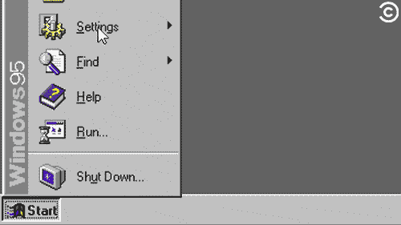
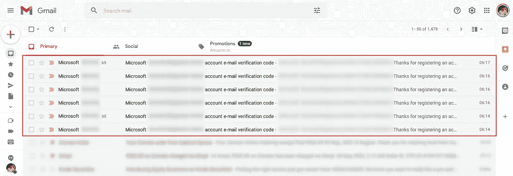
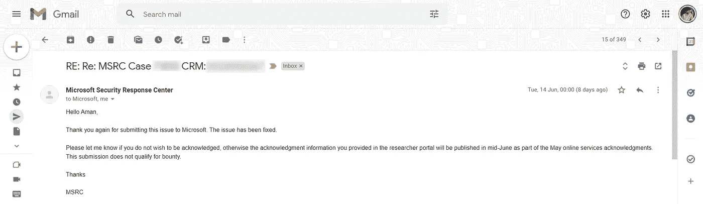
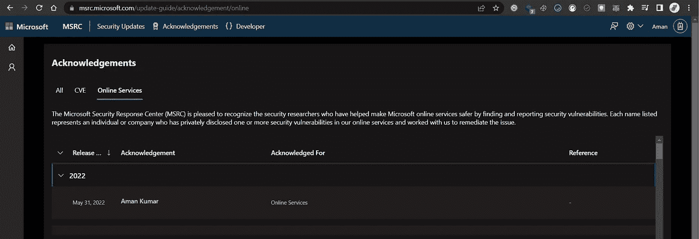

# 微软名人堂的一个小错误配置。

> 原文：<https://medium.com/codex/microsoft-hall-of-fame-for-a-small-misconfiguration-a0bb2eda9441?source=collection_archive---------2----------------------->

GIF 链接:-[https://media.giphy.com/media/3o7abrUyY8FHOpQELe/giphy.gif](https://media.giphy.com/media/3o7abrUyY8FHOpQELe/giphy.gif)

嘿大家好！我是**阿曼，**来自印度的网络安全研究员。希望你们都过得很好。今天我将分享我在**微软 Bug 赏金计划**的经历。在这篇文章中，我将解释如何找到速率限制漏洞，以及我在微软最常用的子域名中的一个小小的错误配置而进入微软名人堂的旅程。 ***(*** *这是我和微软之间的秘密，只能透露* ***)*** 😇

所以，让我们开始吧！

GIF 链接:——[https://giphy . com/gifs/party-Microsoft-windows-95-cxijluawu 955 u](https://giphy.com/gifs/party-microsoft-windows-95-CXijLuAwu955u)

所以，大约两个月前，我开始在微软上搜寻。首先，在寻找微软的漏洞时，我发现了一个要求用户发送电子邮件验证码来注册帐户的子域。每当我看到这样的端点，服务器总是通过填写一些细节向用户发送电子邮件。我试图在那里找到速率限制漏洞。因此，我决定寻找速率限制漏洞。我很快启动了 Burp Suite，捕捉到了浏览器发出的请求，并按照另一个步骤重现了漏洞，猜猜每个请求是什么 **200 OK** ，我开始在收件箱中接收每个请求的电子邮件。

收到来自 Microsoft 的帐户电子邮件验证码。

**漏洞:**验证邮件没有速率限制导致邮件触发。

**严重程度:**低(3.0 ~ 4.0)

**漏洞概述:**速率限制可防止应用因过多请求耗尽应用资源而变得无响应或不可用。发现电子邮件触发端点缺乏速率限制。这使得攻击者能够向任何电子邮件地址创建大量电子邮件，他们可以利用这些电子邮件向目标发送垃圾邮件。

**漏洞描述:**根据会话缓存中的信息，使用速率限制算法来检查是否必须限制用户会话。速率限制是一种限制网络流量的策略。它限制了一个人在一定时间内重复一个动作的频率——例如，尝试登录一个账户。

**漏洞影响:**如果公司正在使用任何电子邮件服务软件 API 或为在支持域上发送的电子邮件购买的某些工具，速率限制可能会导致财务损失，还可能会降低您的服务速度，因为巨大/大量的邮件将导致原始用户可能发送的数据中断，或者已购买的配额可能会用尽。对触发电子邮件的表格没有费率限制可能会对业务造成声誉损害，因为客户的信任会因收到大量不需要的和未经请求的电子邮件而受到影响。这也产生了电子邮件地址域被添加到垃圾邮件列表的风险。

> **重现步骤:**
> 
> **1。**在打嗝套件中打开拦截。
> 
> **2。**在打嗝套件中拦截请求。
> 
> **3。向入侵者发送请求。**
> 
> **4。**在位置选项卡中首先清除所有内容。
> 
> **5。**添加任意位置。(例如，我选择“0.5”)
> 
> **6。**使用空有效载荷并设置有效载荷计数。
> 
> **7。点击开始攻击。**
> 
> **8。**用户将在收件箱中收到电子邮件。

GIF 链接:-[https://media.giphy.com/media/3oKHWhapgmDIoZ6a76/giphy.gif](https://media.giphy.com/media/3oKHWhapgmDIoZ6a76/giphy.gif)

现在让我们来谈谈如何以及在哪里可以以一种有价值的方式轻松地找到速率限制漏洞。大多数人关注注册页面、忘记密码页面和联系我们表单。但是在一个网站上，您可以在不同的端点上找到至少 6 到 7 个速率限制漏洞。

> **在这些不同的端点中，您不会发现任何速率限制漏洞:-**
> 
> **1。-** 登录。
> 
> **2。——**唱起来。
> 
> **3。-** 改邮箱。
> 
> **4。-** 询价单。
> 
> **5。-** 忘记密码。
> 
> **6。-** 联系我们表格。
> 
> **7。-** 重新发送确认邮件。

在检查费率限制漏洞之前，请始终记住一件事。记住一件事，当您试图在 sing up、联系我们表格和查询表格上找到费率限制时，服务器会创建一个标签并发送给用户电子邮件作为参考，但在少数情况下，有时您会收到电子邮件，有时您不会收到任何电子邮件，因此请明智地检查。尝试寻找不同的端点，一般来说，我使用 Burp 套件 HTTP 历史标签寻找端点的最佳和最简单的伎俩。

> ***报告时间线***
> 
> ***2022 年 05 月 09 日:*** *报道*
> 
> ***2022 年 5 月 10 日:*** *复审并分庭*
> 
> ***2022 年 6 月 14 日:*** *固定*

> ***2022 年 6 月 28 日:*** *名人堂*

微软名人堂链接:-https://msrc . Microsoft . com/update-guide/acknowledge/online

最近，我因举报速率限制漏洞获得了$美元的奖金。此处补记:**[【https://medium.com/】T21](/@withamankr/how-i-earned-150-for-reporting-a-security-flaw-2de6334c961)**

****

**GIF 链接:-[https://media.giphy.com/media/8zYunr3Hg8XPq/giphy.gif](https://media.giphy.com/media/8zYunr3Hg8XPq/giphy.gif)**

**感谢您抽出时间阅读本文。如果你喜欢我写的东西，一定要关注我的更多更新，给我鼓掌。不要忘记留下你对这篇文章的看法。**

****联系我:**[*insta gram*](https://www.instagram.com/withamankr/)*，*[*LinkedIn*](https://www.linkedin.com/in/withamankr/)*，* [*Twitter*](https://twitter.com/withamankr)**

# **黑客快乐:)**