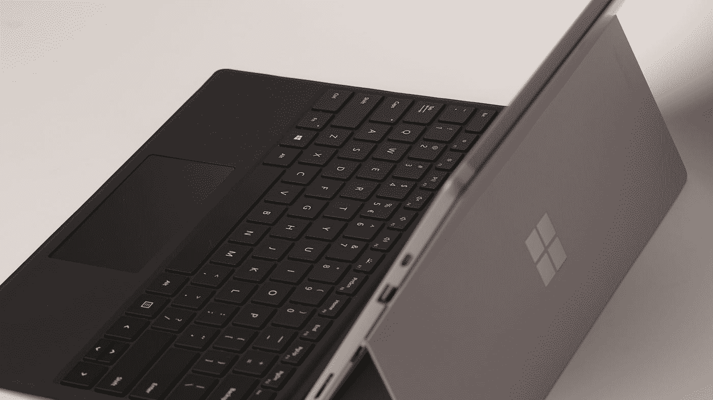

# 微软一点都没变

> 原文：<https://medium.com/codex/microsoft-hasnt-changed-at-all-618160578af5?source=collection_archive---------1----------------------->

## 拥抱，伸展，熄灭

在 [Unsplash](https://unsplash.com?utm_source=medium&utm_medium=referral) 上由 [Przemyslaw Marczynski](https://unsplash.com/@pemmax?utm_source=medium&utm_medium=referral) 拍摄的照片

所以我们都听说过 90 年代的 T4 反垄断案和几年前 Internet Explorer 是如何设定网络标准的。

但是微软现在好了。我是说，他们开源了 C#。他们开发 Visual Studio 代码，这是世界上最流行的编程文本编辑器，他们还开发了一些相当不错的硬件。