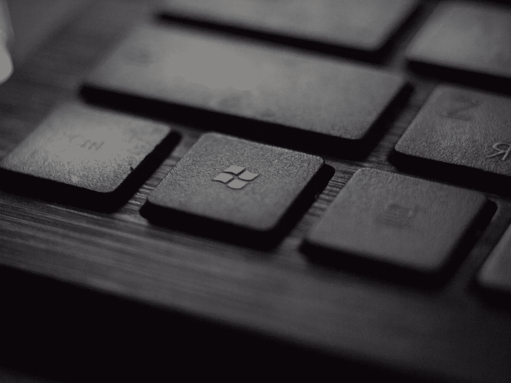

# 微软精神错乱。历史在 Windows 11 上重演

> 原文：<https://medium.com/codex/microsoft-insanity-history-repeats-itself-with-windows-11-2b3a31e4014d?source=collection_archive---------1----------------------->

***“精神错乱的定义就是重复同样的错误，却期待不同的结果。”***

是的，那句名言。你可能认为你知道这句话的作者。有些人可能会把博学的阿尔伯特·爱因斯坦称为这里著名的神谕。

然而，通过各种搜索和查询，没有他的官方记录存在…