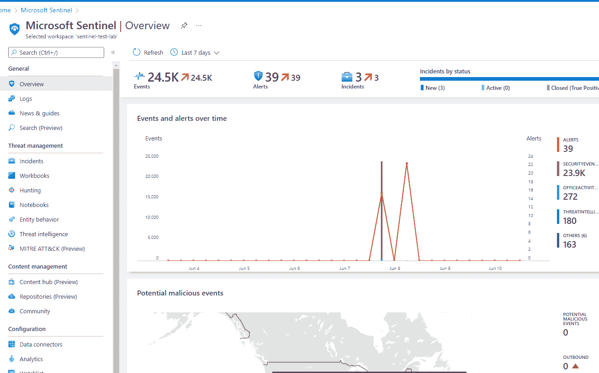
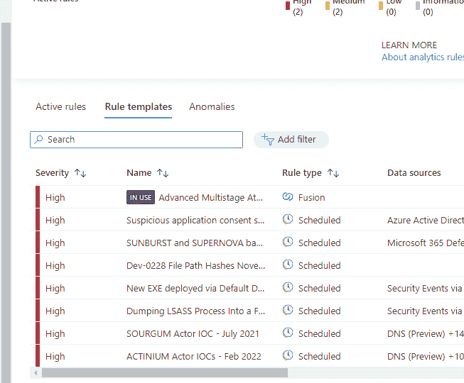
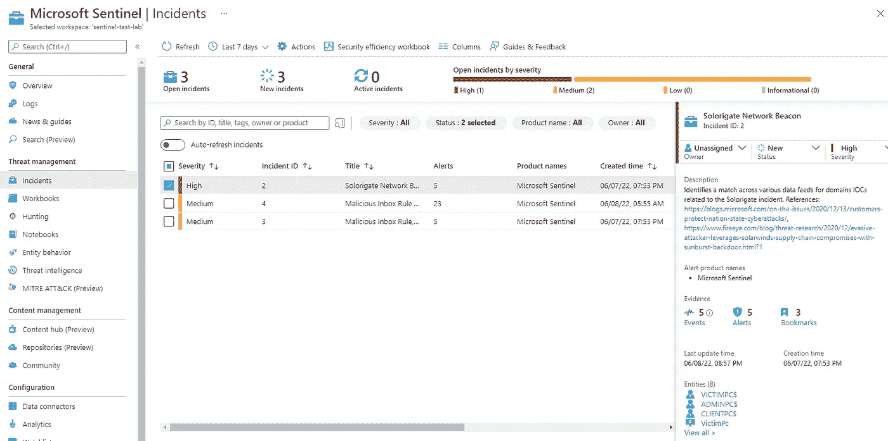
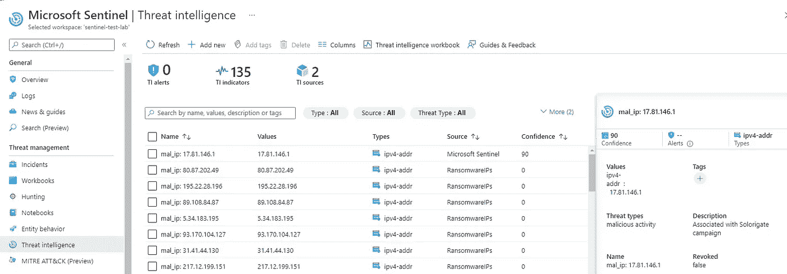
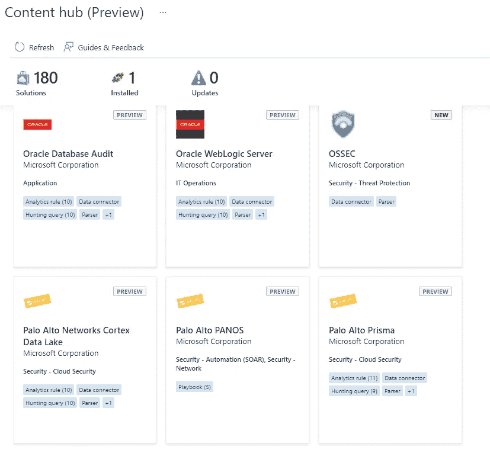
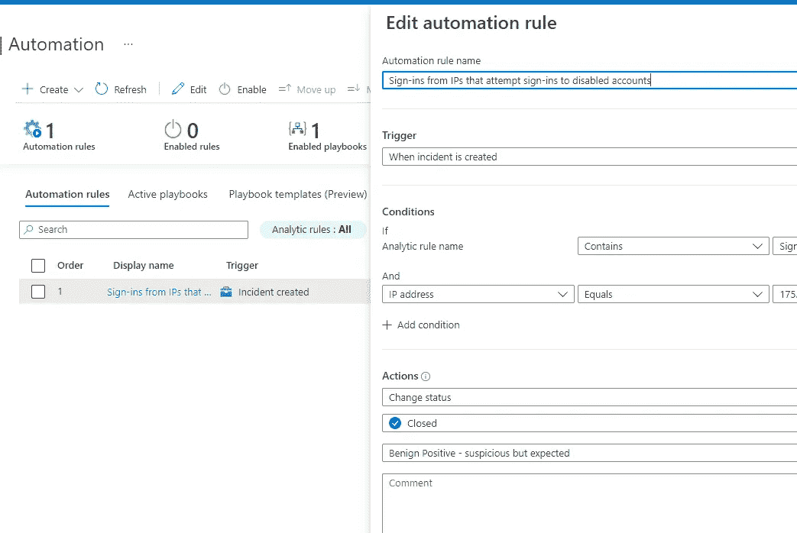
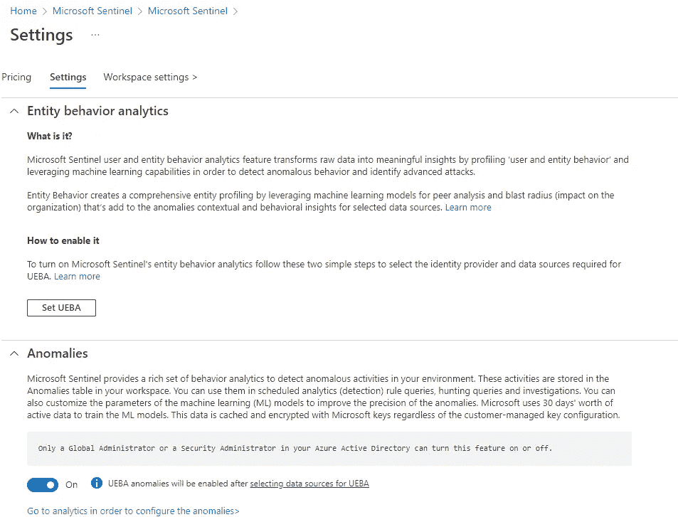

# 微软哨兵培训实验室

> 原文：<https://medium.com/codex/microsoft-sentinel-training-lab-f75f8c966450?source=collection_archive---------8----------------------->

## 学习如何对付门口那些讨厌的闯入者


那么你听说过哨兵和你能用它做的所有很酷的事情？很想看看微软最新的 SIEM 和 SOAR 功能，但又不想花很多钱去玩它？幸运的是，您可以将 Sentinel 培训实验室部署到自己的订阅中，并完成一次很棒的实验室演练。

[https://github . com/Azure/Azure-Sentinel/tree/master/Solutions/Training/Azure-Sentinel-Training-Lab](https://github.com/Azure/Azure-Sentinel/tree/master/Solutions/Training/Azure-Sentinel-Training-Lab)

这些说明将引导您在订阅中设置 Sentinel 环境、获取一些样本数据(不足以显著增加您的支出)、创建规则和事件管理。



此外，实验室将带您完成一些 KQL 搜索查询，以及如何使用监视列表将数据外部化到查询中。实验室中的示例向您展示了如何获取 IP 地址列表以添加到您的 KQL 查询中，在本例中，是我们将从中丢弃数据的地址列表。

另一个模块探讨了威胁情报平台(TIP)连接器。来自 TIP 连接器的 IOC 显示在威胁情报菜单项中，您还可以创建自己的自定义指示器。



您还可以根据威胁指示器创建规则或工作簿。工作簿可帮助您可视化数据，并可打印或导出为 pdf 以供传播或其他用途。

实验室中的最后一个模块向我们展示了 Microsoft Sentinel 内容中心目录。在目录中，您可以将补充软件包添加到 Sentinel 中，以提高安装的效率。这些包包括连接器、自动化选项、分析等等。这些不仅由微软提供，也由第三方提供。



其他有趣的事情包括自动化，使您能够设计许多自动操作来响应事件和威胁补救任务。



实体行为分析利用了微软在许多组织中拥有的大量遥测数据。信息被摄取、过滤和丰富，然后机器学习处理数据，并可以确定异常、制作笔记本或让您执行 KQL 查询等。



```
BehaviorAnalytics
| where ActivityType == "FailedLogOn"
| where ActivityInsights.FirstTimeUserConnectedFromCountry == True
| where ActivityInsights.CountryUncommonlyConnectedFromAmongPeers == True
```

Sentinel 中有大量的功能可以探索，实验室及其附带的说明是一个很好的开始。