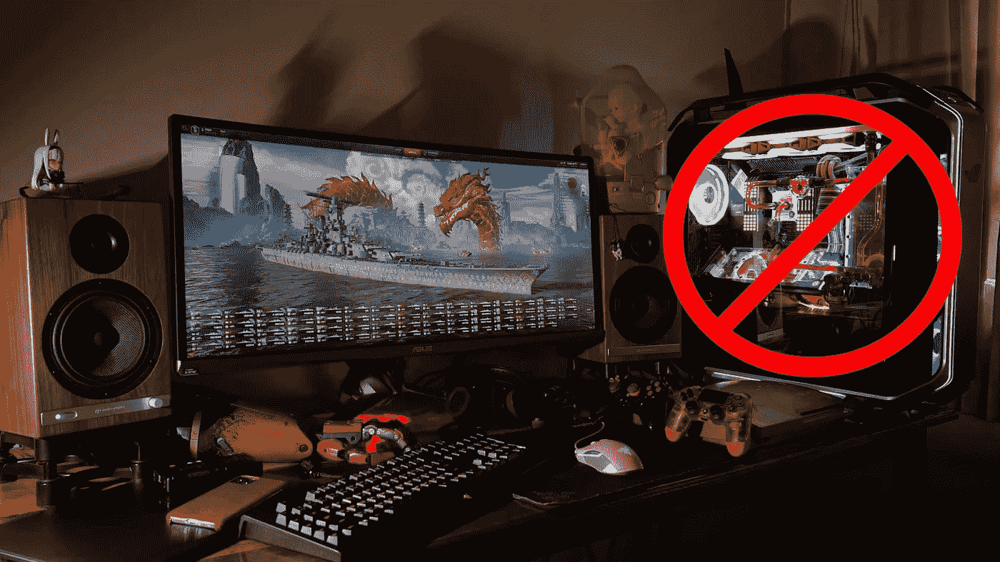

# 微软想用 Windows 11 干掉你的定制游戏 PC

> 原文：<https://medium.com/codex/microsoft-wants-to-kill-your-custom-gaming-pc-with-windows-11-c4f46ed82909?source=collection_archive---------0----------------------->

Windows 11 于 2021 年 6 月 24 日正式公布。

这也可能是我们见证定制 PC 终结的开始的一天。

隐藏在大张旗鼓和闪亮的新功能中的是两个看似微不足道的注脚，它们将对任何没有从工厂 PC 购买预建的人产生重大影响。