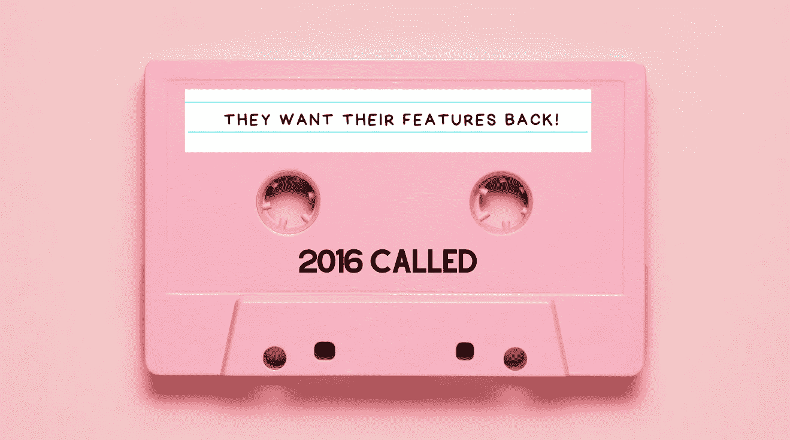

# 微软框架核心 7.0 惊人的新特性实际上是旧的承诺

> 原文：<https://medium.com/codex/microsofts-framework-core-7-0-old-promises-as-new-features-b5ac9d344a77?source=collection_archive---------2----------------------->

## 2016 年仍然缺少的功能将在 7.0 版本中推出

图片由[作者](http://arnoldcode.com)通过 Canva.com 制作

微软没有宣布新功能，而是反其道而行之。公司给你留下了取消的实体框架(EF)核心版本 6 的特性。只专注于将功能从经典 EF 升级到…