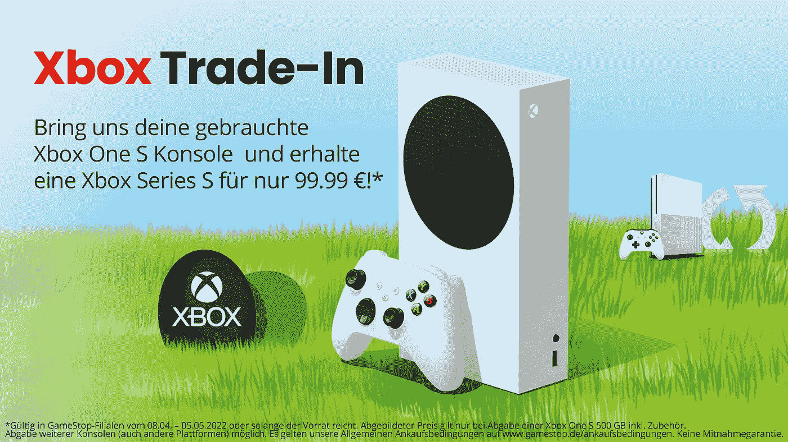
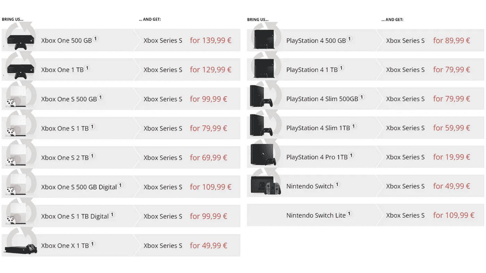

# 微软的 Xbox 以旧换新计划认为€399 PlayStation 4 和€229 Switch Lite 优于€499 Xbox One

> 原文：<https://medium.com/codex/microsofts-xbox-trade-in-program-values-399-playstation-4-and-229-switch-lite-over-499-xbox-one-9934373bf166?source=collection_archive---------6----------------------->

## 这笔交易足以让老主机所有者跳槽吗？

来源:微软 DE。

作为从 4 月 8 日到 5 月 5 日的复活节特别促销活动，微软允许玩家将他们的旧游戏机换成新一代游戏机。

GameStop DE 与微软合作推出了一项新的以旧换新计划，旧主机用户可以带着 Xbox Series S 回家。虽然它不像 Series X 那样强大，但微软最新的平价主机具有快速的 SSD 和一些受欢迎的下一代改进，如快速加载时间和升级的视觉效果。令人惊讶的是，索尼的基本 500 GB PlayStation 4 比它的 Xbox One 同胞兄弟给€提供了 50 英镑的价值。

任天堂的€229 Switch Lite 比一台装有 Kinect 的€499 Xbox One 贵 30 英镑。

虽然我可以理解 Kinect 在这一点上是一个废弃的软件，但有些人可能会指出，消费者不应该承担投资的主要责任。价格上的巨大差异可能意味着微软正在遭受相当大的损失。毕竟，一家公司要用 9 年前的游戏机做什么？

在围绕标题的主机大战接踵而至之前，这里是微软为 PlayStation 和 Switch 用户提供更好交易的原因。

来源:GameStop DE。

## 微软正瞄准游戏机市场的更大份额

成本价格的差异意味着微软试图吸引新的玩家进入它的生态系统。将有效的以旧换新计划与 Xbox Game Pass 订阅捆绑在一起，可能会为首次拥有 Xbox 的用户打开大门。由于 AAA 游戏的价格在 60 美元以上，玩家们纷纷涌向绿色团队的订阅服务，现在[有 2500 万用户。](https://www.windowscentral.com/xbox-game-pass-reaches-25-million-subscribers#:~:text=Xbox%20Game%20Pass%20reached%2025,million%20subscribers%20a%20year%20later.)

我想知道索尼或任天堂是否会用类似的程序来反驳。

令人惊讶的是，微软的交易听起来比索尼的 [PS5 推出以旧换新计划](https://www.androidauthority.com/how-to-trade-in-your-ps4-for-ps5-1163649/)更好。也许雷德蒙公司急于利用其游戏机今年的势头。但是索尼和任天堂没有理由担心 PlayStation 5 和 Switch 游戏机的下架。

我很高兴看到下一代游戏这一次变得负担得起，甚至索尼也加入了改造其 PlayStation Plus 服务的行列。虽然任天堂仍然不能与微软和索尼在同一个领域竞争，但我希望他们能看到通过订阅提供新游戏的价值。随着游戏《T2》在试玩《T3》后在订阅平台上获得成功，这对开发者和消费者来说都是一个胜利。

毕竟，竞争对消费者来说是一件好事。