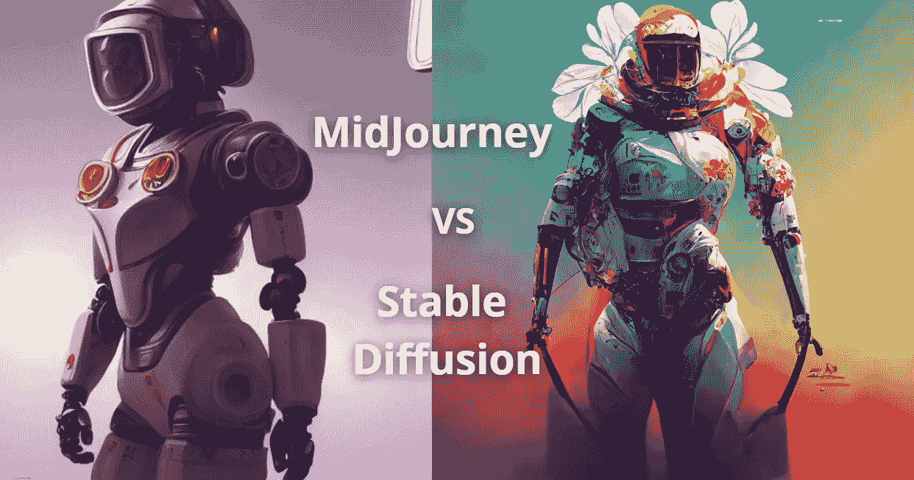

# 中途与稳定扩散:相同的提示，不同的结果

> 原文：<https://medium.com/codex/midjourney-vs-stable-diffusion-same-prompt-different-result-dd29ca482235?source=collection_archive---------0----------------------->

吉姆·克莱德·蒙赫拍摄的图片

如果你和我一样，你总是在寻找新的有趣的人工智能艺术生成器工具。这些天他们像蘑菇一样在互联网上出现。

我现在最喜欢的两个工具是[中期](https://www.midjourney.com/)和[稳定扩散](https://github.com/CompVis/stable-diffusion)。

在过去的几个月里，[中途](https://www.midjourney.com/)文本转艺术人工智能工具已经有了几个[重大的](/mlearning-ai/midjourney-ais-massive-improvements-with-new-v3-algorithm-a44440fb21a8) …