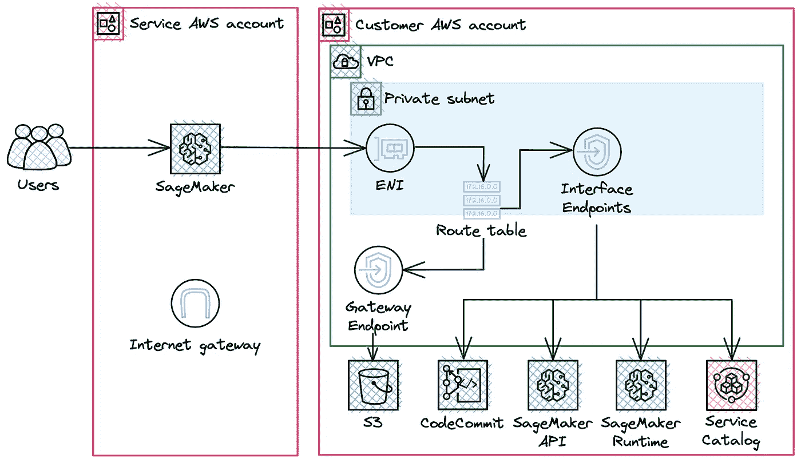
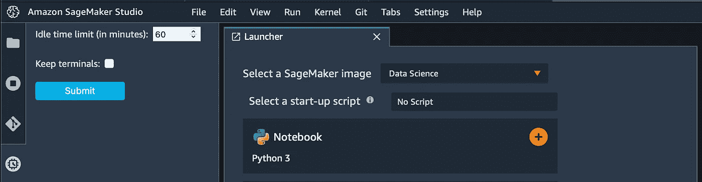

# 将本地数据科学工作空间迁移到 SageMaker Studio

> 原文：<https://medium.com/codex/migrate-local-data-science-workspaces-to-sagemaker-studio-a9e8373d0c36?source=collection_archive---------11----------------------->

架构图(部署视图)

# 工作空间要求

## 问题背景

数据科学团队在本地机器上使用 Jupyter 笔记本电脑和 PyCharm IDE 来训练模型，但模型的性能和配置跟踪存在问题。他们使用 Google Sheets 来跟踪模型的名称、使用的参数值和性能。随着模型数量的增加，它很快变得混乱。此外，团队成员希望在构建模型时相互协作。

## 功能需求

*   **FR-1** 解决方案提供协同开发。
*   **FR-2** 解决方案可以与 AWS EMR 集成/扩展。

## 非功能性需求

*   **NFR-1** 数据和代码不应通过公共互联网传输。
*   NFR-2 数据科学家不应该访问公共互联网。

## 限制

*   **C-1** 数据存储在自动气象站 S3 中。
*   **C-2** 用户的凭证应存储在 AWS IAM 身份中心(SSO)中。
*   **C-3** 选择 AWS CodeCommit 作为版本控制系统。

# 拟议解决方案

## TL；速度三角形定位法(dead reckoning)

将本地开发环境迁移到 AWS SageMaker Studio，并启用 SageMaker 实验和 SageMaker 模型注册来跟踪模型的性能。

SageMaker Studio 将在*仅 VPC 模式*中推出，以提供与亚马逊 EMR 的连接，并满足禁止访问公共互联网的要求。

## 体系结构

该解决方案由以下组件组成:

*   带有 S3 网关端点的 VPC 和一个带有接口端点的专用子网，允许在没有公共互联网的情况下传输数据/代码。
*   IAM Identity Center 重用现有凭据，并支持 SSO sage maker。
*   AWS SageMaker 工作室
*   AWS S3 桶获取数据并保存模型人工制品
*   AWS 代码提交存储库以存储代码

您可以在页面顶部的图表中的 Deployment 视图上看到这些组件的组合。

## 功能视图

用户将通过 SSO 登录页面登录，并访问 SageMaker Studio。然后，用户可以创建和修改 Jupyter 笔记本，训练 ML 模型，并使用模型注册表跟踪它们。

功能视图

## 迁移计划

**第一步。资源清单和所需容量估算**

第一步是创建所有用户、他们使用的型号和最低系统要求的列表。您可以在下面看到此类库存的示例。

用户和模型清单

在为清单中提供的模型选择最佳实例类型时，我考虑了以下几点:

*   期望的训练速度
*   数据卷宗
*   GPU 使用能力
*   实例定价和快速启动能力

我决定对 XGBoost 和 ARIMA 模型使用 ml.t3.medium，对 CNN 和 Seq2seq 使用 ml.g4dn.xlarge。有了免费层，前两个月，您每月在 Studio 笔记本电脑上有 250 小时的 ml.t3.medium 实例。

**第二步。通过网关端点设置 VPC 并更新路由表**

AWS 可以选择自动创建带有公共/私有子网和 S3 网关端点的 VPC。之后，您需要创建以下接口端点:

*   SageMaker API `com.amazonaws.<region>.sagemaker.api`。
*   SageMaker 运行时`com.amazonaws.<region>.sagemaker.runtime`。这是运行工作室笔记本以及培训和托管模型所必需的。
*   使用 SageMaker 项目`com.amazonaws.<region>.servicecatalog`。
*   连接到 CodeCommit `com.amazonaws.<region>.git-codecommit`。

> ⚠️用你的地区替换`<region>`。所有资源，包括单点登录帐户，VPC 和 SageMaker 域应该在同一地区。这一点很重要，因为 AWS 身份中心(SSO)并非在所有地区都可用。

此外，您可以使用[提供的 CDK 堆栈](https://github.com/ChildishGirl/sagemaker-migration)来自动部署网络资源。一旦完成，您将拥有这样的网络:

网络图

**第三步。在 IAM Identity Center 中为用户设置 SSO**

下一步是在 IAM Identity Center 中创建新用户/向组中添加现有用户。

数据科学用户组

稍后，您将能够将该组添加到 SageMaker 用户中。您也可以添加每个用户而无需创建组，但我更喜欢使用组。它允许您从一个位置轻松管理用户。

**第四步。设置没有公共互联网接入的 SageMaker Studio**

使用 SageMaker 域的标准设置启动 SageMaker 配置。每个 AWS 帐户在每个地区仅限一个域。

它提出了两种身份验证选项，我选择 AWS 单点登录，因为我们在那里有一个身份存储。请注意，带有 SSO 认证的 SageMaker 应该在与 SSO 相同的地区启动，在我的例子中，两者都在 eu-central-1 地区。

SageMaker SSO 配置

完成 SageMaker 域配置后，您将能够在应用程序选项卡中看到 SageMaker，并为其分配用户。

下一步是分配一个默认的执行角色，您可以使用 AWS 为您创建的默认角色，该角色附带了*amazonsagemakerfullcaccess***策略。**

**之后，您应该配置是否要使用 SageMaker 的公共互联网。在我的例子中，我禁用了仅 VPC 模式的互联网访问，并使用创建的 VPC 和私有子网来托管 SageMaker。**

****

**SageMaker 网络配置**

**此外，您还可以配置数据加密、Jupyter 实验室版本和笔记本共享选项。然后，您应该通过导航到控制面板添加 data science 用户组，并在其中管理您的用户组部分。**

****第五步。链接 AWS 代码提交****

**在 AWS CodeCommit 中创建一个名为`sagemaker-repository`的存储库，并克隆 HTTPS。然后，在 SageMaker Studio 的左侧栏中，选择 Git 图标(由一个带有两个分支的菱形标识)，然后选择 Clone a Repository。之后，您将能够将对当前笔记本或新笔记本的更改推送到 Git。**

****第六步。设置自动关闭闲置资源****

**有时，人们在完成工作后会忘记关闭实例。这可能会导致资源通宵运行，第二天早上您会收到意想不到的大额账单。但是 JupyterLab 的一个扩展可以帮助你避免这种情况。它会在 SageMaker Studio 中的 KernelGateway 应用程序、内核和图像终端空闲规定的时间后自动关闭它们。您可以根据自己的喜好配置空闲时间限制。设置和脚本的说明可以在 [GitHub 库](https://github.com/aws-samples/sagemaker-studio-auto-shutdown-extension)中找到。安装后，您将在 SageMaker Studio 界面的左侧看到一个新的选项卡。**

****

**闲置资源关闭扩展**

****第七步。添加实验和模型注册表****

**SageMaker Model Registry 是跟踪团队开发的模型的一个很好的工具。要启用该功能，您需要转到 SageMaker resources 选项卡(左侧面板底部的一个)并从下拉列表中选择 Model Registry。您需要为您想要版本化的每个模型创建模型组。**

****

**模型组创建**

**之后，数据科学家可以使用[文档](https://docs.aws.amazon.com/sagemaker/latest/dg/model-registry-version.html#model-registry-version-api)中描述的方法之一注册模型。**

**SageMaker Experiments 是一个让您组织和比较机器学习实验的功能。模型注册中心跟踪被选为最佳版本的模型版本。实验对数据科学家很有用，因为它们允许跟踪所有训练运行，并比较模型性能以选择最佳模型。您可以使用[文档](https://docs.aws.amazon.com/sagemaker/latest/dg/experiments-create.html)中的说明添加实验。**

****第八步。迁移笔记本****

**亚马逊 SageMaker 提供 XGBoost 作为内置算法，数据科学团队决定使用它并重新训练模型。因此，数据科学家只需要调用内置版本并提供 S3 上的数据路径，更详细的描述可以在[文档](https://docs.aws.amazon.com/sagemaker/latest/dg/docker-containers-prebuilt.html)中找到。范例笔记本可以在[这里](https://github.com/aws/amazon-sagemaker-examples/blob/main/introduction_to_amazon_algorithms/xgboost_mnist/xgboost_mnist.ipynb)找到。**

**Seq2seq 笔记本迁移与前一个案例非常相似——sage maker 内置了 Seq2seq 算法。所以，你只需要调用正确的图像 URI 和创建 SageMaker 估计使用它。使用 Seq2seq 算法的 SageMaker 笔记本的例子可以在[这里](https://github.com/aws/amazon-sagemaker-examples/blob/main/introduction_to_amazon_algorithms/seq2seq_translation_en-de/SageMaker-Seq2Seq-Translation-English-German.ipynb)找到。**

**与 ARIMA 的情况稍微有些困难，因为数据科学团队不想使用 SageMaker 提出的 DeepAR。所以，我们需要创建自定义的算法容器。首先，我们需要建立 Docker 图像，将其发布到 ECR，然后我们可以从 SageMaker 使用它。您可以在文档中找到笔记本的[详细说明](https://sagemaker-examples.readthedocs.io/en/latest/advanced_functionality/scikit_bring_your_own/scikit_bring_your_own.html)和[示例。](https://docs.aws.amazon.com/sagemaker/latest/dg/adapt-training-container.html)**

**对于使用 TensorFlow 构建的 CNN，我们可以使用 SageMaker 脚本模式来带来我们自己的模型，示例笔记本可以在这里找到。此外，我们可以使用本地机器来训练它，示例笔记本可以在这里找到。**

**你可以在亚马逊 SageMaker 示例库[找到更多不同型号笔记本的示例。](https://github.com/aws/amazon-sagemaker-examples)**

****第九步。确保数据科学团队可以使用新环境****

**最后一步是为流程创建文档，以便任何新用户都可以使用它来进入数据科学工作环境。它应包括以下部分:**

*   **如何向注册表添加新模型(特征)**
*   **如何给 SageMaker 添加新实验**
*   **如何为模型选择实例**

# **结论**

**SageMaker 是数据科学家的一个伟大工具，它允许你标记数据，跟踪实验，训练，注册和部署模型。它自动化和标准化了 MLOps 实践，并提供了许多有用的功能。**

**用于网络创建和成本分解的 CDK 资源可以在 [GitHub 资源库](https://github.com/ChildishGirl/sagemaker-migration)中找到。**

**谢谢你一直读到最后。我真的希望它是有帮助的，如果你在评论中发现任何错误，请让我知道。**