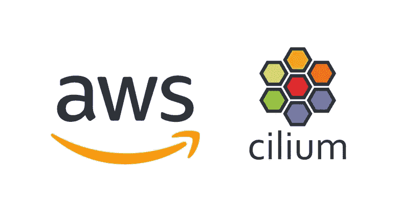

# 从亚马逊 VPC CNI 迁移到纤毛，零停机

> 原文：<https://medium.com/codex/migrate-to-cilium-from-amazon-vpc-cni-with-zero-downtime-493827c6b45e?source=collection_archive---------0----------------------->

CNI (Container Network Interface，容器网络接口)是一个基本框架，用于配置和管理容器的网络资源和连接，由容器运行时使用。

Kubernetes 使用了许多 CNI 实现，Cilium 是其中一种常用的实现。

# 为什么是 CNI 纤毛？