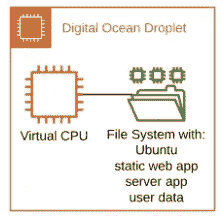

# 将传统应用迁移到云原生环境—第 1 部分

> 原文：<https://medium.com/codex/migrating-a-legacy-app-to-cloud-native-part-1-68a1adbb95d5?source=collection_archive---------6----------------------->

雅利安·辛格在 [Unsplash](https://unsplash.com?utm_source=medium&utm_medium=referral) 上的照片

在八个月的时间里，我进行了一次旅行。您可能会说我的应用程序是一次旅程，但对我来说，这也是一次通过一些新的开发工具学习和奋斗的旅程。一路上，我记录了这段旅程，与你分享。这篇文章是分享这一旅程的八篇文章之一。自始至终，我都努力做到公平和诚实；尊重这些工具和服务的作者，也尊重我的读者…

在这篇文章中，我开始探索如何将我的 [SqAC](https://sqac.fanello.net) 应用迁移为 AWS 云原生应用。在宣布我打算采用的方法之前，我给出了一些关于当前应用程序架构的背景，考虑了 lift & shift 和无服务器迁移方法。本系列的下一部分将介绍并讨论新的架构。

# 背景

耐心听我说，或者浏览下一部分。)

2015 年开始学习成为广场舞呼叫器。🎤🕺🏻方块舞是一种有趣的爱好和社交活动，我已经准备好迎接新的挑战。当我学会如何调用一个舞蹈时，我一直在想“我可以写一个应用程序来帮助我。”🤔

作为一名软件工程师，我发现我的职业正在从编写 Java 后端应用程序转向编写全栈 web 应用程序。在我的知识中有一些空白来完成这个跳跃。

因此，在 2016 年，一个目的的融合诞生了。我会为跳广场舞的人编写这个利基应用程序，并利用它将我的编程经验扩展到新的领域。🎉这将比另一个待办事项应用有趣得多😴正如许多其他人在想玩新技术时所写的那样。

我开始玩 [Dart 1.0](https://dart.dev/) ，它看起来很酷，但也很不成熟。我试过 [Ionic 2](https://ionicframework.com/) ，但是遇到了可用性的麻烦；一个框架*在另一个框架*之上，这个框架很复杂，当时的文档也很糟糕。所以我向下一层到底层框架， [Angular 2](https://angular.io/) 。[材质设计](https://material.io/)存在，但是它的 Angular 库仍在构建中，缺少关键组件，所以我选择了当时仍然流行的 [Bootstrap 3](https://getbootstrap.com/docs/3.3/) 。

该应用程序需要一个简单的后端来验证用户，保存他们的数据，并允许可选的共享。我的早期原型是用 Dart 编写的，但最终我决定使用 [Typescript](https://www.typescriptlang.org/) 作为后端来与有角度的前端配对。一点探索把我带到了[features](https://feathersjs.com/)，一个结合了 [Express.js](https://expressjs.com/) web 服务器和 [Passport](http://www.passportjs.org/) 用于用户认证的框架。我把它放在一个[数字海洋水滴](https://www.digitalocean.com/products/droplets/)服务器上，这基本上是一个带有持久文件系统的小型虚拟机实例。

我想提供一个漂亮的图表来展示现有的架构…但这就是全部了:

此外，由于这是一台服务器，因此还有一个自述文件解释如何配置服务器，包括:

*   自动运行定制的 Feathers 服务器。(记住，是 Express.js)
*   使用 SSL 设置 Nginx 代理到 Feathers 服务器，
*   让我们加密 SSL 证书。
*   将用户数据备份到 S3 存储桶的 Cron 作业；唯一的一块 AWS。

这是*不是*基础设施即代码(IaC)！相反，这是一种让人害怕需要重建的设置。至少我有先见之明记录了手工过程。🤷在当时的‍♂️，这很了不起。

两年后，该应用程序达到了功能完成，我在旅途中学到了很多关于前端开发*和*广场舞编舞的知识。偶尔其他人甚至会用！

大约在完成的同时，我成为了一名认证的 AWS 解决方案架构师。我仍然在用 Angular 做网络应用，但是后端……云……天啊！我现在可以做得更好。

舞台已经搭建好了。我有一个现有的应用程序，想把它转移到 AWS。这是典型的云迁移，尽管规模很小。我有什么选择？

# 提升和移位

最直接的方法是安装一个运行 Ubuntu 的 [AWS Lightsail](https://aws.amazon.com/lightsail/) 实例，按照我的自述文件安装一个新的服务器。复制数据，重定向 DNS，我就完事了。✅

**优点**:快捷方便。
**缺点**:我一事无成！

如果我采取这种方法，我花了一天的时间，这样我就可以每月向亚马逊支付几美元，而不是每月向 DigitalOcean 支付几美元。没有收获。\_(ツ)_/

我还能做什么来利用 AWS 的*优势*？

*   将用户数据转移到 S3 或 DynamoDB？是的，那我可以用 EC2 代替 Lightsail。
*   将 web 应用程序文件转移到 S3，并通过 CloudFront 提供服务？确实是的！
*   用 Lambda 运行 Express.js 应用？现在我们越来越有趣，并适应免费层！
*   将认证切换到 Cognito？哦是的！

当我们开始这样思考时，我们就离开了提升和转移的领域，进入了…

# 云原生

云原生开发是指应用程序被*设计为*在云中原生工作，利用托管服务。云原生和无服务器不完全一样，但两者往往是齐头并进的；理想云原生架构通常是无服务器的，不需要我的旧自述文件中的任何服务器设置工作。

# 不仅仅是无服务器

上面提出的想法将实现无服务器。使用 Cognito、Lambda、S3、DynamoDB 和 CloudFront 可以得到一个无服务器的解决方案。我可以很容易地做到这一点，因为我已经做了很多次。这很容易，而且在这个过程中我什么也学不到。以这种方式将我的应用程序转移到 AWS 将比简单的电梯转移花费更多的时间，并且它将为我节省大约 5 美元/月(相对于数字海洋),因为我的使用将属于所有这些 AWS 服务的免费层。我想了大约一年，但是花的时间不值得节省这么少的钱，而且我不会学到任何东西。

尽管有一些新的东西冲击着主流开发。我甚至会在下个月为当地的 AWS 用户群做一个关于它的演示，但是我还没有用这个更新的技术栈做任何实质性的事情。因此，在上次三年后，一个目标的融合又一次诞生了。我会将我的应用程序迁移到…

# 下次来…

我将探索我的应用程序的需求，并使用 AWS Amplify 设计一个解决方案。

 [## 将传统应用迁移到云原生环境—第 2 部分

### 上一次(在第 1 部分中)，我给出了一些要迁移的应用程序的背景(Square Auto-Choreographer；SqAC)，以及为什么…

medium.com](/@kernwig/migrating-a-legacy-app-to-cloud-native-part-2-533dfebd38fb)