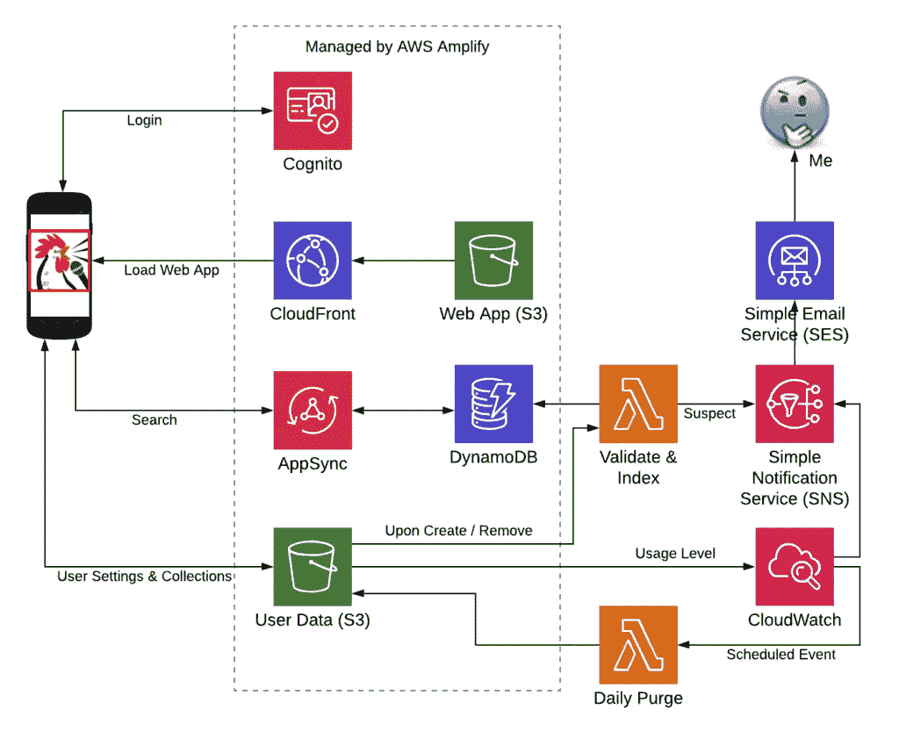

# 将传统应用迁移到云原生环境—第 2 部分

> 原文：<https://medium.com/codex/migrating-a-legacy-app-to-cloud-native-part-2-533dfebd38fb?source=collection_archive---------0----------------------->

[万花筒](https://unsplash.com/@kaleidico?utm_source=medium&utm_medium=referral)在 [Unsplash](https://unsplash.com?utm_source=medium&utm_medium=referral) 上拍摄的照片

[上一次(在第 1 部分)](/@kernwig/migrating-a-legacy-app-to-cloud-native-part-1-68a1adbb95d5)，我给出了一些关于应用程序迁移的背景(Square 自动编排器；SqAC)，以及我迁移它的原因(添加 IaC 并了解云原生开发的最新情况)。具体来说，我告诉剧透，我将通过使用 [AWS Amplify](https://aws.amazon.com/amplify/) 来尝试这种迁移。审查完成。😛

现在进入第 2 部分:需求和架构

# 什么是 AWS Amplify？

博客世界(真实世界)充满了关于 AWS Amplify 的文章。很有可能你就是根据那个关键词找到这里的。简单来说:Amplify 是一个全栈无服务器框架和 CLI 工具。它让开发者专注于他们的(web、iOS 或 Android)应用，并使用来自 [AWS](https://aws.amazon.com) 的云服务来提供诸如用户帐户和数据持久性之类的东西。至少事情是这样开始的。当我在 2018 年第一次看 Amplify 时，我觉得它是孤独的前端开发人员在非常简单的用例中使用 AWS 的玩具。然而，我也在 AWS 看到了一个非常敏感的开发团队和很大的增长空间。它已经成长了！一年后，Amplify 现在可以处理多种环境、多名开发人员和覆盖功能，以利用 AWS 的全部功能来处理复杂的用例。现在看来，结果是两全其美:易于上手，易于使用，而且功能强大！“简单”的案例已经扩展到包括分析、聊天机器人、机器学习、发布/订阅、推送通知和虚拟现实！这个小小的框架/CLI 工具组合已经变得有点势不可挡了！

就我所有的研究而言，我还没有用它建造任何有意义的东西。这就是这个项目的目的。

# 要求

不过，第一步是找出我的应用程序需要这些众多特性中的哪一个。具有业务逻辑的前端应用程序已经存在并且不会改变，所以我不打算讨论任何关于舞蹈编排的内容。😉我们在这里关心的是，我如何用 AWS Amplify 提供的无服务器功能替换我在[第 1 部分](http://fanello.net/home/2019/07/28/migrating-a-legacy-app-to-cloud-native-part-1/)中概述的托管虚拟机。因此，焦点就在那里。

## 业务需求和讨论:

每个应用程序**的用户**(一个舞蹈调用者)都有他们的**设置**；主要包括要使用的编排的其他人的**集合**和**会话**的列表。当呼叫不同组的舞者时，会话存储使用的选项。这些信息对个人用户来说是私有的，存储在云中，因此可以在任何设备上通过任何现代浏览器访问。

*   Amplify Authentication 符合识别用户身份和保护用户数据隐私的要求。目前的应用程序只通过谷歌和脸书使用社交登录。由于一些用户对社交登录感到紧张，我会在将 login 加入用户池的同时尽量保留这些。
*   当前的应用程序将设置存储为一个简单的 JSON 文件。这些数据被一次性访问并缓存在客户端。Amplify Storage 符合这一需求，但它应该瞄准 S3 还是 NoSQL 呢？

Guest **用户**可以访问公共内容，但是不能在云中存储任何数据。

*   现有的应用程序需要登录，用户才能使用它；进入的障碍。
*   Amplify Authentication 有 guest 用户的概念，如果没有帐户，可以访问公共数据，但不能保存私有内容。

每个**集合**的大小可以是**几百千字节**。(JSON 格式)

*   像用户设置一样，集合可以被一次性访问并缓存在客户端。
*   DynamoDB 记录被限制为 400 KB，因此它不能容纳大型集合。
*   因此，收藏将使用 S3 支持的放大存储。
*   看起来 Amplify 只允许 S3 或 DynamoDB 进行存储，而不是两者都允许。因此，用户设置也将进入 S3。

**用户**可以恢复到**集合**的旧**版本**，以防出错。

*   用修订号命名每个集合文件。
*   每次更新实际上会在 S3 创建一个新文件，而不会替换现有文件。
*   AWS 中的计划执行将需要根据计数和年龄删除较旧的修订。

**收藏**可以*私有*给**用户**，或者*公开*分享给其他**用户**查看。

*   将 Amplify 认证与 Amplify 存储相结合提供了一个受*保护的*访问类别。
*   受*保护的数据*对每个人都是可读的(因此是公共的)，但只有创建它的用户才是可写的。

**用户**可以通过一些元数据(名称、描述、&其他)搜索收藏*找到*和*订阅*其他用户的公共收藏。

*   每当一个集合被保存到 S3 *保护的*区域，一个 *s3:ObjectCreated* 事件将触发一个 Lambda。这个 lambda 将加载内容并更新 DynamoDB 中的一个并行记录。
*   每当从 S3 *保护的*区域移除一个集合时，S3:ObjectRemoved 事件将触发一个 Lambda。这个 lambda 将删除 DynamoDB 中的并行记录，如果它是最新版本的话。
*   只有最新的修订版是可搜索的。
*   具有 GraphQL 特性的 Amplify API 将提供针对 DynamoDB 表的搜索功能。
*   这可以很容易地用 REST API 特性来代替，但这样 Amplify 将管理 DynamoDB 表 IAM，我可以使用 AppSync。😌

这个网络应用是一个渐进的网络应用，可以离线使用，也可以在移动网络上使用。它需要能够找到何时**收藏**和用户**设置**已经改变并下载改变。

*   对于用户自己的私有和受保护的存储，可以使用 *Storage.list* API(目录列表)来检查新内容，同时使用最少的带宽。

1.  对于对其他人的集合的订阅，可以使用 GraphQL 查询来检查新的修订。只有当发现更新的版本时，才从 Amplify Storage (S3)下载文件。

通过设计和管理**风险**，持续**成本**应保持最低。

*   S3 存储只有 12 个月的免费(5 GB)，但即使在那之后，存储和读取也非常便宜。
*   DynamoDB 可释放高达 25 GB 的存储空间，具有 25 个读写容量单元。Amplify 默认使用按需定价，没有免费层。不过，这可以更改为使用供应的访问，从而利用这些空闲单元。
*   避免 GraphQL 中的 *@searchable* 指令，因为这会启动一个昂贵的非无服务器 ElasticSearch 实例。如果数据量很小，对 DynamoDB 搜索的偶尔扫描将落入空闲层。
*   设置 S3 策略以限制每个文件的大小。每个文件 2mb 对于合法用户来说已经足够了，同时也阻止了黑客使用我的账户进行免费存储。
*   将 S3 策略设置为每个用户最多 25 MB。同样，足够合法使用，同时阻止黑客。
*   监控存储使用情况，并在可疑级别或活动时向我发出警报。使用 CloudWatch 规则发布到 SNS 主题，订阅者给我发邮件。

# 客户选择:放大客户 vs 阿波罗

当使用 [GraphQL](https://graphql.org/) 时，Amplify 让我们选择 Amplify GraphQL 客户端或 [AppSync SDK](https://github.com/awslabs/aws-mobile-appsync-sdk-js) ，后者利用了更高级的 [Apollo](https://www.apollographql.com/) 客户端。我第一次尝试 GraphQL 时，坚持使用更简单的 Amplify 客户端。Apollo 对离线模式和数据同步有很大的支持。然而，我的 PWA 客户端已经开始管理离线数据，并使用 S3 存储，而不是 GraphQL。(GraphQL 仅用于跟踪共享集合的元数据。)我可以通过建模将所有数据转移到 AppSync，并让 AppSync 解析器将数据存储到多个 DynamoDB 表中。如果这是一个新的应用程序，我可能会。不过，对于迁移现有的应用程序来说，没有明显的优势来保证额外的开发时间。

# 放大器外部

敏锐的读者可能会注意到需求中概述的一些功能不是 Amplify 提供的。这很不幸，但不是障碍。Amplify 允许定制 CloudFormation 模板，也可以与通过其他方式创建的 CloudFormation 堆栈集成。我们甚至可以使用其他工具，如[无服务器框架](https://serverless.com/)、 [SAM](https://aws.amazon.com/serverless/sam/) 和 [CDK](https://aws.amazon.com/cdk/) 以及 side Amplify。我还没有决定采取哪种方法，但我知道这是可以做到的。

# 设计它

既然已经列出并考虑了业务需求，就可以构建架构了。这在很大程度上是由 AWS Amplify 为我们做的事情驱动的，而上面的讨论驱动了其余部分:

*带 Amplify 的 SqAC 云原生架构*

# 下次来…

这包括了背景、需求和架构。接下来，我将使用 Amplify 实际启动*，并尝试迁移应用程序。未来的帖子将记录这些努力，无论它们导致了成功、错误的转折还是彻底的失败。*

 [## 将传统应用迁移到云原生环境—第 3 部分

### 这是系列文章的第 3 部分。如果您之前没有遵循它，至少在继续之前阅读第 2 部分:

medium.com](/@kernwig/migrating-a-legacy-app-to-cloud-native-part-3-4bb187fea485)