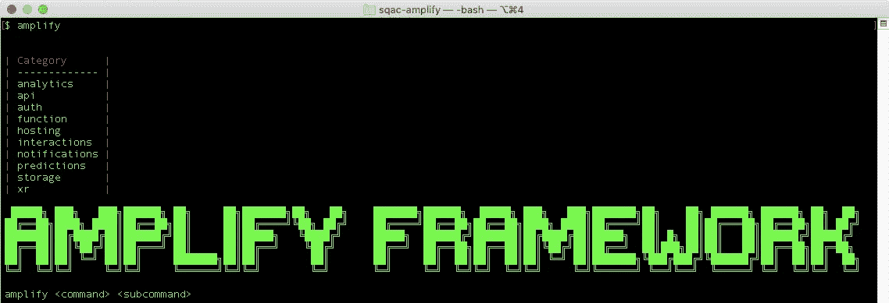
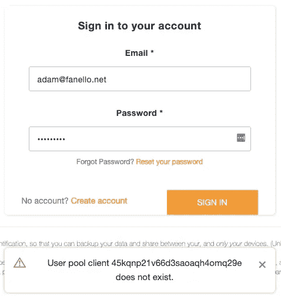
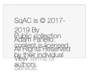

# 将传统应用迁移到云原生环境—第 3 部分

> 原文：<https://medium.com/codex/migrating-a-legacy-app-to-cloud-native-part-3-4bb187fea485?source=collection_archive---------0----------------------->



这是系列文章的第 3 部分。如果您之前没有遵循它，至少在继续之前阅读第 2 部分:

*   [第一部分:背景](/@kernwig/migrating-a-legacy-app-to-cloud-native-part-1-68a1adbb95d5)
*   [第二部分:需求&架构](/@kernwig/migrating-a-legacy-app-to-cloud-native-part-2-533dfebd38fb)

既然计划已经结束，是时候开始真正的工作了。这是我开始遇到问题的地方，不像许多博客把一些工具描绘成鲜花和夕阳，我将谈论问题和成功。没有一个工具、框架或过程是完美的、适用于每个项目的灵丹妙药。AWS 和 Amplify 很神奇，有时也很痛苦。就这样，让我们开始…

# 步骤 1:将代码转移到 GitHub

我的遗留项目(SqAC)是闭源的，托管在 BitBucket 上的一个私有存储库中。在开始这个系列的时候，我知道人们会希望看到我所说的代码，但是不希望我实际的*应用*被复制。它已经有了版权和服务条款，我决定保留应用程序和具有业务逻辑的服务的全部版权。其余的单个文件虽然没有提到版权，虽然它们在技术上仍然受版权法保护，但欢迎您复制和重用您认为有用的部分。

这个项目现在[在 GitHub](https://github.com/kernwig/sqac-amplify) 上。您可以通过[拉取请求](https://github.com/kernwig/sqac-amplify/pulls?q=is%3Apr+)跟踪变更。

# 步骤 2:设置放大器

由于 SqAC 是一个 [Angular](https://angular.io/) 应用，我从[https://aws-amplify.github.io/docs/js/angular](https://aws-amplify.github.io/docs/js/angular)的指令开始。这些说明跳过了关于创建 AWS 帐户和配置命令行环境以访问该帐户的部分。这是你第一个`amplify init`命令之前需要的。

首先，您可以转到[https://aws.amazon.com](https://aws.amazon.com)并点击`Complete Sign Up`按钮来创建一个新的 AWS 账户。我已经有了一个 AWS 帐户，它刚刚被用来从现有的实现中备份到 S3。我考虑过创建一个新账户来重新开始我 12 个月的免费试用，但是为了这次实验，我决定不这么做。我想看看在 Amplify 下运行这个应用程序的实际月成本是多少，而不是被暂时的节省所扭曲。

登录 AWS 控制台(在浏览器中)，然后我可以使用 Amplify CLI: `amplify configure`

这个步骤在 Angular guide 的任何地方都没有提到，但是在 [Quickstart](https://aws-amplify.github.io/docs/cli-toolchain/quickstart?sdk=js) 页面上有一个很好的视频。这是文档中的一个小缺陷；一些重要的信息在通用文档中，一些在框架特定的(Angular，React，Vue)部分。你必须阅读两者，并把它们编织在一起，以获得一个完整的画面。这是一件痛苦的事情，但是获得这种正确的记录是困难的。

继续前进，`amplify init`进行得很顺利。🎉

接下来是`amplify hosting add`添加项目的开发虚拟主机，`amplify publish`构建并复制 web 应用程序到一个具有发布权限的 S3 存储桶。

```
$ amplify hosting add
? Select the environment setup: DEV (S3 only with HTTP)
? hosting bucket name sqac-amplify-20190817123020-hostingbucket
? index doc for the website index.html
? error doc for the website index.htmlYou can now publish your app using the following command:
Command: amplify publish$ amplify publish
```

这创建了一个 S3 桶，构建了我的应用程序，并将结果上传到桶中。完成后，一个新的浏览器选项卡在[http://sqac-amplify-20190817123020-hostingbucket-dev . S3-website-us-west-2 . amazonaws . com](http://sqac-amplify-20190817123020-hostingbucket-dev.s3-website-us-west-2.amazonaws.com/)打开，显示我的应用程序，在旧代码下验证失败。👍

一堆规则、策略、存储桶和服务只需两个命令即可设置。这个。是。厉害！🤩

在我的[第一次拉动请求](https://github.com/kernwig/sqac-amplify/pull/1)中查看对此零件所做的所有更改。

# 步骤 3:设置身份验证

接下来显而易见的是能够创建帐户、登录和注销。还没有数据(存储)，只是一步一个脚印。

尽管 CLI 会询问大量问题，但设置 auth 的说明是有限的。(只需输入 amplify add auth 和… magic？)特别是问题“`Enter your redirect signin URI`”。呃。不确定。我的应用程序还没有运行。[AWSer Nader Dabit 的这篇博客文章](https://dev.to/dabit3/the-complete-guide-to-user-authentication-with-the-amplify-framework-2inh)提供了真实的细节。似乎提示的答案是`http://localhost:4200/#/home/account/`，因为这是本地开发服务器的 URL，指向用户登录后我想返回的帐户页面。

然后我就撞上了这个问题，这个问题不在 Dabit 的博文里:

```
Select the OAuth flows enabled for this project. (Use arrow keys)
❯ Authorization code grant 
  Implicit grant
```

搜索这个问题，人们会选择第一个(默认)选项，但没有任何解释。于是我更笼统地搜索了一下，被带到了关于隐式授权的 [OAuth 2.0 规范，上面基本写着:不要用这个。很好；](https://oauth.net/2/grant-types/implicit/)[授权码授予](https://oauth.net/2/grant-types/authorization-code/)就是它了！以下是完整的运行:

```
$ amplify add auth
Using service: Cognito, provided by: awscloudformation

 The current configured provider is Amazon Cognito. 

 Do you want to use the default authentication and security configuration? Manual configuration
```

我知道默认身份验证使用用户名，我希望用户通过电子邮件地址登录。因此`Manual configuration`...

```
Select the authentication/authorization services that you want to use: User Sign-Up, Sign-In, connected with AWS IAM controls (Enables per-user Storage 
features for images or other content, Analytics, and more)
 Please provide a friendly name for your resource that will be used to label this category in the project: sqacauth
 Please enter a name for your identity pool. sqac_amplifyf81356f4_identitypool_f81356f4
 Allow unauthenticated logins? (Provides scoped down permissions that you can control via AWS IAM) I want to learn more.

If you select 'yes', your identity pool will provide temporary AWS credentials for unauthenticated guest users.

 Allow unauthenticated logins? (Provides scoped down permissions that you can control via AWS IAM) Yes
 Do you want to enable 3rd party authentication providers in your identity pool? I want to learn more.

If you select yes, your identity pool will support users who are authenticated via a public login provider such as Facebook, Google, and Amazon (non-Cogn
ito).  Your identity pool will continue to support users who are authenticated via a user pool.

 Do you want to enable 3rd party authentication providers in your identity pool? No
 Please provide a name for your user pool: sqac_amplifyf81356f4_userpool_f81356f4
 Warning: you will not be able to edit these selections. 
 How do you want users to be able to sign in? Email
 Multifactor authentication (MFA) user login options: OPTIONAL (Individual users can use MFA)
 For user login, select the MFA types: Time-Based One-Time Password (TOTP)
```

这些大多是默认选项。虽然我选择了通过电子邮件登录，也选择了 TOTP，因为每个网站都应该提供 MFA，但我不希望它成为进入的障碍。

```
Please specify an SMS authentication message: Your SqAC authentication code is {####}.
 Email based user registration/forgot password: Enabled (Requires per-user email entry at registration)
 Please specify an email verification subject: Your SqAC verification code
 Please specify an email verification message: Your SqAC verification code is {####}
 Do you want to override the default password policy for this User Pool? No
 Warning: you will not be able to edit these selections. 
 What attributes are required for signing up? (Press <space> to select, <a> to toggle all, <i> to invert selection)Email
 Specify the app's refresh token expiration period (in days): 30
 Do you want to specify the user attributes this app can read and write? Yes
 Specify read attributes: (Press <space> to select, <a> to toggle all, <i> to invert selection)Email
 Specify write attributes: (Press <space> to select, <a> to toggle all, <i> to invert selection)
 Do you want to enable any of the following capabilities? (Press <space> to select, <a> to toggle all, <i> to invert selection)
```

我将我的应用程序名称添加到默认的电子邮件字符串中，并允许应用程序读取电子邮件属性。

```
Do you want to enable any of the following capabilities? (Press <space> to select, <a> to toggle all, <i> to invert selection)
 Do you want to use an OAuth flow? I want to learn more.

When you create a user pool in Amazon Cognito and configure a domain for it, Amazon Cognito automatically provisions a hosted web UI to let you add sign-
up and sign-in pages to your app.

 Do you want to use an OAuth flow? Yes
 What domain name prefix you want us to create for you? sqac
 Enter your redirect signin URI: http://localhost:4200/#/home/account/
? Do you want to add another redirect signin URI No
 Enter your redirect signout URI: http://localhost:4200/#/home/account/
? Do you want to add another redirect signout URI No
 Select the OAuth flows enabled for this project. Authorization code grant
 Select the OAuth scopes enabled for this project. Email, OpenID, Profile, aws.cognito.signin.user.admin
 Select the social providers you want to configure for your user pool: (Press <space> to select, <a> to toggle all, <i> to invert selection)
```

我不想创建自己的注册和登录组件，所以我选择 Yes to OAuth。(这被证明是一个错误——正如我后来指出的。)

```
? Do you want to configure Lambda Triggers for Cognito? Yes
? Which triggers do you want to enable for Cognito Learn More
Additional information about the triggers available for Cognito can be found here: https://docs.aws.amazon.com/cognito/latest/developerguide/cognito-user
-identity-pools-working-with-aws-lambda-triggers.html
 Which triggers do you want to enable for Cognito (Press <space> to select, <a> to toggle all, <i> to invert selection)
Successfully added resource sqacauth locally

Some next steps:
"amplify push" will build all your local backend resources and provision it in the cloud
"amplify publish" will build all your local backend and frontend resources (if you have hosting category added) and provision it in the cloud
```

在上面，我最初同意 Lambda 触发器，但是当给我选项时，我没有选择任何一个。然后运行完成，并给出了一些建议的后续步骤。👍

我做了建议的`amplify push`、*，失败了！*

```
CREATE_IN_PROGRESS OAuthCustomResourceInputs                                 Custom::LambdaCallout      Sun Aug 18 2019 10:26:23 GMT-0700 (Pacific Daylight Time) Resource creation Initiated                                                                                              
CREATE_FAILED      OAuthCustomResourceInputs                                 Custom::LambdaCallout      Sun Aug 18 2019 10:26:23 GMT-0700 (Pacific Daylight Time) Failed to create resource. See the details in CloudWatch Log Stream: 2019/08/18/[$LATEST]aa2cac0c6491465c82e73e4934b63bb3
CREATE_FAILED      sqac-amplify-dev-20190817121515-authsqacauth-WOW6AXV1C4UK AWS::CloudFormation::Stack Sun Aug 18 2019 10:26:24 GMT-0700 (Pacific Daylight Time) The following resource(s) failed to create: [OAuthCustomResourceInputs].
```

如果 Amplify 的目标是让前端开发人员能够轻松建立云基础设施，那么它在这里失败了。如果我在第一个提示中选择了默认配置，那么事情会简单得多。仅仅因为我想让用户通过电子邮件而不是用户名登录，我就降低了很多复杂性。许多这些问题超出了没有认知经验的人的理解范围。类似上面的失败消息会让 AWS 经验有限的开发人员茫然地盯着他们的终端。

深入研究 CloudWatch，我发现了一个错误，这个错误可以追溯到我在 CLI 中不确定的最初问题:

```
"message": "http://localhost:4200/#/home/account/ cannot use fragment",
  "code": "InvalidParameterException",
```

叹气。

```
$ amplify update auth
Please note that certain attributes may not be overwritten if you choose to use defaults settings.
Using service: Cognito, provided by: awscloudformation
 What do you want to do? Add/Edit signin and signout redirect URIs
 Which redirect signin URIs do you want to edit? http://localhost:4200/#/home/account/
? Update http://localhost:4200/#/home/account/ http://localhost:4200/
 Do you want to add redirect signin URIs? No
 Which redirect signout URIs do you want to edit? http://localhost:4200/#/home/account/
? Update http://localhost:4200/#/home/account/ http://localhost:4200/
 Do you want to add redirect signout URIs? No
Successfully updated resource sqacauth locally
```

很好，尽管我不认为这些 URIs 在没有联邦登录的情况下会被使用。回顾 CLI 交互，我可能应该对问题“`Do you want to use an OAuth flow?`回答“否”，显然这是针对 Cognito 托管的用于登录的*页面*。我将在自己的应用程序页面上使用 Amplify 组件。我看不到没有第三方身份提供者的情况下使用 OAuth flow 的方法，那么为什么在我对那些第三方提供者回答“不”之后它还要问这个问题呢？

# 步骤 4:将身份验证集成到应用程序中

既然我已经设置了 Cognito，我需要将它集成到我的应用程序中。在[https://aws-amplify.github.io/docs/js/angular](https://aws-amplify.github.io/docs/js/angular)的角度设置说明非常全面。👍这是我走向成功的大部分道路，但也有一些并发症…

首先，是这样的:



事实上，这就是我的`aws-exports.js`文件中的池客户机 ID；但它和 Cognito 里的客户 ID 都不匹配。(对，*要么*。我无法解释为什么 Amplify 创建了两个完全相同的 Cognito 应用程序客户端，但其中一个以“client”结尾，另一个以“clientWeb”结尾。)

与 AWS 控制台中的 Cognito 相比，`aws-exports.js`的内容完全无效。Amplify 文档说这个文件是在一个`amplify push`上生成的，但是一个 push 只是告诉我`No changes detected.`“我最后尝试了一个`amplify init`，什么也没改变，并且*说*生成了一个新的具有适当内容的`aws-exports.js`。我一直不明白这是怎么变得不同步的。

下一个复杂问题是造型。上图显示了橙色的 Amplify 身份验证组件。Amplify for Angular 文档告诉我将`~aws-amplify-angular/Theme.css`导入到我的应用程序的顶层`style.scss`。这给了我登录主题，但在应用程序的许多其他部分搞得一团糟。例如:



原来，Amplify 样式表使*全局*改变样式，包括对`body`、`h1`到`h5`、`span`和`p`！许多类选择器以“amplify”为前缀，但是有一个简单的`.tooltip`选择器也很有可能干扰你的应用程序。该问题已被报告为[问题 2750](https://github.com/aws-amplify/amplify-js/issues/2750) ，修复被捆绑在远未完成的组件的完整重构中。经过大量的实验后，我发现在我的`styles.scss`中添加以下内容，代替建议的导入，并用`<div class=”amplify-block”>`结束我对 Amplify 身份验证组件的使用，事情就解决了:

```
@import "~@aws-amplify/ui/src/Theme.css";
.amplify-block {
   @import "~@aws-amplify/ui/src/Angular"; .amplify-container {
       padding-bottom: 2em;
   }
}
```

除了这些挑战之外，Amplify 身份验证组件确实让我不必处理任何实际的代码来为我的应用程序添加注册(包括通过电子邮件发送验证码)、登录或注销。一点配置，它就在那里。这是一个真正的节省时间。👏(缺点是，我选择了允许用户使用 [TOTP](https://en.wikipedia.org/wiki/Time-based_One-time_Password_algorithm) ，但是在 U/I 中没有启用它的方法。)

# 步骤 5:修改应用程序代码

一旦 Amplify 身份验证就绪，我需要调整我的应用程序逻辑来响应登录、注销，并将用户属性从 Cognito 用户中取出，放入应用程序其余部分使用的对象中。这是我遇到下一个难题的地方…

Angular 是用 Typescript 编写的，Amplify Angular 库也是如此，但是它到处都使用 type `any`，扼杀了 Typescript 的任何好处。(Type `any`是大致翻译成\_(ツ)_/的数据类型。)因此，我不得不做`console.log`来发现物体的属性。

一旦弄清楚了类型，就不难了。事实上，如果这是一个全新的应用程序，它会非常简单。作为一种迁移，转换成现有的逻辑需要一点时间，但它仍然是尽可能简单的。最基本的是注入`AmplifyService`，然后订阅该服务中的`authStateChange$`来检查`“signedIn”`和任何其他值之间的状态变化。您可以在该零件的[拉动请求中的`user.service.ts`变更中找到详细信息。](https://github.com/kernwig/sqac-amplify/pull/2)

# 还没有社交登录

我最初通过 Google 和 Amazon 登录为社交提供商配置 auth，但是在尝试配置时遇到了困难。设置谷歌证书失败，声称`amazoncognito.com`域名没有被授权，即使我授权了。我发现 Amplify 文档中的说明在尝试跟随时有点混乱。最终，我决定第一次不需要社交登录，并决定坚持使用基本功能。我希望回头再做这件事，可能是在最初的生产部署之后。

# 下次再来…

在第 4 部分中，我将向应用程序添加私有和受保护的存储。

[](/@kernwig/migrating-a-legacy-app-to-cloud-native-part-4-2741585e4953) [## 将传统应用迁移到云原生环境—第 4 部分

### 在本系列的第 4 部分中，我添加了 Amplify 存储，并探讨了它的安全模型以及如何定制它…

medium.com](/@kernwig/migrating-a-legacy-app-to-cloud-native-part-4-2741585e4953)