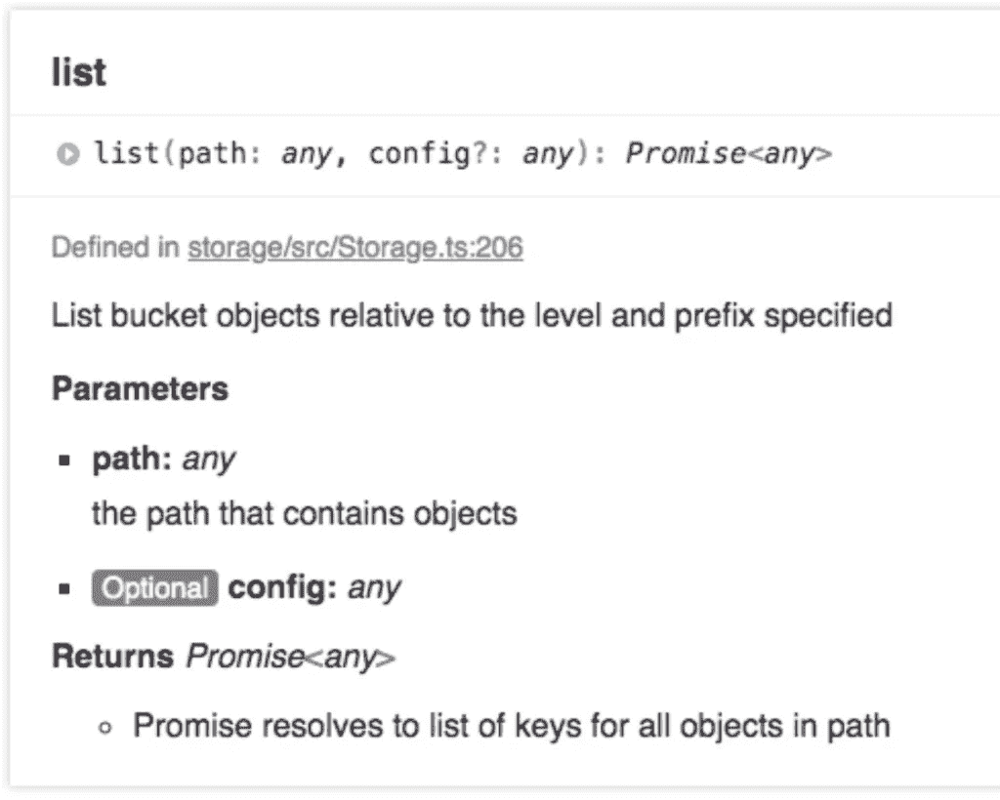

# 将传统应用迁移到云原生环境—第 5 部分

> 原文：<https://medium.com/codex/migrating-a-legacy-app-to-cloud-native-part-5-34696c6f0f43?source=collection_archive---------17----------------------->


酝酿中的风暴——亚当·法内罗摄影

这是系列文章的第 5 部分。如果你之前没有关注过，以下是之前的帖子:

*   [第一部分:背景](/@kernwig/migrating-a-legacy-app-to-cloud-native-part-1-68a1adbb95d5)
*   [第二部分:需求&架构](/@kernwig/migrating-a-legacy-app-to-cloud-native-part-2-533dfebd38fb)
*   [第三部分:认证](/@kernwig/migrating-a-legacy-app-to-cloud-native-part-3-4bb187fea485)
*   [第 4 部分:添加云存储](https://adamfanello.medium.com/migrating-a-legacy-app-to-cloud-native-part-4-2741585e4953)

现在，我已经通过 Amplify CLI 添加了云存储，并对其进行了配置，是时候在我的应用程序中使用新的存储了。

# 前言

一般来说，这个系列是在我使用这个工具时编写的，并按照我创建内容的顺序呈现。从草稿到出版有一些编辑工作，但是这个系列是关于旅程的，所以我这样呈现它。

不过这一次，我会在你进入帖子内容之前回来添加这个注释。到目前为止，这绝对是迁移中最具挑战性的部分，我怀疑它在整个系列中会一直如此。由于糟糕的文档和我的挫败感，我大约一半的时间花在了对 Amplify 和 Javascript SDK 的逆向工程上。我想在这里声明，我真的很喜欢 AWS，我真的很期待 Amplify 的成功。AWS 的工程师创造了令人惊叹的工具和服务，在过去十年中改变了软件开发人员的身份，使得以前所未有的规模和速度构建产品成为可能。因此，虽然我对不完美感到沮丧，但我也承认，如果没有 Amazon 和 AWS 的出色工作，我可能还会回到构建认证系统的第 1 部分。😬

在被吓退之前，也一定要阅读结论。开始了…

# 为 Amplify App 添加存储支持

第一步是将 Amplify 存储模块添加到我的 Angular 应用程序中，如下图[所示](https://aws-amplify.github.io/docs/js/angular#option-2-configuring-the-amplify-provider-with-specified-amplify-js-modules)。不过，出于对这种需求的预期，我已经在添加身份验证时完成了这一步。继续前进…

# 基本使用—不太容易

web 应用程序一直在使用 [Feathers](https://feathersjs.com/) 的客户端库与 Feathers 后端进行通信。现在必须用放大存储来代替。幸运的是，我通过将所有的实际通信隔离到一个`PersistenceService`类中，很好地设计了这个应用程序。🎉

首先要做的是写一些东西到存储，这就导致了`Storage.put(key, content, config)`。有哪些`config`选项？没有一个地方能告诉你所有的信息。Typescript 声明没有给出任何东西，只有[文档的这一部分](https://aws-amplify.github.io/docs/js/storage#put)通过一系列例子告诉你什么可能是，什么可能不是一个完整的列表。这里有一个 API 引用，显然是从一些类型脚本中生成的，只是将配置选项列为类型`any`。😕`get`函数的 API 在某种程度上更糟糕，因为它表明它返回“预先指定的 url 或对象”。哪一个是神秘的，也许是由同样神秘的`config?: any`第二个参数控制的。不管怎样，Amplify Storage [文档](https://aws-amplify.github.io/docs/js/storage#get)声明 get“检索可公开访问的 URL ”,所以这看起来是最有可能的结果，尽管不是很有用。也许是这样，但是当我追踪到[源代码](https://github.com/aws-amplify/amplify-js/blob/master/packages/storage/src/Storage.ts)并发现 API 文档是从整个代码中*而不是*生成的时候，我之前的怀疑似乎得到了证实。JsDoc 被证明更有用:

```
/**
 * Get a presigned URL of the file or the object data when download:true
 *
 * @param {String} key - key of the object
 * @param {Object} [config] - { level : private|protected|public, download: true|false }
 * @return - A promise resolves to either a presigned url or the object
 */
public async get(key: string, config?): Promise<String | Object> {
```

感谢开源！实际的逻辑在 [AWSS3Provider.ts](https://github.com/aws-amplify/amplify-js/blob/master/packages/storage/src/Providers/AWSS3Provider.ts) 中，其内容回答了我下一个关于错误处理的问题。我看到`Promise`从 AWS-SDK 的`s3.getObject`返回原始响应。所以跟踪 API 的[只会发现被拒绝的数据类型是`Error`，就像它变得那样通用。😕此外，只有在这里我才知道，在选择下载时，结果对象将有一个名为“类型化数组”的属性`Body`…不管那是什么。<叹>通过实验(也就是`console.log`，我发现身体是`Uint8Array`，那上面的一个`toString(‘UTF-8’)`把我存的弦还回去了。(一般来说，我认为任何包含 getter 和 setter 的 API 都不会以与设置时相同的形式返回值。)](https://docs.aws.amazon.com/AWSJavaScriptSDK/latest/AWS/S3.html#getObject-property)

情况更糟*又*为`Storage.list()`。示例[这里的](https://aws-amplify.github.io/docs/js/storage#list-keys)只是表示它返回一个结果。就是这样。它返回*某个东西*。我又一次追踪到了 SDK s3.listObjects 文档，但是这一次实际结果甚至与那里的不匹配，因此表明 AWS 的文档问题不仅仅局限于 Amplify。(仅供参考:实际返回的结果只是`Contents`数组，它的字段以小写字母开始，而不是记录的大写字母。)

我大概可以进一步挖掘其来源，但这种做法已经达到了荒谬的程度。这是一个 API 的失败，是不可维护代码的标志，当任何超出文档和函数签名的内容需要被试图使用它的人读取时。Amplify 的目的是使 AWS 的使用更容易。它的存储模块被证明是另一层神秘的东西，让我难以捉摸。这是一个特别的失误，因为放大源本身*有*更多的文档准备提供帮助，但它被隐藏起来了。

以下是 Amplify Storage API 实际工作的重点片段*。完整代码可在 [PR #4](https://github.com/kernwig/sqac-amplify/pull/4/files?w=1) 中找到。*

```
import {AmplifyService} from 'aws-amplify-angular';
import {StorageClass} from 'aws-amplify';@Injectable()
export class PersistenceService {
  /** API to the cloud storage */
  **private readonly cloud: StorageClass;** **constructor(private readonly amplifySvc: AmplifyService) {
    this.cloud = this.amplifySvc.storage();
  }** async loadUser(): Promise<UserSettings> {
 **const downloadedObj = await this.cloud.get(
      settingsKey, 
      {level: 'private', download: true}
    );
    const downloadedStr = (downloadedObj as any).Body.toString('utf-8');**    const downloadedJson = JSON.parse(downloadedStr) as UserSettingsJSON;
    // etc
  } private async saveModelToCloud<T extends AbstractStorableModel>(model: T, id: string, level: 'private'|'protected'): Promise<T> {
    let json = model.toJSON() as AbstractStorableModelJSON;
 **await this.cloud.put(
      id, JSON.stringify(json),
      {level, contentType: "application/json"}
    );**  }
}
```

好消息是，我现在有一个文件在我的存储 S3 桶！🎉

# 当 sub 不是 sub 时

在本系列的第 4 部分[中，我研究了存储策略，并发现该策略保护了云结构中的 S3 存储路径`"private/${cognito-identity.amazonaws.com:sub}/"`。](https://adamfanello.medium.com/migrating-a-legacy-app-to-cloud-native-part-4-2741585e4953)

一旦我存储了一个文件，我看到它实际上创建了 S3 前缀`“private/us-west-2:ecee2298-97c5-4331-867c-908eef1660c8/”`，而 by `CognitoUser`有 sub `"508903f1-9203-4cf6-b0d8-353fc54c2916"`。🤔为什么这些不匹配？

经过一番挖掘，我终于注意到云结构的第一部分写着“cognito- *identity* ”。这是认知身份池。同时，`CognitoUser` sub 来自 Cognito **用户**池。两码事。哎呦。这是一个陷阱，在 Amplify CLI [第 1847 期](https://github.com/aws-amplify/amplify-cli/issues/1847)和 [Amplify JS 第 54 期](https://github.com/aws-amplify/amplify-js/issues/54)中详细讨论过，其中一些评论者对复杂的解决方法感到有点困惑。这是一个惊喜，但只需几行代码就可以解决。简单地说，我调用`AuthService#currentUserInfo()`并使用这个 ID(身份池 ID)而不是来自`AuthService#authStateChange$`的值。在[提交](https://github.com/kernwig/sqac-amplify/commit/2ffb97af1c4821b4d2d8c8d093b48ffc91a5e97c?w=1)中可以看到代码的变化。

# 存储 NoSQL 选项？

在深入研究 Amplify 以发现如何使用存储模块的过程中，我了解到它是 AWS SDK 的一个薄薄的包装器，其行为与 S3 紧密耦合。如果我在执行`amplify add storage`命令时选择了 NoSQL (DynamoDB)选项，会发生什么？相同的 API 会提供完全不同的结果吗？我回头在 [amplify-js 存储源代码](https://github.com/aws-amplify/amplify-js/tree/master/packages/storage)中，只找到了 S3 提供者。😲

然后我看了一眼 iOS 和 Android 文档。像 Javascript 文档一样，他们说要选择“内容”选项。(我在之前的阅读中漏掉了这句话。)我认为编写 Angular CLI 的团队只是领先于客户端库团队。我很高兴在项目的架构阶段考虑这个问题时，我选择了 S3 选项！

# 结论

虽然 Amplify CLI 使建立 AWS 基础设施变得更加容易，Amplify 身份验证模块使管理用户*变得真正*容易，但存储模块已经失败了。考虑到我必须深入研究底层 SDK 来弄清楚如何使用它，使用底层 SDK 会更容易。不过，这远不是一个注定要失败的事业。能力是存在的；赎回只需要适当的 API 文件！正确使用 Typescript 也会大有帮助。(避免类型`any`。)

不幸的是，这是开发人员驱动的产品的一个常见问题。我们开发人员喜欢制作功能，而不是文档。我们让这个功能达到“适合我”的程度，称之为完整，然后继续下一个闪亮的东西。我们很少有人喜欢为人类写作。即使有文档(Amplify 也确实写了很多文档)，结果也是更多的废话。“看看这个闪亮的新功能！用它来做大事！”当你真正尝试使用它时，我们会得到这样的结果:



list 函数接受 something 的两个参数，并返回一个 something。🤷‍♂️:这不是 AWS 的问题，这是我整个职业生涯中遇到的行业问题。也许开源变得如此占主导地位的部分原因不是经济上的，而是因为在一个没有文档的专有库和一个没有文档的开源库之间做出选择，我们使用唯一一个*可以*使用的库。

# 下次再来…

我需要花更多的时间来测试我的应用程序，并确保这个存储工作正常，所以在我继续之前可能会有一点延迟。下一部分将涉及使用 Amplify CLI 来设置非常小的 GraphQL API，以便它将生成 DynamoDB 表。为了将数据*放入*表中，我将监控 S3 数据桶的变化，并将元数据存储到 DynamoDB 中。如我的架构图所示(第二部分的结尾)，我可能需要跳出 Amplify 的范围。更多即将推出！

*(故事原载* [*此处*](http://fanello.net/home/2019/09/18/migrating-a-legacy-app-to-cloud-native-part-4/)*2019 年 10 月。)*