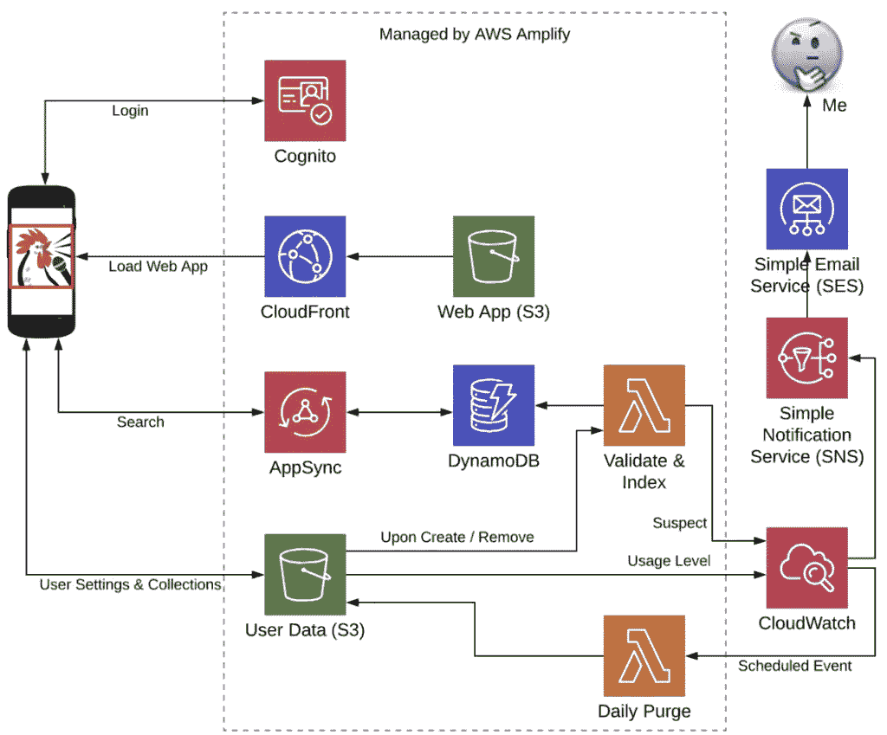
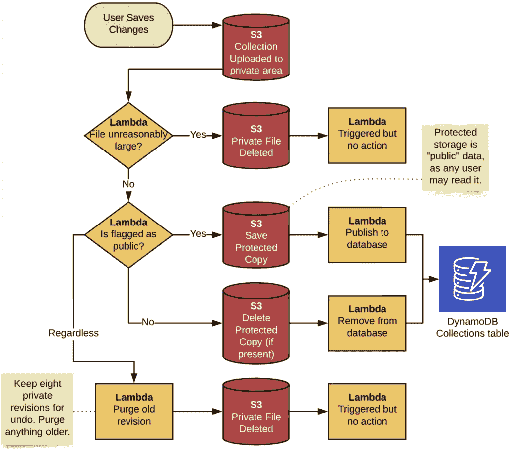

# 将传统应用迁移到云原生环境—第 6 部分

> 原文：<https://medium.com/codex/migrating-a-legacy-app-to-cloud-native-part-6-280cd65a0937?source=collection_archive---------14----------------------->

这是记录我的旅程系列的第 6 部分。如果你之前没有关注过，以下是之前的帖子:

*   第一部分:背景
*   [第二部分:需求&架构](/@kernwig/migrating-a-legacy-app-to-cloud-native-part-2-533dfebd38fb)
*   [第三部分:认证](/@kernwig/migrating-a-legacy-app-to-cloud-native-part-3-4bb187fea485)
*   [第 4 部分:添加云存储](https://adamfanello.medium.com/migrating-a-legacy-app-to-cloud-native-part-4-2741585e4953)
*   [第 5 部分:使用云存储](https://adamfanello.medium.com/migrating-a-legacy-app-to-cloud-native-part-5-34696c6f0f43)

# 回顾我们的目标

用户设置和收藏可以保存到云中，也可以从云中检索。现在，我需要完成“公共”收藏的发布，并增加其他用户找到这些收藏的能力。让我们回头参考一下架构图:



在本系列文章中，我将实现中间的行: [AppSync](https://aws.amazon.com/appsync/) 、 [DynamoDB](https://aws.amazon.com/dynamodb/) 、 *Validate & Index* 、 [lambda](https://aws.amazon.com/lambda/) 。

[上次我展示这张图](http://fanello.net/home/2019/08/13/migrating-a-legacy-app-to-cloud-native-part-2)时，两个 lambdas 在“由 AWS Amplify 管理”框之外。从那以后，我发现了如何将它们包含在 Amplify 中…

# Amplify API 是 AppSync

Amplify 有两个实现[API](https://aws-amplify.github.io/docs/js/api)的选项。一个是通向 Lambda 方法传统 API 网关，放大器称之为 REST。(它实际上没有强制[宁静](https://restfulapi.net/)，它只是*可以*宁静。)除了 Amplify 文档，我没有看到任何关于这个选项的讨论。当有人谈论 Amplify API 时，他们说的是 [GraphQL](https://graphql.org/) 。在 AWS 云端，这是使用 [AppSync](https://aws.amazon.com/appsync/) 服务来完成的。
我将通过`amplify add api`命令给 [SqAC](http://fanello.net/home/2019/07/28/migrating-a-legacy-app-to-cloud-native-part-1/) 添加一个 API:

```
$ **amplify add api**
? Please select from one of the below mentioned services GraphQL
? Provide API name: **sqacamplify**
? Choose an authorization type for the API **Amazon Cognito User Pool**
Use a Cognito user pool configured as a part of this project
? Do you have an annotated GraphQL schema? No
? Do you want a guided schema creation? Yes
? What best describes your project: Single object with fields (e.g., “Todo” with ID, name, description)
? Do you want to edit the schema now? Yes
Please edit the file in your editor: /Users/adamfanello/dev/sqac/sqac-amplify/amplify/backend/api/sqacamplify/schema.graphql
? Press enter to continue GraphQL schema compiled successfully.
```

对于授权，我选择了 *Amazon Cognito 用户池*，这是面向用户的客户端所需要的。我实际上是在构建一个公共的只读 API，因此不会强制任何身份验证，但是没有“无”选项。

我的 GraphQL API 模式非常简单。实际上，我可以通过其他方式用一个 DynamoDB 表和 REST API 选项很容易地做到这一点——甚至可以让客户端直接访问 DynamoDB！这次旅程的重点是尝试新事物，例如 GraphQL 和带有 Amplify 的 AppSync。下面是 GraphQL 模式:

```
type Collection
 # Store in DynamoDB, disable mutations and subscriptions
 @model( mutations: null, subscriptions: null)
{
 id: ID!
 created: String!
 modified: String!
 revision: Int! name: String!
 author: String!
 authorUserId: String!
 description: String!
 difficulty: Int!
 level: String!
 formations: Int
 families: Int
 calls: Int
 modules: Int!
 license: String!
}
```

这是一个公共的只读 API，因此在模型中我禁用了所有的突变，并且没有`@auth` [指令](https://aws-amplify.github.io/docs/cli-toolchain/graphql#auth)。这只是让应用程序的用户搜索个人作者向公众发布的集合。`@model` [指令](https://aws-amplify.github.io/docs/cli-toolchain/graphql#model)告诉 Amplify 用一个`GetCollection`查询和一个`ListCollections`查询扩展这个类型，以及驱动这些查询所需的所有 GraphQL 输入和输出类型。(如果我没有禁用突变和订阅，它会做得更多。)最棒的是，由于 Amplify 知道我在使用 Angular 框架，它还生成了 Typescript 类型和 Angular 服务供我使用。结果是:我实际上没有*来接触我的客户端中的 GraphQL 这只是一个函数调用来做我需要的事情。😎*

默认情况下，创建的 DynamoDB 表是`PAY_PER_REQUEST`，这使得它真正是无服务器的。然而，这个[按需选项](https://aws.amazon.com/blogs/aws/amazon-dynamodb-on-demand-no-capacity-planning-and-pay-per-request-pricing/)不属于 AWS 免费层。所以我把 [DynamoDBBillingMode](https://aws-amplify.github.io/docs/cli-toolchain/graphql#dynamodbbillingmode) 换成了`PROVISIONED`，默认为 5 个 RCU 和 5 个 WCU——这符合免费等级，足以满足我的应用程序当前的需求。

# S3 触发λ

由于 API 是只读的，您可能想知道数据来自哪里。这就是*验证&索引*λ的工作——一个 S3 触发器。每当一个集合被上传，它将触发这个 Lambda 来管理公共集合，包括更新这个 API 正在读取的 DynamoDB 表。添加触发器:

```
$ **amplify update storage**
? Please select from one of the below mentioned services Content (Images, audio, video, etc.)
? Who should have access: Auth and guest users
? What kind of access do you want for Authenticated users? (Press <space> to select, <a> to toggle all, <i> to invert selection)create/update, read, dele
te
? What kind of access do you want for Guest users? (Press <space> to select, <a> to toggle all, <i> to invert selection)read
? Do you want to add a Lambda Trigger for your S3 Bucket? **Yes**
? Select from the following options Create a new function
Successfully added resource S3Trigger08755fbf locally
? Do you want to edit the local S3Trigger08755fbf lambda function now? Yes
Please edit the file in your editor: /Users/adamfanello/dev/sqac/sqac-amplify/amplify/backend/function/S3Trigger08755fbf/src/index.js
? Press enter to continue 
Successfully updated resource
```

这抹去了我在`storage/parameters.json`的所有定制，如[第五部分](https://adamfanello.medium.com/migrating-a-legacy-app-to-cloud-native-part-5-34696c6f0f43)所述。😑幸运的是，我很明智地在提交之前从 CLI 工具中检查了所有更改，因此能够恢复损坏，只留下“`triggerFunction`”参数更改。

我还为这个函数编辑了 CloudFormation 模板，以使用 Node.js 10 并限制为单个并发执行。(Amplify 仍然在将 Lambdas 设置为 Node.js 8 运行时，即使它的弃用距离我写这篇文章只有五周。)

现在我需要这个触发器能够写入 DynamoDB 中的收集表。为此，需要两件事:

1.  lambda 需要表的名称。
2.  lambda 需要*权限*才能写入表。

# 寻找桌子

这需要一些实验和温和的黑客技术。除了环境名(“dev”)之外，Amplify 不向触发器 Lambda 提供任何信息。在 AWS 控制台中，我看到表名是我的类型名“Collection”、生成的 AppSync API 标识符和环境名的连接。“集合”是一个静态名称，对于硬编码来说非常安全。环境通过环境变量(在不同的上下文中重载单词“environment”)和我在`amplify-meta.json`文件中找到的 AppSync ID 提供给 Lambda。🤔我试着用 Javascript `require(‘../../../amplify-meta’)`获取这些内容，但是这个文件不是作为 Lambda 源代码的一部分提交的，因此在运行时失败了。(我也是这么想的，但值得一试。)通过一些搜索，我发现 Amplify 具有预部署挂钩功能，如[文档](https://aws-amplify.github.io/docs/cli-toolchain/usage#build-options)中所述。🎉我用这个`package.json`脚本将`amplify-meta.json`复制到函数`src`目录下，同时添加了打字稿编译！

在λ的`package.json`处的`amplify/backend/function/S3Trigger08755fbf/src/`

```
"scripts": {
  "build": "cp ../../../amplify-meta.json . && ../../../../../node_modules/.bin/tsc"
}
```

在 Lambda `src`目录中，我还运行了`tsc --init`来生成一个`tsconfig.json`，从而为 Typescript 做好了准备。

然后在我的顶层`package.json`:

```
"scripts": {
  "amplify:S3Trigger08755fbf": "cd amplify/backend/function/S3Trigger08755fbf/src/ && npm run build"
}
```

它可以全部放在顶层，但是这样我可以从 lambda `src`目录中进行测试构建。现在每当做一个`amplify push`的时候，最新的元数据都会被复制并编译成脚本。🎉
(当然我把复制的`amplify-meta.json`和编译的`.js`输出添加到我的`.gitignore`文件中。)

综上所述，我的 Lambda 源代码现在包括:

```
**const** amplifyMeta = *require*(**'./amplify-meta'**);
**const** ddbTableName = **'Collection-'** 
  + amplifyMeta.api.sqacamplify.output.GraphQLAPIIdOutput 
  + **'-'** + ***process***.**env**.**ENV**;
```

我确实尝试了另一种方法，如这里提到的，其中@ mikeparisstuff 指出，如果我只是为云形成堆栈定义一个输入参数(比如说，S3 触发器 lambda)，那么 Amplify 将提供值。我用`AppSyncApiId`试过这个，但是因为无法解决而失败。也许这只适用于 API 类别。

# 添加权限

可能有很好的解决方案来为 S3 触发器 lambda 添加访问 DynamoDB 表的权限，但是我找不到任何解决方案。我只是将新语句添加到赋予 lambda 执行角色的策略中，就在存储类别的 CloudFormation 中。我甚至给了它访问所有资源的权限，我觉得这样很好，因为我遵循了一个环境对应一个 AWS 帐户的做法。因此，通配符资源只允许访问帐户中的一个 DynamoDB 表。具体来说，我修改了`amplify/backend/storage/storage/s3-cloudformation-template.json`中的`S3TriggerBucketPolicy`,将其添加到语句数组中:

```
{
   "Effect": "Allow",
   "Action": [
       "dynamodb:PutItem",
       "dynamodb:DeleteItem",
       "dynamodb:GetItem",
       "dynamodb:Query",
       "dynamodb:UpdateItem"
   ],
   "Resource": "*"
}
```

# S3 触发逻辑

Amplify 创建了一个基本示例 Lambda，我现在已经授予它访问 Amplify API 类别创建的 DynamoDB 表的权限。现在我必须写出准确的逻辑。🙌这对我来说是容易的部分。基础设施是 meh🤷‍♂.用工具打架是啊！😱回到仅仅用熟悉的工具、语言和服务写一些代码就像是安慰食物；我可以放松和享受。🤗

经过一些反复的实验和编码，Lambda 被写了出来。你可以在[公关#7](https://github.com/kernwig/sqac-amplify/pull/7/files#diff-4da5aa6aa8c351a993fe612bf34bfd56) 中找到。(注意，实际的处理程序只有八行循环和错误处理代码——其他的都在小的辅助函数中。对 S3 和 DynamoDB 的访问被抽象到`storage.ts`和`database.ts`文件中。)

产生的逻辑流程描述如下。注意，只有一个 S3 桶和一个 Lambda(有多个执行)。这里反复展示了它们，以便按步骤进行分解。



“已触发但无动作”的 lambda 执行是不幸的副作用，因为一切都在一个桶中，没有[执行前过滤](https://docs.aws.amazon.com/AmazonS3/latest/dev/NotificationHowTo.html#notification-how-to-filtering)。(手卷 S3 允许这两种方法，但不能放大。)因为 Lambda 在这两点上总是热的(我将并发性设置为 1)，所以它只是一个不到 100 毫秒的快速执行来检测状态和退出。

# 在客户端实现搜索

要开始使用 Amplify API 类别，第一步是将 API 添加到在`app.module.ts`中注册的 Amplify 模块列表中，如这里的[所述](https://aws-amplify.github.io/docs/js/angular#option-2-configuring-the-amplify-provider-with-specified-amplify-js-modules)。未指定为此添加的确切代码；链接的文档只有其他三个类别的例子。关键是`import API from "@aws-amplify/api";`然后把`API`加到传递给`AmplifyModules`的对象上。

我的搜索功能允许用户输入一点文本，然后在集合的名称、描述和作者姓名中搜索该文本。挑战在于弄清楚如何用生成的`ListComponents`函数做到这一点。[输入类型](https://github.com/kernwig/sqac-amplify/pull/7/files#diff-054ad11f5781091a8c630b686ff95013)允许为每个属性给出标准，但不指定多重标准是一个`and`操作还是一个`or`操作。实验发现它是一个`AND`，但是我真正想要的是 ORs(三个属性中任意一个的文本)和其他搜索标准(难度和级别属性)的`ANDs`的混合。我终于注意到生成的`ModelCollectionFilterInput`在末尾有三个额外的属性，它们不属于我的数据模型:`and`、`or`和`not`。这可能行得通。当我注意到这些的时候，我也通过我的实验意识到文本搜索是区分大小写的。这就是 DynamoDB 的行为方式，AppSync 与 DynamoDB 的对话也是如此。最后，我向 GraphQL 模式添加了一个`searchText`属性，并向 Lambda 添加了一个位，以便在写入 DynamoDB 时设置该值。有了这个包含三个连接在一起的文本字段的新属性，在客户端中`ListComponents` [的输入现在可以简单地使用小写搜索文本和默认`and`操作行为设置相关标准。](https://github.com/kernwig/sqac-amplify/pull/7/files#diff-158659f833a70ba45f7a6e953037c8e6R55-R85)

我解释了所有枯燥的细节，因为*你在其他任何地方都找不到解释*。甚至深入到`ListComponents`的解析器也会导致一个死胡同——一个 Velocity 模板实用函数，它将输入转换为 DynamoDB 过滤器表达式，但是没有如何转换的细节。(想看的话在[这个页面](https://docs.aws.amazon.com/appsync/latest/devguide/resolver-util-reference.html#dynamodb-helpers-in-util-dynamodb)找`toDynamoDBFilterExpression`。)你是否厌倦了我抱怨糟糕的文档？我也是。继续前进。

好消息是:在这之后，Amplify→Angular→graph QL→app sync→dynamo db 集成刚刚工作！一旦一些细节搞清楚了，真的就好办了。🎉我链接了上面段落中所有相关的小代码。

# 下次再来…

完成这一部分后，我很兴奋地意识到 SqAC 的这个迁移版本已经达到了与现有产品版本相同的特性！🎉 🥳

我的待办事项列表上还有一个功能:访客账户。此外，还有一些收尾工作，如 S3 策略、按年龄清除版本、CloudWatch 监控和电子邮件通知。

下次见。🙇‍♂️

*(故事原载* [*此处*](http://fanello.net/home/2019/11/27/migrating-a-legacy-app-to-cloud-native-part-6/)*2019 年 11 月。)*