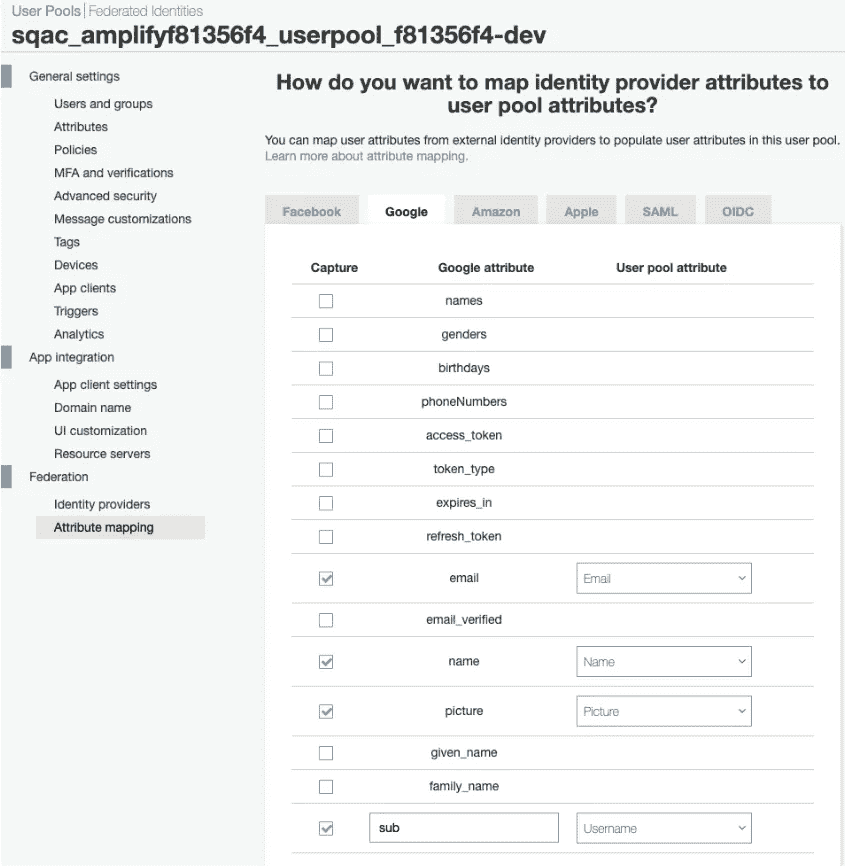

# 将传统应用迁移到云原生环境—第 7 部分

> 原文：<https://medium.com/codex/migrating-a-legacy-app-to-cloud-native-part-7-ec359519e04a?source=collection_archive---------18----------------------->


[Zan](https://unsplash.com/@zanilic?utm_source=medium&utm_medium=referral) 在 [Unsplash](https://unsplash.com?utm_source=medium&utm_medium=referral) 上的照片

这是记录我将名为 SqAC 的渐进式 web 应用程序迁移到 AWS cloud native 的旅程的系列文章的第 7 部分。如果你之前没有关注过，以下是之前的帖子:

*   [第一部分:背景](/@kernwig/migrating-a-legacy-app-to-cloud-native-part-1-68a1adbb95d5)
*   [第二部分:需求&架构](/@kernwig/migrating-a-legacy-app-to-cloud-native-part-2-533dfebd38fb)
*   [第 3 部分:认证](/@kernwig/migrating-a-legacy-app-to-cloud-native-part-3-4bb187fea485)
*   [第 4 部分:添加云存储](https://adamfanello.medium.com/migrating-a-legacy-app-to-cloud-native-part-4-2741585e4953)
*   [第 5 部分:使用云存储](https://adamfanello.medium.com/migrating-a-legacy-app-to-cloud-native-part-5-34696c6f0f43)
*   [第 6 部分:AppSync API 和 S3 触发器](https://adamfanello.medium.com/migrating-a-legacy-app-to-cloud-native-part-6-280cd65a0937)

现在，在第 7 部分中，我将首先使用 Google Sign-in (federation)增强用户帐户，然后使用本地(guest)帐户让用户先试用应用程序。

但是首先…

# 更新的依赖关系

这个系列不是讲棱角的，就不赘述了。然而，我发现要更新到最新的 Amplify 库，我必须将 Angular 从 6.0 升级到 8.0。同时，我更新了其他各种依赖项。

就在 AWS 在 Lambdas 中弃用 Node.js v8 大约一周前，Amplify 终于添加了对 Node.js v10 的支持，因此更新也已经完成。

代码更改的拉请求:

*   [第 7 部分—更新依赖关系](https://github.com/kernwig/sqac-amplify/pull/8)
*   [第 7 部分—放大 Node.js 10 的更新](https://github.com/kernwig/sqac-amplify/pull/15)

# 添加 Google 登录

在[第三部分](https://adamfanello.medium.com/migrating-a-legacy-app-to-cloud-native-part-3-4bb187fea485)，新的云原生版 SqAC 通过 Cognito 获得了用户认证。当时，我没有添加任何联合登录。传统应用支持谷歌和脸书登录，但我发现脸书登录并不流行。有了这个新应用程序中的 Cognito 账户，任何联合账户都不需要真正的*了，但就我个人而言，我喜欢使用我的谷歌账户进行认证，因为这比跟踪另一个账户更容易。除此之外，这也是 Amplify 要探索的另一个特性！*

Amplify 设置 Google 的文档是这里的。是的，我实际上为我的 AWS 原生应用程序使用了一点谷歌云平台。呼吸。没事的。

```
$ **amplify auth update**
Scanning for plugins...
Plugin scan successful
Please note that certain attributes may not be overwritten if you choose to use defaults settings.You have configured resources that might depend on this Cognito resource.  Updating this Cognito resource could have unintended side effects.Using service: Cognito, provided by: **awscloudformation**
 What do you want to do? **Update OAuth social providers**
 Select the identity providers you want to configure for your user pool: **Google**

 You've opted to allow users to authenticate via Google.  If you haven't already, you'll need to go to [https://developers.google.com/identity](https://developers.google.com/identity) and create 
an App ID. 

 Enter your Google Web Client ID for your OAuth flow:  **<hidden>**
 Enter your Google Web Client Secret for your OAuth flow:  **<hidden>**
Successfully updated resource sqacauth locallySome next steps:
"amplify push" will build all your local backend resources and provision it in the cloud
"amplify publish" will build all your local backend and frontend resources (if you have hosting category added) and provision it in the cloud$ **amplify push**
✔ Successfully pulled backend environment dev from the cloud.
```

一个`amplify push`之后，Cognito 被设置为使用 Google 登录。同样，Amplify 使认证变得容易！🥳

在我的 Angular 应用程序的帐户页面中，我将 AmplifyService 作为 amplifySvc 注入并添加了函数:

```
signInWithGoogle() {
   this.amplifySvc.auth().federatedSignIn({provider: 'Google'});
}
```

页面上的一个按钮调用这个函数。这将我带到熟悉的 Google 帐户选择页面，然后导航回我的应用程序。但是有几个问题:

1.  在我导航到帐户页面之前，它不会识别出我已登录。简单地呈现`<amplify-authenticator>`组件触发了要被识别的登录，但是我不希望它出现在应用程序的登录页面上。
2.  我的名字叫“未知”。
3.  没有收到我的照片。

我们一会儿将讨论第一个问题。后两个问题让我大吃一惊，因为遗留的 SqAC 应用程序也支持 Google 登录，通过 [Passport](http://www.passportjs.org/) 。在 Cognito AWS 控制台中，我能够为名称和图片选择属性映射(已经检查了 email 和 sub)。这解决了收到我的名字和照片。这很容易做到，但是我已经知道去哪里找了，因为我有使用 OAuth 和 Cognito 的经验。没有 AWS 经验的人会失去使用 Amplify 的机会。



问题#1 仍然存在:登录不能马上被识别。登录 Google 后，应用程序重新加载，我在浏览器本地存储中看到了 Cognito 用户信息。然而，`Auth.authStateChange$`报告了`“signedOut”`的状态。显式请求当前 auth 用户也会返回“无当前用户”。如果我重新加载页面，那么状态变成`“signedIn”`，一切正常。这似乎是一个错误。🐞我在现有的 [Amplify-js 问题#4621](https://github.com/aws-amplify/amplify-js/issues/4621) 中添加了信息。在交换了一些信息和做了一些实验后，下面是我解决这个问题后的评论:

> *好的，根据您的评论*[*@ ampli fiyer*](https://github.com/Amplifiyer)*找到两个修复，都涉及使用* `*Hub*` *监听签到。我首先用这个来直接模拟监控* `*Auth.authStateChange$*` *。* `*Hub*` *告诉我一个联合用户何时登录/退出，* `*authStateChange$*` *告诉我一个用户池用户。尽管如此，我还是想登陆我的账户页面。所以我把它改为导航到* `*Hub signIn*` *事件上的账户页面。这样做导致了 auth 组件渲染时* `*Auth.authStateChange$*` *触发，所以我只是依赖于此。下面是代码改动:*[*kern wig/sqac-amplify @ 8de 758 e*](https://github.com/kernwig/sqac-amplify/commit/8de758e5dcc8c0f6ef7ce729aa872acf0d96abc2)
> 
> *注意:* `*Hub*` *与棱角不协调，因此需要直接使用* `*NgZone*` *。*

[Amplify Hub](https://aws-amplify.github.io/docs/js/hub) 是 Amplify 使用的浏览器内发布-订阅功能，我们也可以使用。在 Angular 中，服务和 RxJS 提供了类似的行为，所以在此之前我没有使用过 Hub。

# 认证秘密

在向 github 提交这些更改时，我注意到我的 Google Web 客户端秘密存储在`amplify/team-provider-info.json`中。是否提交该文件将在 Amplify 文档的[新章节](https://aws-amplify.github.io/docs/cli-toolchain/quickstart#environments-and-teams)中讨论。我最终从源代码控制中删除了这个文件。

# 安全托管和认证

采取联合登录生活，我需要 HTTPS 托管。(OAuth 不允许 http 回调 URL。)因此，我必须更新我的主机配置，以包括 [CloudFront](https://aws.amazon.com/cloudfront/) ，AWS 内容交付网络:

```
$ **amplify update hosting**
? Specify the section to configure **CloudFront**
CloudFront is NOT in the current hosting
? Add CloudFront to hosting **Yes**
? default object to return from origin **index.html**
? Default TTL for the default cache behavior **86400**
? Max TTL for the default cache behavior **31536000**
? Min TTL for the default cache behavior **60**
? Configure Custom Error Responses **No**
? Specify the section to configure **Publish**
You can configure the publish command to ignore certain directories or files.
Use glob patterns as in the .gitignore file.
? Please select the configuration action on the publish ignore. **exit**
? Specify the section to configure **exit**
$ **amplify publish**
```

这就把 SqAC 部署到了[https://d3l0j9nusq7n6r.cloudfront.net](https://d3l0j9nusq7n6r.cloudfront.net)。我不得不在谷歌将这个添加到应用的[凭证，然后添加到我的应用:](https://console.cloud.google.com/apis/credentials)

```
$ **amplify update auth**
Please note that certain attributes may not be overwritten if you choose to use defaults settings.You have configured resources that might depend on this Cognito resource.  Updating this Cognito resource could have unintended side effects.Using service: Cognito, provided by: **awscloudformation**
 What do you want to do? Add/Edit signin and signout redirect URIs
 Which redirect signin URIs do you want to edit? (Press <space> to select, <a> to toggle all, <i> to invert selection)
 Do you want to add redirect signin URIs? **Yes**
 Enter your new redirect signin URI: [**https://d3l0j9nusq7n6r.cloudfront.net/**](https://d3l0j9nusq7n6r.cloudfront.net/)
? Do you want to add another redirect signin URI **No**
 Which redirect signout URIs do you want to edit? (Press <space> to select, <a> to toggle all, <i> to invert selection)
 Do you want to add redirect signout URIs? **Yes**
 Enter your new redirect signout URI: [**https://d3l0j9nusq7n6r.cloudfront.net/**](https://d3l0j9nusq7n6r.cloudfront.net/)
? Do you want to add another redirect signout URI **No**
Successfully updated resource sqacauth locally$ **amplify push**
```

但是等等，这个不行！😱Javascript 库不够聪明，无法在这个 CloudFront URL 和我已经有的 localhost URL 之间做出选择。`aws-exports.js`文件包含两个以逗号分隔的 URL，但是在运行时只使用第一个 URL(localhost，因为它首先出现)。当从 CloudFront 运行应用程序时，这完全失败了。请在此处查看[问题报告](https://github.com/aws-amplify/amplify-cli/issues/2792)。我不明白这种差距是如何继续存在的。几乎所有的前端开发人员在部署到云(CloudFront)之前都会先在本地(localhost)工作吗？我把这个*黑客*加到有角的`main.ts`来处理这个问题:

```
**import** awsconfig **from './aws-exports'**;*// Choose an OAuth config based on environment*
**const** redirectSignInOptions = awsconfig.**oauth**.redirectSignIn.split(**','**);
**const** redirect = ***environment***.**production**
? redirectSignInOptions.find(s => s.startsWith(**'https'**))
   : redirectSignInOptions.find(s => s.includes(**'localhost'**));
awsconfig.**oauth**.redirectSignIn = redirect;
awsconfig.**oauth**.redirectSignOut = redirect;
```

这里还有一个惊喜:默认情况下，`amplify publish`不会使 CloudFront 缓存失效。🙄这意味着我们在浏览器中发布和重新加载后，我们将看不到我们的更改！(除非我们等一天——甚至不清除浏览器缓存也无济于事。)要实际发布和测试这些更改，我们必须显式地传递一个选项:`amplify publish --invalidateCloudFront`。是的，这被记录在[这里](https://aws-amplify.github.io/docs/cli-toolchain/quickstart#workflow-1)，当然我下次发布时不会记得了，所以我为它添加了一个脚本到我的`package.json`。

拉请求:[第 7 部分—添加谷歌认证提供商](https://github.com/kernwig/sqac-amplify/pull/13)

# 访客访问

迁移到 AWS 时，我的一个需求是添加访客访问。我收到一些想试用我的应用程序的人的投诉，但他们不得不通过谷歌或脸书的认证才能做任何事情。缓解这种担忧的一种方法是使用 Cognito 用户池，这样用户就不需要链接一个社交账户。更有影响的是允许基本的功能而不需要创建账户。在 SqAC 中，我将此称为“本地帐户”，并提供了一些关于没有云备份的数据丢失的警告。然而，这为人们提供了一种方法来玩这个应用程序，并在提供电子邮件地址之前决定他们是否想进一步发展。

我的大部分工作是对我的客户端应用程序本身进行修改。由于我在[第四部分](https://adamfanello.medium.com/migrating-a-legacy-app-to-cloud-native-part-4-2741585e4953)中所做的工作，我能够毫无困难地从存储器(AWS S3)加载公共内容。用户数据存储在浏览器的[索引数据库](https://developer.mozilla.org/en-US/docs/Web/API/IndexedDB_API/Using_IndexedDB)中。如果有云账户，这些数据也会被复制到 S3；对于本地帐户，跳过这一步。一切都很顺利，直到我点击了最后一个要测试的功能:通过 AppSync 搜索。此操作失败，抛出一个异常，提示“没有当前用户”。🤔这让我很惊讶——我认为在我的 GraphQL 类型中不包含`@auth`意味着“没有授权”,因此不需要用户。🤷‍♂️没有。一次搜索让我了解了一些背景知识，最终我无意中找到了大量告诉我们如何进行公共认证的 [Amplify 文档](https://aws-amplify.github.io/docs/cli-toolchain/graphql#public-authorization)。它*表示*...

👉 ***注意:不要这样！请继续阅读！*👈
首先，使用 API 密钥认证类型:**

```
$ **amplify update api**
? Please select from one of the below mentioned services: **GraphQL**
? Choose the default authorization type for the API **API key**
? Enter a description for the API key: **Public access**
? After how many days from now the API key should expire (1-365): **7**
? Do you want to configure advanced settings for the GraphQL API **No, I am done**.The following types do not have '@auth' enabled. Consider using @auth with @model
  - Collection
Learn more about @auth here: [https://aws-amplify.github.io/docs/cli-toolchain/graphql#auth](https://aws-amplify.github.io/docs/cli-toolchain/graphql#auth) GraphQL schema compiled successfully.
```

其次，在 GraphQL 类型上使用 auth mode API 键和`@auth(rules: [{allow: public}])`。

我对 7 天(默认)到期感到紧张。在一次`amplify push`中，CLI 向我显示了“GraphQL API KEY”的值，它被设置在我的`aws-export.js`中。我的应用程序能够成功地执行 GraphQL 查询，而无需创建一个 Cognito 用户，但很明显，这将在一周内停止工作。我可以把这个数增加到 365，但这只会推迟问题的解决。有些人正为此苦苦挣扎。

回到[扩展文档](https://aws-amplify.github.io/docs/cli-toolchain/graphql#public-authorization)，它首先说 API 密匙必须用于公共访问，然后给出第二个例子，使用 IAM 认证用于公共访问。为什么不试试呢？🤷‍♂️

我用`@auth(rules: [{allow: public**, provider: iam**}])`更新了我的 GraphQL，然后在 CLI 上:

```
$ **amplify update api**
? Please select from one of the below mentioned services: **GraphQL**
? Choose the default authorization type for the API **IAM**
? Do you want to configure advanced settings for the GraphQL API **No, I am done.**GraphQL schema compiled successfully.$ **amplify api gql-compile**
$ **amplify push**
```

用一个云帐户和一个本地(来宾)帐户做了一点测试，它工作了！🎉

*向 Amplify 团队呼吁:* [文档的这一点](https://aws-amplify.github.io/docs/cli-toolchain/graphql#public-authorization)可以说得更清楚，有两种方法，以及如何在它们之间进行选择。

# 结论

就像所有的 Amplify(老实说，一般来说是做新的东西)一样，添加谷歌登录和访客访问比看起来要难。这需要一些网络搜索和实验，但最终比没有 Amplify 要容易得多。

# 下次再来…

切过去！旧的应用程序仍然在[https://sqac.fanello.net/](https://sqac.fanello.net/)，这个新的在[https://d3l0j9nusq7n6r.cloudfront.net](https://d3l0j9nusq7n6r.cloudfront.net)。一个名字比另一个稍微友好一些。😉

我刚刚支付了一个月的数字海洋托管费，希望这是最后一次。

下次见。😎

*(本故事原载* [*此处*](http://fanello.net/home/2020/01/19/migrating-a-legacy-app-to-cloud-native-part-7/)*2020 年 1 月。)*