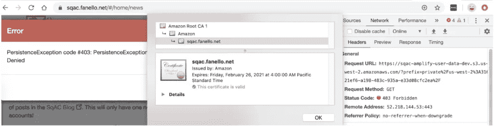

# 将传统应用迁移到云原生环境—第 8 部分

> 原文：<https://medium.com/codex/migrating-a-legacy-app-to-cloud-native-part-8-bd908b9bb199?source=collection_archive---------16----------------------->


装运它！

这是记录我将名为 SqAC 的渐进式 web 应用程序迁移到 AWS cloud native 的旅程的系列文章的第 8 部分。如果你之前没有关注过，以下是之前的帖子:

*   [第一部分:背景](/@kernwig/migrating-a-legacy-app-to-cloud-native-part-1-68a1adbb95d5)
*   [第二部分:需求&架构](/@kernwig/migrating-a-legacy-app-to-cloud-native-part-2-533dfebd38fb)
*   [第三部分:认证](/@kernwig/migrating-a-legacy-app-to-cloud-native-part-3-4bb187fea485)
*   [第 4 部分:添加云存储](https://adamfanello.medium.com/migrating-a-legacy-app-to-cloud-native-part-4-2741585e4953)
*   [第 5 部分:使用云存储](https://adamfanello.medium.com/migrating-a-legacy-app-to-cloud-native-part-5-34696c6f0f43)
*   [第 6 部分:AppSync API 和 S3 触发器](https://adamfanello.medium.com/migrating-a-legacy-app-to-cloud-native-part-6-280cd65a0937)
*   [第 7 部分:联盟&访客访问](https://adamfanello.medium.com/migrating-a-legacy-app-to-cloud-native-part-7-ec359519e04a)

现在，在第 8 部分中，我将对新的 AWS 托管应用程序进行最后的润色，并将其投入使用！还有，我最后的结论。

# 自定义域名

在 S3 上托管一个应用程序很容易——我们在第 3 部分的中用`amplify hosting add`命令就做到了。简单，但不值得使用类似 [*的 URL http://sqac-amplify-2019 08 17123020-hostingbucket-dev . S3-website-us-west-2 . Amazon AWS . com*](http://sqac-amplify-20190817123020-hostingbucket-dev.s3-website-us-west-2.amazonaws.com)

在第七部的[中，为了有 HTTPS 加入了 CloudFront，我们在](https://adamfanello.medium.com/migrating-a-legacy-app-to-cloud-native-part-7-ec359519e04a)[*https://d3l0j9nusq7n6r.cloudfront.net*得到了一个更简洁的 URL。这已经好多了，但仍然不是我能让别人在浏览器中输入的东西。否，需要自定义域。事实上，我的旧应用程序正在 sqac.fanello.net 运行，是时候让这个新的云原生版本取而代之了。](https://d3l0j9nusq7n6r.cloudfront.net.)

我首先尝试通过 AWS Amplify 控制台在我的应用程序上设置一个自定义域。AWS Amplify 控制台在点击*添加域名*按钮后并没有更新太多内容，我在浏览器开发控制台发现了*错误*。😲我怀疑，因为这是一个以使用 AWS Amplify 控制台作为构建管道的想法为中心的功能，但我没有，所以不这样做，域管理就会失败。不友好的 UI，不过还好。这并不是一个需要解决的大问题；我的应用程序实际上只是托管在一个由 CloudFront 前端 S3 桶，所以我只需要找到如何附加一个自定义域。如果这只是 HTTP(没有 S ),那么添加一个 [DNS CNAME 记录](https://en.wikipedia.org/wiki/CNAME_record)将我的子域转发到 AWS 托管域就很简单了。CloudFront 提供的安全证书使这变得复杂，因为我不能在 fanello.net 的域名下提供一个 CloudFront 的证书并期望浏览器接受它。

我试着[连接到第三方自定义域](https://docs.aws.amazon.com/amplify/latest/userguide/howto-third-party-domains.html)，但是这并不是我想要完成的，所以它本身没有帮助。然而，它把我带到了 [AWS 证书管理器](https://docs.aws.amazon.com/acm/latest/userguide/acm-overview.html)。

在 AWS 控制台中，我转到 AWS 证书管理器并选择[创建一个新的公共证书](https://docs.aws.amazon.com/acm/latest/userguide/gs-acm-request-public.html)。(我先[查了一下](https://aws.amazon.com/certificate-manager/pricing/)这样一个证书上的定价:免费！)我设置了 DNS 验证，然后等待它发生…但什么也没发生。

经过几次尝试，每次都要等几天，我最终发现提供的 CNAME 域名末尾有一个点，当我在 DNS 域名服务器中设置它时，我必须删除它。🤷‍♂️

当我试图将证书附加到我的 CloudFront 发行版时，没有找到它。在互联网上快速搜索[发现【CloudFront 只能在 us-east-1 (N. Virginia)使用证书，没有教程提到这一点。😞它的*是在 CloudFront 发行版设置页面上的*，所以我会知道已经阅读了表单字段下的浅灰色小文本。因此，在一周之后，我终于在 us-west-2(俄勒冈州)拿到了证书，我不得不重新开始。幸运的是，我第一次就吸取了教训。我删除了结束点，将 DNS TTL(生存时间)值设置为低，并在大约五分钟内设置好新证书。](https://aws.amazon.com/premiumsupport/knowledge-center/custom-ssl-certificate-cloudfront/)

终于有了需要的证书，我可以通过[编辑设置](https://docs.aws.amazon.com/AmazonCloudFront/latest/DeveloperGuide/CNAMEs.html)来配置 CloudFront 发行版。我添加了证书，将“替代域名”设置为我的子域，打开 HTTP/2(为什么不是默认的？)并将价格等级下调至美国、加拿大和欧洲。由于渐进式网络应用程序被浏览器强烈缓存，世界上其他地方的较慢访问不会很重要。

在[https://sqac.fanello.net](https://sqac.fanello.net)AAAA 和…刷新。失败。证书仍然显示我的旧证书，让我们加密颁发的证书。拖了一周左右拿着证书到处玩，把最初的目标给忘了！🤦将*sqac.fanello.net*子域设置为 CNAME 指向我的 CloudFront 发行版后的‍♂️…



我有亚马逊的有效证书，应用程序加载，但访问由 Amplify Storage 管理的 S3 桶被拒绝。进步！

如果你回头看看[上一篇博文](https://adamfanello.medium.com/migrating-a-legacy-app-to-cloud-native-part-7-ec359519e04a)，在设置了 CloudFront 之后，我不得不使用 CloudFront URL 重新配置认证。现在，我必须将它更改到我的新领域:

```
$ **amplify update auth**
Please note that certain attributes may not be overwritten if you choose to use defaults settings.You have configured resources that might depend on this Cognito resource.  Updating this Cognito resource could have unintended side effects.Using service: Cognito, provided by: awscloudformation
 What do you want to do? **Add/Edit signin and signout redirect URIs**
 Which redirect signin URIs do you want to edit? [**https://d3l0j9nusq7n6r.cloudfront.net/**](https://d3l0j9nusq7n6r.cloudfront.net/)
? Update [https://d3l0j9nusq7n6r.cloudfront.net/](https://d3l0j9nusq7n6r.cloudfront.net/) [**https://sqac.fanello.net/**](https://sqac.fanello.net/)
 Do you want to add redirect signin URIs? **No**
 Which redirect signout URIs do you want to edit? [**https://d3l0j9nusq7n6r.cloudfront.net/**](https://d3l0j9nusq7n6r.cloudfront.net/)
? Update [https://d3l0j9nusq7n6r.cloudfront.net/](https://d3l0j9nusq7n6r.cloudfront.net/) [**https://sqac.fanello.net/**](https://sqac.fanello.net/)
 Do you want to add redirect signout URIs? **No**
TypeError: Cannot use 'in' operator to search for 'dev' in undefined
    at keys.forEach.key (/Users/adamfanello/.nvm/versions/node/v10.16.3/lib/node_modules/@aws-amplify/cli/lib/extensions/amplify-helpers/envResourceParams.js:33:19)
    at Array.forEach (<anonymous>)
    at getOrCreateSubObject (/Users/adamfanello/.nvm/versions/node/v10.16.3/lib/node_modules/@aws-amplify/cli/lib/extensions/amplify-helpers/envResourceParams.js:32:10)
    at AmplifyToolkit.saveEnvResourceParameters [as _saveEnvResourceParameters] (/Users/adamfanello/.nvm/versions/node/v10.16.3/lib/node_modules/@aws-amplify/cli/lib/extensions/amplify-helpers/envResourceParams.js:66:23)
    at Object.saveResourceParameters (/Users/adamfanello/.nvm/versions/node/v10.16.3/lib/node_modules/@aws-amplify/cli/node_modules/amplify-provider-awscloudformation/src/resourceParams.js:26:19)
    at saveResourceParameters (/Users/adamfanello/.nvm/versions/node/v10.16.3/lib/node_modules/@aws-amplify/cli/node_modules/amplify-category-auth/provider-utils/awscloudformation/index.js:110:12)
    at serviceQuestions.then (/Users/adamfanello/.nvm/versions/node/v10.16.3/lib/node_modules/@aws-amplify/cli/node_modules/amplify-category-auth/provider-utils/awscloudformation/index.js:330:7)
    at process._tickCallback (internal/process/next_tick.js:68:7)
There was an error adding the auth resource
```

叹气。😞我发布了 Amplify CLI [bug #3273](https://github.com/aws-amplify/amplify-cli/issues/3273) 。原来是*某个东西*删除了我的`team-provider-info.json`文件，这个文件不再受源代码控制，因为它包含了 Google 登录密码。我去从 AWS 重新拉环境，从而重新创建文件，但这也失败了，我发出了 Amplify CLI [bug #3274](https://github.com/aws-amplify/amplify-cli/issues/3274) 。🙄忍无可忍，我从源码控制找到了老版本的文件，然后发了一个`amplify env pull`。这一次它成功了，并提示我输入谷歌认证 ID 和密码，这是我从谷歌云平台控制台恢复的。在 GCP 控制台中，我意识到我也需要在`Authorized redirect URIs`列表中添加新的子域，于是我这么做了。

# 然后，灾难

一切就绪:自定义域名、SSL 证书、DNS 重定向、丢失文件恢复和身份验证重新配置。现在是最终胜利的时候了！我发了一个`amplify push`，它愣住了。😱一小时后，CloudFormation 堆栈超时，开始回滚恢复。在*另一个*小时后，回滚也失败了。结尾解释:

```
The following resource(s) failed to update: [OAuthCustomResourceInputs]
```

啊？这个错误信息的谷歌搜索结果是本系列第三部分[的*我自己的博客文章*！不幸是，问题不同。那一次，CloudWatch 里有一个日志解释了它不喜欢什么。这次有:](https://adamfanello.medium.com/migrating-a-legacy-app-to-cloud-native-part-3-4bb187fea485)

```
ERROR Uncaught Exception 
{
    "errorType": "Runtime.ImportModuleError",
    "errorMessage": "Error: Cannot find module 'cfn-response'",
    "stack": [
        "Runtime.ImportModuleError: Error: Cannot find module 'cfn-response'",
        "    at _loadUserApp (/var/runtime/UserFunction.js:100:13)",
        "    at Object.module.exports.load (/var/runtime/UserFunction.js:140:17)",
        "    at Object.<anonymous> (/var/runtime/index.js:45:30)",
        "    at Module._compile (internal/modules/cjs/loader.js:778:30)",
        "    at Object.Module._extensions..js (internal/modules/cjs/loader.js:789:10)",
        "    at Module.load (internal/modules/cjs/loader.js:653:32)",
        "    at tryModuleLoad (internal/modules/cjs/loader.js:593:12)",
        "    at Function.Module._load (internal/modules/cjs/loader.js:585:3)",
        "    at Function.Module.runMain (internal/modules/cjs/loader.js:831:12)",
        "    at startup (internal/bootstrap/node.js:283:19)"
    ]
}
```

搜索结果是[这个问题](https://github.com/aws/aws-sdk-js/issues/2955)将 CloudFormation custom lambdas 升级到 node . js 10——这是 Amplify 最近添加的内容。我编辑了我的身份验证 CloudFormation 模板，以修复问题中提到的相对路径导入。 [Amplify Node.js 更新指令](https://aws-amplify.github.io/docs/cli/lambda-node-version-update)提到了这种行为上的变化，但只是针对我们自己的定制函数，而不是由 Amplify 创建并隐藏在 CloudFormation 模板中的那些函数。😡

修复后，我仍然不知道如何恢复。我的“auth”cloud formation 堆栈处于`UPDATE_ROLLBACK_FAILED`状态。继续回滚的多次尝试也失败了(每次一小时后)。我怀疑它仍然试图运行坏的定制兰姆达斯。

像这样的失败在任何技术中都可能发生。这就是为什么备份很重要，并且在处理云服务时，我们必须始终将基础架构视为短暂的。然而，数据并不是短暂的。这个堆栈包含了 Cognito 用户。同样，作为整个应用程序的[嵌套栈](https://docs.aws.amazon.com/AWSCloudFormation/latest/UserGuide/using-cfn-nested-stacks.html)，它处于故障状态意味着整个应用程序栈处于故障状态。

我联系了 AWS Amplify 团队的一个人寻求帮助。这位联系人是我在 LinkedIn 和 re:Invent 2019 上认识的，他很快回复了我，并把我转给了 Amplify CLI 团队的一位同事。几封电子邮件的交流简单地引出了“对我有用”。😢

# 重新开始

幸运的是，这是一个开发环境，所以唯一的数据是我自己的。我本打算简单地将其投入生产，但由于堆栈损坏，我不得不重新开始一个全新的生产环境:

```
$ **amplify init**
Scanning for plugins...
Plugin scan successful
Note: It is recommended to run this command from the root of your app directory
? Do you want to use an existing environment? **No**
? Enter a name for the environment **prod**
Using default provider  awscloudformationFor more information on AWS Profiles, see:
https://docs.aws.amazon.com/cli/latest/userguide/cli-multiple-profiles.html? Do you want to use an AWS profile? **Yes**
? Please choose the profile you want to use **sqac-amplify-cli**
Adding backend environment prod to AWS Amplify Console app: d2g2lwfk7ok1zm
⠹ Initializing project in the cloud...CREATE_IN_PROGRESS amplify-sqac-amplify-prod-161346 AWS::CloudFormation::Stack Sat Feb 01 2020 16:13:48 GMT-0800 (Pacific Standard Time) User Initiated             
CREATE_IN_PROGRESS DeploymentBucket                 AWS::S3::Bucket            Sat Feb 01 2020 16:13:51 GMT-0800 (Pacific Standard Time)                            
CREATE_IN_PROGRESS UnauthRole                       AWS::IAM::Role             Sat Feb 01 2020 16:13:51 GMT-0800 (Pacific Standard Time)                            
CREATE_IN_PROGRESS AuthRole                         AWS::IAM::Role             Sat Feb 01 2020 16:13:52 GMT-0800 (Pacific Standard Time)                            
CREATE_IN_PROGRESS UnauthRole                       AWS::IAM::Role             Sat Feb 01 2020 16:13:52 GMT-0800 (Pacific Standard Time) Resource creation Initiated
CREATE_IN_PROGRESS DeploymentBucket                 AWS::S3::Bucket            Sat Feb 01 2020 16:13:52 GMT-0800 (Pacific Standard Time) Resource creation Initiated
CREATE_IN_PROGRESS AuthRole                         AWS::IAM::Role             Sat Feb 01 2020 16:13:52 GMT-0800 (Pacific Standard Time) Resource creation Initiated
⠹ Initializing project in the cloud...CREATE_COMPLETE UnauthRole AWS::IAM::Role Sat Feb 01 2020 16:14:06 GMT-0800 (Pacific Standard Time) 
CREATE_COMPLETE AuthRole   AWS::IAM::Role Sat Feb 01 2020 16:14:07 GMT-0800 (Pacific Standard Time) 
⠇ Initializing project in the cloud...CREATE_COMPLETE DeploymentBucket AWS::S3::Bucket Sat Feb 01 2020 16:14:13 GMT-0800 (Pacific Standard Time) 
⠸ Initializing project in the cloud...CREATE_COMPLETE amplify-sqac-amplify-prod-161346 AWS::CloudFormation::Stack Sat Feb 01 2020 16:14:15 GMT-0800 (Pacific Standard Time) 
✔ Successfully created initial AWS cloud resources for deployments.
✔ Initialized provider successfully.

 You've opted to allow users to authenticate via Google.  If you haven't already, you'll need to go to [https://developers.google.com/identity](https://developers.google.com/identity) and create 
an App ID. 

 Enter your Google Web Client ID for your OAuth flow:  **<hidden>**
 Enter your Google Web Client Secret for your OAuth flow:  **<hidden>**
? Do you want to configure Lambda Triggers for Cognito? **No**
Initialized your environment successfully.Your project has been successfully initialized and connected to the cloud!Some next steps:
"amplify status" will show you what you've added already and if it's locally configured or deployed
"amplify add <category>" will allow you to add features like user login or a backend API
"amplify push" will build all your local backend resources and provision it in the cloud
“amplify console” to open the Amplify Console and view your project status
"amplify publish" will build all your local backend and frontend resources (if you have hosting category added) and provision it in the cloudPro tip:
Try "amplify add api" to create a backend API and then "amplify publish" to deploy everything
```

然后推升新环境:

```
$ **amplify push**
✔ Successfully pulled backend environment prod from the cloud.Current Environment: prod| Category | Resource name     | Operation | Provider plugin   |
| -------- | ----------------- | --------- | ----------------- |
| Hosting  | S3AndCloudFront   | Create    | awscloudformation |
| Auth     | sqacauth          | Create    | awscloudformation |
| Storage  | storage           | Create    | awscloudformation |
| Function | S3Trigger08755fbf | Create    | awscloudformation |
| Api      | sqacamplify       | Create    | awscloudformation |
? Are you sure you want to continue? YesGraphQL schema compiled successfully.Edit your schema at /Users/adamfanello/dev/sqac/sqac-amplify/amplify/backend/api/sqacamplify/schema.graphql or place .graphql files in a directory at /Users/adamfanello/dev/sqac/sqac-amplify/amplify/backend/api/sqacamplify/schema
? Do you want to update code for your updated GraphQL API No
⠹ Updating resources in the cloud. This may take a few minutes...... Lots of CloudFormation output as everything is built ...
```

参见拉动式请求[第 8 部分/上线](https://github.com/kernwig/sqac-amplify/pull/16)。

完成后，我将种子数据安装到 S3 中(S3 触发器自动将其索引到 DynamoDB 中),新的 SqAC 现已上线！将传统应用迁移到云原生 AWS 的漫长旅程(周末勇士)已经完成！🎉

# 结论

如您所见，对新环境进行全新安装可以避免失败的堆栈。我的庆祝活动感觉受到了污染，死亡堆栈仍然在 AWS 控制台上用鲜红色盯着我。尽管创建一个全新的生产环境可能是正确的做法，但它并不能解决所有问题。开发和维护一个软件系统需要几个月甚至几年的时间，包括更新。不能丢失用户和用户数据的更新。找不到堆栈崩溃的根本原因让我对信任 Amplify 的用户数据感到非常紧张。Amplify 有很多优点和前景——新的 [Amplify DataStore](https://aws-amplify.github.io/docs/js/datastore) 功能看起来很棒——但是我的最终体验让我犹豫是否使用或推荐这个工具集。我等了几个星期才写完最后这篇文章。部分延迟是为了给 Amplify 团队时间去寻找一个解释。也许更大的原因是，在这次探索的七个月后，我真的不希望它以这种方式结束。😕

最后，我对使用 AWS Amplify 的最终结论很简单:

*没有快捷方式*

Amplify 给人的感觉是一个神奇的工具集，让前端开发人员不用成为后端开发人员或云工程师就可以创建应用程序。事实并非如此，我见过的 Amplify 团队成员告诉我，这从来都不是他们的初衷。这是一个帮助管理和使用云基础设施的工具集。正如我的旅程和(极其详细的)博客帖子所显示的，你仍然需要了解 Amplify 正在帮助你的一切背后的 AWS 服务。一件工具只有在知道如何使用它的人手里才有用，这句话是有道理的:“我知道的足够危险。”我对希望利用云的应用程序开发人员的建议是:了解完整的堆栈或与解决方案架构师合作。在你所在的地区找一个 AWS Meetup 小组，建立一些关系网。找一家能够#thinkcloudnative 的[咨询公司。AWS 仍然是最全面的开发平台，所以勇往直前去创造吧！](https://www.linkedin.com/feed/hashtag/thinkcloudnative/)

*(本故事原帖* [*此处*](http://fanello.net/home/2020/03/25/migrating-a-legacy-app-to-cloud-native-part-8/)*2020 年 3 月。)*