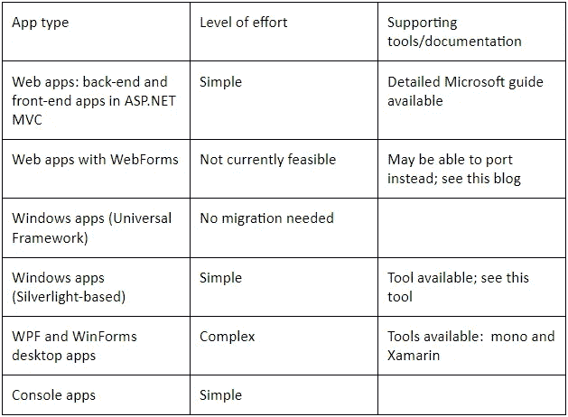

# 从迁移。NET 框架到。网络核心

> 原文：<https://medium.com/codex/migrating-from-net-framework-to-net-core-d872185e8aa4?source=collection_archive---------4----------------------->

> **目录**

1.[简介](#513a)

2.[从升级的主要原因。净到。网芯](#2362)

2.1 [跨平台支撑](#7496)

2.2 [更好的性能和可扩展性](#27c0)

2.3 [与以前的兼容性。网络版](#e86e)

2.4 [对现代建筑的支持](#24ed)

2.5 [对 razor 页面的改进](#ea21)

3.[迁移类型](#c4bd)

4.[迁移什么？](#8463)

5.[适度的未来风险](#ecbd)

6.[结论](#6185)

# 介绍

众所周知，微软不断对其技术堆栈进行再投资，使开发人员能够创建安全、受保护和增强的软件产品，从而帮助企业满足不断变化的客户需求。它的云服务和商业智能产品在用户数量上没有限制，而软件开发平台像。Net 继续以现代的特性和功能快速发展。

微软已经解决了一个新的升级助手来帮助你移植。Net 框架应用程序。Net 5.0，是一个漫长的过程来检索一个完整的解决方案。越来越多的企业正计划从。净到。Net 核心，因为它提供了跨所有平台的兼容性。。Net 版本有助于消除升级您当前使用的框架和应用程序的成本。

许多版本的。Net 框架已经过时了，微软在不久的将来将不再支持它们。因此，迁移到一个更新的平台对于利用你的应用中的高级特性和功能是必不可少的。

。Net 平台提供了众多的开发服务，这也是。Net 将在未来一段时间内持续增长。根据最新消息，未来的。Net core 的确很聪明，你应该了解。Net framework 之后，才进入一个更具创新性的商业模式。

在从。NET 框架添加到。网芯。因此，您必须在迁移之前了解这些事情。因此，在这篇文章中，我们将讨论企业和开发人员从。Net 框架到。网芯。所以去喝杯咖啡，享受旅程吧。

# 从升级的主要原因。净到。网络核心

## **1。跨平台支持**

。NET core 是跨平台的，侧重于 web、windows store 和 windows mobile，而不是桌面应用程序开发。如果您的代码不依赖于特定于 Windows 的技术，它可以在 macOS、Linux 和 Android 上运行。它支持 windows 窗体和 WPF 应用程序，并包括自动化、库、基于控制台的工具和 ASP.NET 站点等项目类型。

您的基于控制台的应用程序和您正在使用的库可能会利用跨平台，而不会有太大的改进。迁移到时。NET，您可能希望对此进行分析，并询问您在其他平台上的应用程序。

## **2。更好的性能和可扩展性**

。Net core 得到了增强，以提高应用程序的性能、速度和效率。随着容器化和微服务等现代化架构理论的出现，可伸缩性不再是问题。Net Core 旨在处理用 Docker 等数百种技术创建的应用程序。

## **3。与以前版本的兼容性。网络版**

例如，让我们假设您已经在使用。NET 框架。每个。你正在为个人应用程序使用的. Net 版本；为您提供所有方面的兼容性。NET 版本，有助于避免升级现有框架和应用程序的费用。

这里有几个。不可用或兼容的. NET 技术。网芯。

*   **工作流相关服务:**这些服务只能与。NET 框架。
*   **网页:**。NET 网页被排除在外。网芯。
*   **特定于 Windows 的 API:**如果你的应用程序与 Windows 注册表兼容，那么它就不适用。NET 核心，因为它与底层操作系统是分离的。
*   **网络表单:**这些表单仅在。NET 框架。

## **4。支持现代建筑**

微服务架构是当今非常著名的现代架构之一。而这背后，有。NET 核心，是构建微服务的理想选择。它是创建高度可伸缩服务的模型。

单片架构是微服务架构的对立面。它是整个应用程序的一部分。NET 项目。这种架构在同一个源存储库和单个托管服务中可用。

## **5。razor 页面的改进**

解决了各种改进问题。Net 核心平台，它增加了 Razor 页面的功能，在可重用性方面提供了新的机会，为传统的局部视图概念提供了更多的选择。创建组件的过程看起来像标准的 Web 组件，通常内置 Javascript。然而，这种方法在性能方面有一些限制，而且它比较的是在前端使用 Angular 框架创建的相同应用程序。

# 迁移类型

如果您计划迁移解决方案，并选择从框架直接迁移到核心，那么您必须完全迁移。这意味着一旦您迁移了其中一个项目，所有的项目都必须在。网芯。但是如果。NET 框架和。NET 核心是完全不同的，你不能在核心项目中导入框架项目，反之亦然。

如果您的软件不是分布式的，您也可以一次性迁移整个解决方案。但是，如果您的软件随着不断的开发和发布而前进，那么不推荐一步到位的解决方案。

在迁移支持方面，微软非常聪明。如果您计划从 SQL Server 2015 迁移到 2021，新数据库附带的向导可以快速轻松地迁移旧数据库中的几乎所有内容。

想象一下，在您的情况下，不可能一次迁移所有内容，因为这会危及您当前的解决方案。一种方法是在框架和核心之间共享 API。

# 迁移什么？

一旦您确定要迁移到。Net core 之后，你会想到的下一个问题是，“我可以迁移我所有的应用吗？答案在于你的应用类型。对于应用程序迁移，建议您使用相关工具来分析您的应用程序，如 API 可移植性分析器或。NET Framework 兼容性诊断。

[表格来源](https://gorillalogic.com/blog/what-why-and-how-to-migrate-to-net-core/)

# 适度的未来风险

众所周知。，将 WebForms 移动到。NET 核心，因为这种技术被众多的商业组织广泛使用。作为一名开发人员，如果您仍在使用 WebForms 并且不想迁移到。NET Core，有一些选项可以让你在以后尽量减少工作量:

## **1。生成。NET 标准库**

这些库允许您知道您的代码是否与这两者兼容。NET 框架和。NET Core，它将帮助您移动您的代码。

## **2。模型绑定的实现**

您是否计划从。NET 框架到。未来的网芯？如果是，那么为了简化过程，建议采用模型绑定特性。

## **3。API 和客户端开发**

对于应用程序开发，您可以增加 API 的使用，并通过转移到 Angular 和 React 等框架来更加面向客户端，这些框架对 WebForms 的依赖更少，移动起来更舒适。

# 最后的想法

微软现在正计划。Net 6，它将在年底前发布。最初的研究刚刚开始。。Net 6 将突出 Xamarin 完全支持的完全整合的跨平台体验，以便一个应用程序可以在 Windows、Linux、macOS 和 Android 等各种平台上工作。尽管如此，它将提供几个新特性，包括性能增强、更大的社区、更快的开发过程、扩展的 blazor 支持等等。

只要确保您没有匆忙过渡到将应用程序与 Windows 操作系统紧密结合，以确保您的业务跟上最新趋势。