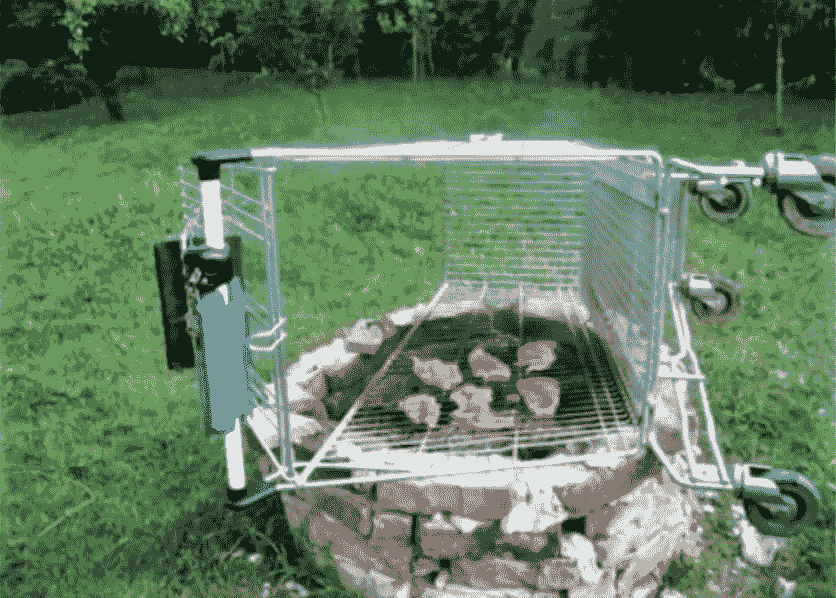

# 移民驱动的发展

> 原文：<https://medium.com/codex/migration-driven-development-d3c8b4601dd2?source=collection_archive---------8----------------------->

本周，当我计划重写我们系统的一部分时，我面临一个道德问题。问题是，我最近读了[乔尔·斯波尔斯基](https://www.joelonsoftware.com/)的一篇帖子，他说重写你的代码是，我引用一下:

> 任何软件公司都会犯的最严重的战略错误

平心而论，帖子谈到重写*整个*系统，以网景 6.0 重写为例，但我努力做到[谨慎冷水](https://en.wiktionary.org/wiki/%D7%9E%D7%99_%D7%A9%D7%A0%D7%9B%D7%95%D7%94_%D7%91%D7%A8%D7%95%D7%AA%D7%97%D7%99%D7%9F_%D7%A0%D7%96%D7%94%D7%A8_%D7%91%D7%A6%D7%95%D7%A0%D7%A0%D7%99%D7%9F)，于是我想，我是不是在犯错？

在冷水中小心谨慎(图片由[奥斯卡·萨顿](https://unsplash.com/@o5ky?utm_source=medium&utm_medium=referral)在 [Unsplash](https://unsplash.com?utm_source=medium&utm_medium=referral) 上拍摄)

我震惊地读到:

> 绝对没有理由相信你会比第一次做得更好

但后来我想——但第一次不是我写的！我松了一口气，直到我读到这仅仅意味着:

> 你实际上并没有“更多的经验”。你只会再次犯下大部分老错误，并引入一些原始版本中没有的新问题。

这真是令人失望。我真的认为代码需要重写！幸运的是，另一个[帖子](/@herbcaudill/lessons-from-6-software-rewrite-stories-635e4c8f7c22)，这是由 [Herb Caudill](https://medium.com/u/7235e9383aa6?source=post_page-----d3c8b4601dd2--------------------------------) 写的，谈到了一些合理且成功的重写的例子。简而言之，这篇文章说，有时重写是合理的，但不仅仅是因为代码主观上是坏的，而是因为它明显地阻碍了你，或者你现在比以前更好地理解了你的需求。

斯波尔斯基的观点中我最喜欢的一点是旧代码有优势*，因为*它是旧的。已经过测试和调试。它已经面对了[外部世界的复杂性](https://dotanrs.medium.com/your-system-is-feature-perfect-but-is-it-still-fragile-60e96541240b)。它的许多丑陋之处可能是直接由此导致的——越来越多的调整和 *if* s 和 hacks 解决了以前不知道的、在你重写时可能不知道的实际问题。([不要看罐子，要看里面是什么](https://en.wiktionary.org/wiki/%D7%90%D7%9C_%D7%AA%D7%A1%D7%AA%D7%9B%D7%9C_%D7%91%D7%A7%D7%A0%D7%A7%D7%9F_%D7%90%D7%9C%D7%90_%D7%91%D7%9E%D7%94_%D7%A9%D7%99%D7%A9_%D7%91%D7%95#Hebrew)

或者像考迪尔总结的那样:

> 你已经创造的东西是有价值的。

你已经创造的东西有价值。(图片来自一个推荐但不相关的关于 DevOps 的[演讲](https://www.youtube.com/watch?v=RTEgE2lcyk4)

所有这些让我想到了这篇文章的目的，正如标题微妙暗示的那样:

# ***迁移驱动开发***

这是我每次不得不进行大规模重写或重构时无意中开发的一种方法，我相信它有助于规划重写，使您不会丢失现有代码中的价值，并且您会很快发现新代码何时表现不佳。

想法是这样的:

> **根据**您的迁移计划**计划重写**。

也就是说，在您有一个集成到开发计划中的完整迁移计划之前，您还没有完成规划。开发步骤包括在编写代码之后和编写更多代码之前，如何将每段代码集成到生产环境中。我所说的集成并不是指仅仅部署无所作为的代码，而是指替换现有的功能或调用。写完每一段新代码后马上使用它。

例如，假设我有一个保存所有客户数据的服务，我想提取其中的一部分，比如关于客户爱好的信息。旧服务保存和更新它们的方式都是丑陋和错误的，有很多代码我不懂，等等。现在客户模型看起来是这样的:

*{客户 Id:字符串，名字:字符串，电话号码:字符串，爱好:字符串[] }*

我可能想为业余爱好编写一个新的服务，实现所有的功能，然后运行一些迁移并完成它。但这可能意味着失去当前设计的所有价值。也许丑陋的代码隐藏了一些关于系统需要如何运行的见解？

因此，我要做的是提前计划迁移将如何进行，并将其与我的工作流集成。我可能会从创建这个新服务开始，只实现一个非常基本的 API 来创建和删除爱好，并且只在它现在创建或删除爱好的地方从原始服务调用它们，所以它们是重复的。然后，我会逐步从新服务中获取数据，并回退到原始服务。同时，我将在服务之间移动小块的逻辑。只有当我确信我没有破坏任何东西，并且两个服务中的数据完全匹配时，我才会停止使用旧的集合。

然后我会逐渐将更多的逻辑转移到新服务中，只有当第一个服务成为新服务的代理时，我才会让其他服务直接调用新服务。这可能需要更多的时间，但是我事后发现有一些逻辑我没有实现的可能性很小。

迁移(照片由 [Julia Craice](https://unsplash.com/@jcraice?utm_source=medium&utm_medium=referral) 在 [Unsplash](https://unsplash.com?utm_source=medium&utm_medium=referral) 上拍摄)

我认为这种方法有几个优点:

1.  当迁移完全集成到开发过程中时，运行迁移就不那么可怕和危险了。
2.  您不会失去旧代码的价值(除非您决定这样做)。
3.  如果新设计在某些方面不如旧设计，那么您将会在过程中(甚至在开始之前)失败，而不是在最后才弄清楚，可能是在不可逆的迁移步骤之后。

但是所有的好事都有代价:

1.  编写新代码可能需要更长时间。
2.  系统将有更多的时间处于迁移中期，如果更多的人在处理您想要替换的代码，这可能会有问题。
3.  您可能无法写出自己想要的代码。如果您想要彻底的改变，在完成之前，迁移可能是不可能的。(这是重点，因为这样的重写意味着您失去了旧代码的价值)

迁徙的照片很有趣(照片由[乔迪·费尔南德斯](https://unsplash.com/@tambuzi?utm_source=medium&utm_medium=referral)在 [Unsplash](https://unsplash.com?utm_source=medium&utm_medium=referral) 上拍摄)

这里的要点是:在过程的任何一点，如果你不是向后兼容的，你应该假设你已经产生了新的错误。我建议的方法将这种情况最小化到几乎为零。如果现有的代码如此糟糕，以至于你认为你可以[放弃它的蜂蜜](https://en.wiktionary.org/wiki/%D7%9C%D7%90_%D7%9E%D7%93%D7%91%D7%A9%D7%9A_%D7%95%D7%9C%D7%90_%D7%9E%D7%A2%D7%A7%D7%A6%D7%9A)，那么祝你好运，我希望你在未来找到更好的代码基础来工作。

## 延伸阅读:

*   [6 个软件重写故事的教训](/@herbcaudill/lessons-from-6-software-rewrite-stories-635e4c8f7c22)
*   [永远不要做的事情，第一部分](https://www.joelonsoftware.com/2000/04/06/things-you-should-never-do-part-i/)(剧透:永远不要重写代码)