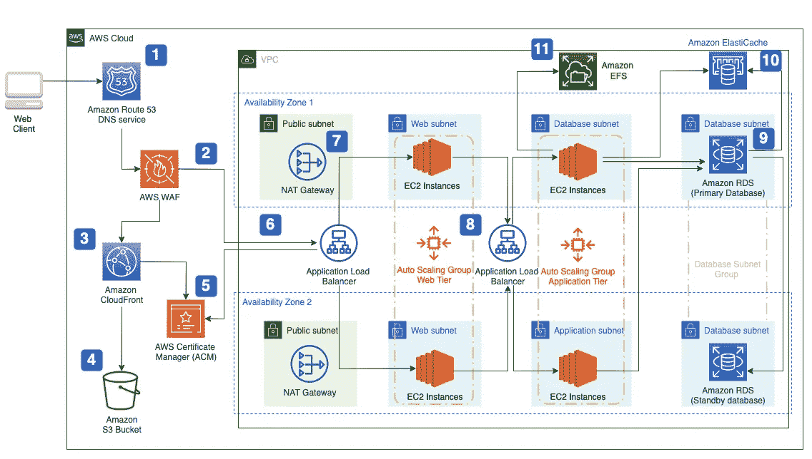

# 将 Web 应用程序迁移到 AWS

> 原文：<https://medium.com/codex/migration-web-application-to-aws-b12928349579?source=collection_archive---------2----------------------->

在过去的十年里，嘈杂的环境变得流行起来，我很感激我在早期跳上了那艘船。作为云架构师，我有很多机会设计架构。在我职业生涯的初期，我是一名后端 python 开发人员，我的许多 web 应用程序都运行在本地主机上。我决定将我的一个应用程序迁移到 AWS 云。我为此设计了建筑…