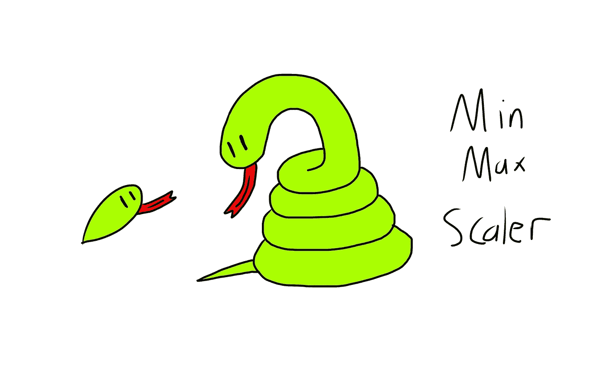

# MinMaxScaler 在 4 分钟内——它如何获得其值

> 原文：<https://medium.com/codex/minmaxscaler-in-4-minutes-how-it-gets-its-values-f545361a586a?source=collection_archive---------9----------------------->



如果你正在潜入机器学习的世界，很可能你已经在你的一些学习例子中看到了`MinMaxScaler`。本文试图尽可能简单地解释`MinMaxScaler`是如何得到它的值的。

```
from sklearn.preprocessing import MinMaxScaler
```

# 我们的示例数据集