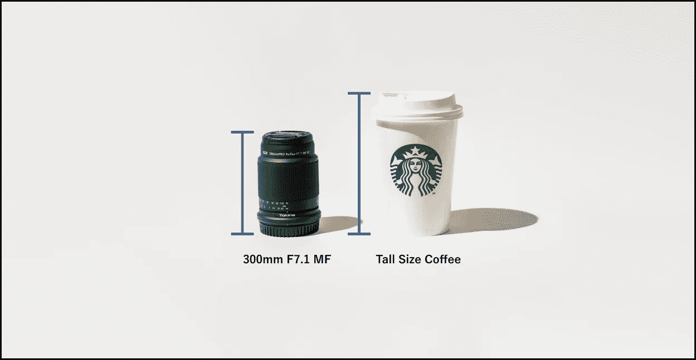

# 镜面镜片又回来了

> 原文：<https://medium.com/codex/mirror-lenses-are-back-5ec8204bdcc?source=collection_archive---------2----------------------->

## 镜面透镜

## 希望不会太久。

图片由 [Tokina](https://www.indiegogo.com/projects/ultralight-and-compact-super-telephoto-lens#/) 提供。由作者编辑。

Tokina 最近[发布了一套三镜头](https://www.indiegogo.com/projects/ultralight-and-compact-super-telephoto-lens#/)。当我看到照片时，我意识到它们实际上是紧凑型超长焦镜头。

我不得不说，我很惊讶！他们是怎么用这么小的镜头得到这么长的焦距范围的！？这是进入摄影市场的新技术吗？不知道。